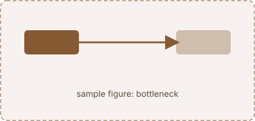
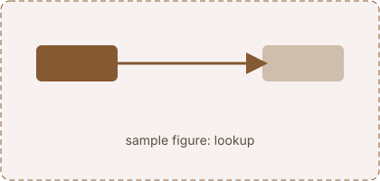

## One vector for the whole sentence

Sample prose so the layout can be judged before the real text exists. A model reads a sentence and has to answer a question about it, and ==the one sentence worth highlighting sits here==. The score between a query $q$ and a key $k$ is the dot product $q \cdot k$, and the weights come from a softmax:

$$
\alpha_j = \frac{e^{s_j}}{\sum_i e^{s_i}}, \qquad s_j = \frac{q \cdot k_j}{\sqrt{d_k}}
$$

A second paragraph, because pages are mostly paragraphs. It has a [link](https://en.wikipedia.org/wiki/Attention_(machine_learning)), some `inline code`, and a list:

1. **The request.** What the model asks for.
2. **The reply.** What every word hands back.
3. **The score.** How well a reply answers the request.

:::figure{#bottleneck}

The recurrent network compresses everything into a state of fixed dimension.
:::

## Why not make the vector bigger

Sample prose so the layout can be judged before the real text exists. A model reads a sentence and has to answer a question about it, and ==the one sentence worth highlighting sits here==. The score between a query $q$ and a key $k$ is the dot product $q \cdot k$, and the weights come from a softmax:
:::aside[Why the square root]
A collapsible note for something that would break the flow. Variance of a dot product of two $d_k$-dimensional unit-variance vectors is $d_k$, so dividing by $\sqrt{d_k}$ keeps the scores at unit scale.
:::

:::figure{#lookup}

Every word reports how well it answers the request.
:::

## What that buys and what it hides

Sample prose so the layout can be judged before the real text exists. A model reads a sentence and has to answer a question about it, and ==the one sentence worth highlighting sits here==. The score between a query $q$ and a key $k$ is the dot product $q \cdot k$, and the weights come from a softmax:
:::note[Notation]
An open callout with a small title. $Q$, $K$, $V$ are matrices, $q_i$, $k_j$, $v_j$ their rows, $n$ the sequence length.
:::

