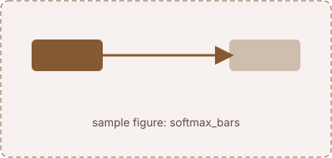

## What a weight has to be

Sample prose so the layout can be judged before the real text exists. A model reads a sentence and has to answer a question about it, and ==the one sentence worth highlighting sits here==. The score between a query $q$ and a key $k$ is the dot product $q \cdot k$, and the weights come from a softmax:

$$
\alpha_j = \frac{e^{s_j}}{\sum_i e^{s_i}}, \qquad s_j = \frac{q \cdot k_j}{\sqrt{d_k}}
$$

A second paragraph, because pages are mostly paragraphs. It has a [link](https://en.wikipedia.org/wiki/Attention_(machine_learning)), some `inline code`, and a list:

1. **The request.** What the model asks for.
2. **The reply.** What every word hands back.
3. **The score.** How well a reply answers the request.

:::figure{#softmax_bars}


Five scores in, five weights out, summing to one.
:::

## Analyzing the spread

Sample prose so the layout can be judged before the real text exists. A model reads a sentence and has to answer a question about it, and ==the one sentence worth highlighting sits here==. The score between a query $q$ and a key $k$ is the dot product $q \cdot k$, and the weights come from a softmax:
:::note[Notation]
An open callout with a small title. $Q$, $K$, $V$ are matrices, $q_i$, $k_j$, $v_j$ their rows, $n$ the sequence length.
:::

```python
import torch

scores = Q @ K.T / d_k**0.5
weights = scores.softmax(dim=-1)
out = weights @ V
```

| word  | score | weight |
|-------|------:|-------:|
| the   |  0.90 |   0.04 |
| cat   |  2.80 |   0.60 |
| mouse |  0.20 |   0.12 |


