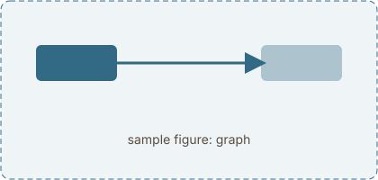

## Forward pass

Sample prose so the layout can be judged before the real text exists. A model reads a sentence and has to answer a question about it, and ==the one sentence worth highlighting sits here==. The score between a query $q$ and a key $k$ is the dot product $q \cdot k$, and the weights come from a softmax:
```python
import torch

scores = Q @ K.T / d_k**0.5
weights = scores.softmax(dim=-1)
out = weights @ V
```

| word  | score | weight |
|-------|------:|-------:|
| the   |  0.90 |   0.04 |
| cat   |  2.80 |   0.60 |
| mouse |  0.20 |   0.12 |


:::figure{#graph}


Gradients flow backwards along the same edges.
:::

## Backward pass

Sample prose so the layout can be judged before the real text exists. A model reads a sentence and has to answer a question about it, and ==the one sentence worth highlighting sits here==. The score between a query $q$ and a key $k$ is the dot product $q \cdot k$, and the weights come from a softmax:
:::note[Notation]
An open callout with a small title. $Q$, $K$, $V$ are matrices, $q_i$, $k_j$, $v_j$ their rows, $n$ the sequence length.
:::


