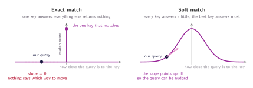
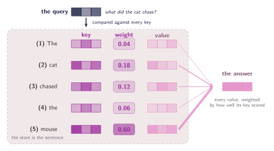

## Give it a key, get back a value

The last chapter left the model asking the sentence a question without ever saying what asking means. The mechanism for it is not new, and nothing about it is particular to machine learning: it is a key-value store, the dictionary every language ships with. You hand it a key, it hands you back a value.

Every entry is a pair. The key is what the entry can be found by; the value is what the entry gives you once it is found. A query comes in, it is compared against each key in turn, and the one that matches hands over its value. The comparison is exact, exactly one entry answers, and every other entry contributes nothing.

```python
store = {
    "cat":    "a small carnivorous mammal",
    "mouse":  "a small rodent",
    "chased": "pursued at speed",
}

store["mouse"]                     # 'a small rodent'
store["what did the cat chase?"]   # KeyError
```

That is the shape the model needs. It is also where the analogy breaks.

## Where it breaks

A real query is never literally one of the keys. Asking what the cat chased does not hand the store the string `"mouse"`. It hands it something closer to the idea of the thing being chased, and nothing in the store is filed under that.

The deeper problem is that ==an exact match gives the model nothing to learn from==. Either a key matches or it does not, so the score is one or it is zero, and a function that only ever returns one or zero has no slope. There is no direction in which to nudge the query to make the match better, because in this setup there is no better. There is only found and not found.

:::figure{#match_gradient}


Learning means following a slope. On the left there is none: the score is flat everywhere except at one point, so no small change to the query improves anything. On the right every key answers a little, which gives the score a slope to follow.
:::

## Let every key answer a little

So give up the one thing causing the trouble: the demand that exactly one entry answers. Instead of asking whether a key matches, ask how well it matches. What comes back is a number rather than a yes or a no.

Every key in the store gets a score. Those scores become weights that add up to one, and the store returns a blend of all the values, each weighted by how well its own key scored. Nothing is ever not found any more, and everything is found a little.

This is more general than what it replaces, not a compromise on it. If one key scores far above the rest, its weight goes to almost one and the others fall to almost zero, and the blend is essentially that key's value. ==The exact lookup is what a soft lookup looks like when it is very confident.==

## Query, key, value

Time to give the three things their names.

1. **Query** — what is handed in, describing the thing being looked for. Written $q$.
2. **Key** — what each entry offers up to be matched against. Entry $j$ supplies $k_j$.
3. **Value** — what that entry hands back once it is matched. Entry $j$ supplies $v_j$.

Query, key and value. That is the entire vocabulary for everything that follows.

Something is still too simple here. The store maps strings to strings, and there is no arithmetic to do with a string: scores and weights mean nothing applied to `"mouse"`. Everything in the store has to be a vector.

Swap the strings for vectors and look at what the store turns into. It is not something written by hand any more. It is the sentence itself. Every word becomes a key vector, which is how it gets found, and a value vector, which is what it hands over. Five words, five entries. The query is a vector too, and it comes from whichever part of the model needs to know something.

:::figure{#soft_dictionary}


Each word supplies a key and a value. The query is compared against every key at once, and the answer is a blend of all five values. These are the weights from the previous chapter, now with the vectors drawn in.
:::

A word is no longer mapped to a written definition. It is mapped to numbers, and to two sets of them: a key vector and a value vector. Unlike a real dictionary, nothing is looked up from a fixed table. Each position in the sentence produces its own key and its own value, which is why the two occurrences of `"the"` are separate entries rather than one entry consulted twice — **(1)** _The_ carries weight 0.04 and **(4)** _the_ carries 0.06.

:::note[Attention]
A query, a set of keys, a set of values, and an answer built by blending every value in proportion to how well its key matched the query. That is the whole mechanism; the rest of this tutorial is about where the vectors come from and how the scores are computed.
:::

Two questions are still open. How is a query compared with a key to get a score out? And where do all these vectors come from in the first place? The first is the next chapter. The second has to wait, because it needs something not yet on the table.
