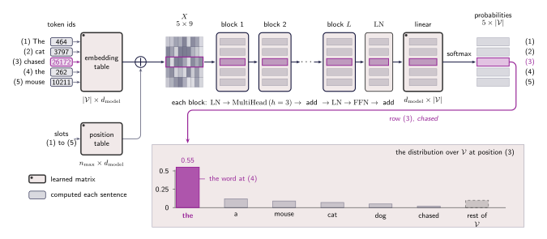

## From a stack of blocks to a word

A block takes an $n \times d_{\text{model}}$ matrix and returns one of the same shape, so blocks stack with nothing in between having to change. Put $L$ of them in a row and by the time the sentence reaches the top it has been read and updated $L$ times.

Depth buys something specific here. Block 1 reads the raw sentence, so its attention can only match one word's embedding against another's. Block 2 reads what block 1 wrote, where _chased_ already carries part of _mouse_, so its queries and keys are built from vectors that are partly about their neighbours. Each block asks its questions of a sentence the blocks below it have already annotated, which is how relations that span several steps — a pronoun to its antecedent, by way of the verb between them — get resolved at all. One block cannot do it, because one round of attention has only the embeddings to work with.

Pre-norm leaves one loose end. The stream arrives at the top carrying $2L$ additions and has not been normalised since the last branch, so a final $\operatorname{LN}$ goes in before anything else reads it. That is the price named in the last chapter, paid here.

One piece is still missing, and the masking chapter has been waiting for it. The stack produces one vector per position; the task asks for a word. So add one more learned matrix, of shape $d_{\text{model}} \times \lvert\mathcal{V}\rvert$ where $\mathcal{V}$ is the vocabulary, and multiply the stream by it. Each row of $d_{\text{model}}$ numbers becomes a row of $\lvert\mathcal{V}\rvert$ numbers, one score per word the model knows. A softmax along that row — the same operation that turned attention scores into weights — makes it a distribution: ==for each position, how likely the model thinks each word is to come next==.

:::aside[What the vocabulary actually is]
$\mathcal{V}$ is the full list of tokens the model can read or produce, fixed before training and never changed. A token id is a position in that list and nothing more.

The entries are not quite words. A vocabulary of English words would be enormous and still incomplete, since there is always a name or a typo it has not seen, so the list is built from subword pieces: common words get an entry to themselves while rare ones are spelled out of smaller parts. Every string can be written and the list stays finite.

The original Transformer used about 37,000 entries, GPT-2 used 50,257, and recent models run past 100,000. That number is not free, because it appears twice: the embedding table is $\lvert\mathcal{V}\rvert \times d_{\text{model}}$ going in, and the matrix just added is $d_{\text{model}} \times \lvert\mathcal{V}\rvert$ coming out. At $d_{\text{model}} = 512$ and $\lvert\mathcal{V}\rvert = 50{,}000$ each is about 25 million weights, while one block at that width is $12 d_{\text{model}}^{2} \approx 3$ million. One embedding table costs about as much as eight blocks.
:::

## Everything, in one chain

Read the figure left to right and every box in it was built somewhere in this tutorial: the embedding table, the position vectors added to it, the blocks, the final norm that pre-norm made necessary, and the matrix and softmax just added.

:::figure{#full_stack}

The distribution drawn at the bottom belongs to position **(3)** _chased_, and it is the guess the masking chapter asked that position for.
:::

Follow the highlighted row. **(3)** _chased_ goes in as a token id, collects its context in every block on the way, and comes out as a distribution putting 0.55 on _the_ — the word at position **(4)**, which is exactly what the next-token task asked position **(3)** to predict.

The complaint this tutorial opened with, that everything a model knew about a sentence had to fit inside one fixed vector, has turned into a model that reads a sentence and says what comes next. Nothing was memorised into a summary. Each position kept its own vector, looked at the others whenever it had a reason to, and computed with what it found.

## What it costs

The answer has a bill attached. Every block builds an $n \times n$ table of scores for each of its $h$ heads, so doubling the length of the sentence quadruples those tables, and a model reading a long document spends most of its memory there rather than on any of the weights counted so far.

Generating text is worse. The model produces one token at a time, and each new token means pushing the whole prefix through all $L$ blocks again — the same work, redone, once per word.

Both problems come from the same decision, taken in the very first chapter: keep the sentence around and look at all of it whenever anything is asked. The last chapter of this tutorial is about what that costs and what can be done about it.
