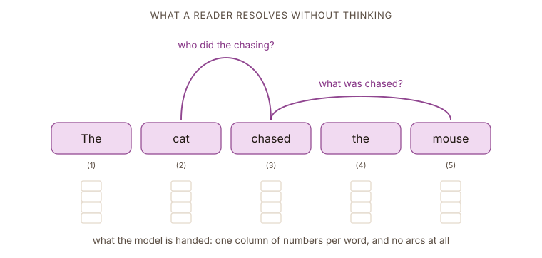

## Our reference sentence

Every chapter of this tutorial works on the same five words: _The cat chased the mouse._ Every weight, every score and every figure from here to the end is computed on that one sentence, so keep that sentence in mind!

A human reader understands this text effortlessly. We naturally see that "chased" connects to "cat" as the subject and "mouse" as the object. That is what makes the cat the pursuer and the mouse the pursued. Those links are not actually written anywhere in the text. They are not marked or spelled out because the human brain supplies them automatically.

The interesting part is that a machine learning model does not get that intuitive understanding for free. The big question is how to help a model build that understanding when reading text. The model needs a way for every word to decide which other words it should look at and ==how much attention to pay to each one==.

:::figure{#running_sentence}

Notice how a human instinctively adds the connecting arcs, while the blank number columns represent everything the model actually receives. Every single mechanism we will explore in this tutorial is designed to teach the model how to transform that raw bottom row into the connected structure of the top row.
:::

## One vector for the whole sentence

Consider a model that reads a sentence and has to answer a question about it. Before attention, the standard recipe was a recurrent network that walks the sentence one word at a time, carrying a single hidden state that it updates at every step. By the time the model reaches the full stop, ==everything it knows about the sentence has to fit inside that one vector==. It is the same size whether the sentence has five words or five hundred.

Call that state $h$ and its width $d$. The recurrent network reads word by word and rewrites $h$ in place, so $h$ after the last word is the model's entire record of what it read.

:::figure{#bottleneck_rnn}

The recurrent network compresses whatever it has read into a state of fixed dimension $d$. Five words or five hundred, the model gets the same number of slots to store them in.
:::

## Why not make the vector bigger?

The obvious response is to give the model more room: increase the length of the vector so there is more space for the sentence to live in, but of course this has a limit. The recurrent weight matrix is $d \times d$, so doubling the state size quadruples the parameters in that block, and a larger state is slower to train and easier to overfit.

Suppose, for a moment, something completely absurd given the current situation: **RAM is cheap** and the vectors can be as wide as we like. The problem does not go away, because it was never only about size.

Looking closely at the sentence again "_The cat chased the mouse_", it shows a major flaw in standard recurrent networks. To answer what the cat chased, the model needs one specific piece of information. To answer who did the chasing, it needs something completely different. A recurrent network must write its entire summary into a vector before it ever sees the question. This means the state gets computed before the model knows what is actually important. ==Because this compression happens far too early, simply making the vector larger will never truly fix the problem==.

Now let's rethink this problem by refusing to compress at all. Let's say we keep one vector per word, which for the sentence above means five of them: **(1)** _The_, **(2)** _cat_, **(3)** _chased_, **(4)** _the_, **(5)** _mouse_.

Let's now imagine that the model can come back to read them whenever it needs something, the way we would bring a cheat sheet to an exam. When it needs to know who did the chasing, it puts out a request; ==every word reports how well it answers that request==; the replies are blended in proportion to how well they answered. Nothing has to be decided in advance (in other words, nothing has to be compressed), because nothing was thrown away.

The figure below draws that idea from end to end, with a different request this time: _what did the cat chase?_ It arrives on the left as a vector of its own (grey vector) and meets five words that are still whole, each one keeping the vector it came in with. Every word answers with a single number, and here those numbers come out as 0.04, 0.18, 0.12, 0.06 and 0.60, so _mouse_ supplies most of the answer and the two words "_the_" contribute almost nothing. Follow the arrows down and all five replies arrive at one vector at the bottom, which is what the model walks away with (one blended answer).

:::figure{#lookup_not_memorise}

Every word reports how well it answers the request, and the scores decide how much of each word ends up in the answer. The five scores are normalised to sum to one, so the answer is a blend of the sentence rather than a summary written before the request arrived. Wider arrows are stronger weights.
:::

## What that buys, and what it hides

Look back at the complaint this chapter started with. There is no longer a single state that has to be the same size for five words and five hundred, because there is no single state at all. The sentence stays where it is, and the model reads it whenever it has a reason to.

The cost has not disappeared, though. It has moved. The model now looks over every word each time it asks for something, and that behavior grows with the length of the sentence.

Look at the figure again. It shows three things as though they were already built. A request comes in from the left, and nothing says where it originates or what it contains. Each word produces a score, and no rule says how. Using those scores to blend the words is the only step that can actually be carried out, because it is a weighted sum and nothing more.

The description so far has made some assumptions that are hard to follow given what has been covered up to now, that is:

1. **The request.** The model works with vectors, not questions, so it is not even clear what a request is made of.
2. **The reply.** Every word hands something back when a request arrives, and nothing has said what that something is.
3. **The score.** Some rule has to decide how well a reply answers a request, and that rule has not been written down.

Everything in that list points to the same missing piece. A request is sent in, every entry calculates how well it matches, and a result comes back weighted by those match scores. This relies on the simple concept of a key-value store lookup. The next chapter picks up from there because this type of store handles all three problems at once.
