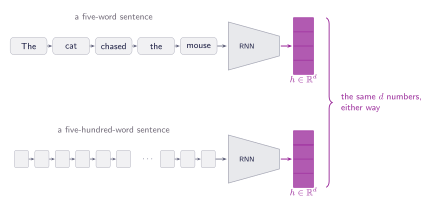
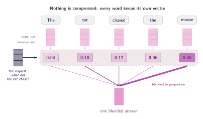

## One vector for the whole sentence

Consider a model that reads a sentence and has to answer a question about it. Before attention, the standard recipe was a recurrent network that walks the sentence one word at a time, carrying a single hidden state that it updates at every step. By the time the model reaches the full stop, ==everything it knows about the sentence has to fit inside that one vector==. It is the same size whether the sentence has five words or five hundred.

Call the width of that state $d$. The recurrent network reads word by word and rewrites $h$ in place, so $h$ after the last word is the model's entire record of what it read. Nothing else survives the walk.

:::figure{#bottleneck_rnn}

The recurrent network compresses whatever it has read into a state of fixed dimension $d$. Five words or five hundred, the model gets the same number of slots to store them in.
:::

## Why not make the vector bigger?

The obvious response is to give the model more room: increase the length of the vector so there is more space for the sentence to live in. This works, and it was a real part of how recurrent networks were improved. But it has a limit. The recurrent weight matrix is $d \times d$, so doubling the state size quadruples the parameters in that block, and a larger state is slower to train and easier to overfit.

Suppose, for a moment, something absurd: RAM is cheap and the vectors can be as wide as you like. The problem does not go away, because it was never only about size.

_The cat chased the mouse because it was hungry._ Asked what the cat chased, the model needs one thing. Asked who was hungry, it needs another. The recurrent network has to write its summary before it is aware of the question: the state is computed before anything is asked of it. ==The compression happens too early, and no amount of room fixes that.==

Now go the other way. Refuse to compress at all. Keep one vector per word, which for the sentence above is five of them: **(1)** _The_, **(2)** _cat_, **(3)** _chased_, **(4)** _the_, **(5)** _mouse_. Let the model come back and read them whenever it needs something, the way you would bring a cheat sheet to an exam. When it needs to know who was hungry, it puts out a request; every word reports how well it answers that request; the replies are blended in proportion to how well they answered. Nothing has to be decided in advance, because nothing was thrown away.

:::figure{#lookup_not_memorise}

Every word reports how well it answers the request, and the scores decide how much of each word ends up in the answer. The five scores sum to one, so the answer is a blend of the sentence rather than a summary written before the request arrived. Wider arrows are stronger weights.
:::

## What that buys, and what it hides

Look back at the complaint this chapter started with. There is no longer a single state that has to be the same size for five words and five hundred, because there is no single state at all. The sentence stays where it is, and the model reads it whenever it has a reason to.

The cost has not disappeared, though. It has moved. The model now looks over every word each time it asks for something, and that is work that grows with the length of the sentence. The last chapter of this tutorial is about the size of that bill.

Look at the figure again. It shows three things as though they were already built. A request comes in from the left, and nothing says where it originates or what it contains. Each word produces a score, and no rule says how. Using those scores to blend the words is the only step that can actually be carried out, because it is a weighted sum and nothing more. Two of the three steps are still gestures.

Three words in that description were carrying all the weight:

1. **The request.** The model works with vectors, not questions, so it is not even clear what a request is made of.
2. **The reply.** Every word hands something back when a request arrives, and nothing has said what that something is.
3. **The score.** Some rule has to decide how well a reply answers a request, and that rule has not been written down.

None of this is new. What the last two sections described, in a roundabout way, is something programmers reach for constantly: a lookup in a key-value store. That is where the next chapter starts, and it hands over all three definitions at once.
