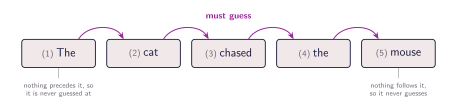
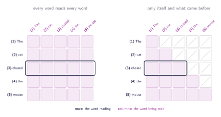
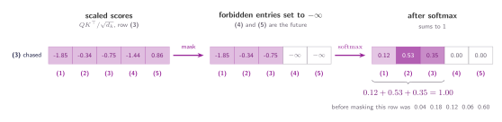
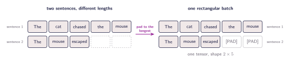
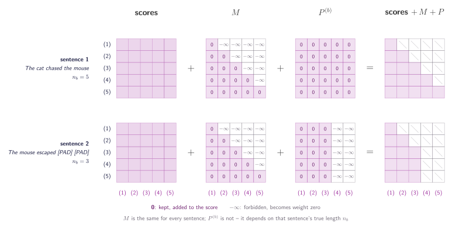

## The score table is the answer key

Which positions is a head allowed to read? So far, all of them, and the question never came up because of an assumption nobody wrote down: that the sentence is a finished object, handed over complete, free to be studied from any angle. Plenty of tasks do look like that. One important task does not. A model shown a sentence one word at a time and asked what comes next is in a different position, and for it ==the score table built over the last five chapters is the answer key==.

That task is **next-token prediction**. The sentence still goes in as $X$, all five words at once. What changes is what is asked of the output: row $i$ is no longer read as a better representation of word $i$, it is read as a guess at word $i+1$.

:::figure{#next_token_targets}


Five words, four arrows. Every position is asked for the word to its right, so **(1)** is never guessed at and **(5)** never guesses. The two occurrences of _the_ are separate boxes here, exactly as they are separate entries in the store.
:::

So **(1)** _The_ must guess _cat_, **(2)** _cat_ must guess _chased_, **(3)** _chased_ must guess _the_, and **(4)** _the_ must guess _mouse_. Five words, four guesses. The loss measures how wrong those four are, and that number is the entire training signal.

Nothing about the mechanism has changed. What changed is what is wanted from it. Earlier, _chased_ pulling 0.60 out of _mouse_ was the mechanism working as intended: a verb is incomplete without its object, and the blend turned _chased_ into something closer to _chased a mouse_. Reaching forward was fair, because the whole sentence was there to read. The goal is no longer that. _chased_ is not being asked what it means, it is being asked what comes next.

## How to delete an entry

Take row **(3)** again: 0.04, 0.18, 0.12, 0.06 and 0.60. Under the new job, _chased_ has to produce the _the_ at **(4)**. Its row hands it 0.06 of that exact word, and another 0.60 of _mouse_ one step further on. Two thirds of what _chased_ walks away with is built out of the words it is meant to be predicting. The answer is inside the vector it has to answer from.

If the trouble is that a word can see what comes after it, stop letting it. _chased_ may look at **(1)**, **(2)** and itself, and nothing further. **(2)** gets one fewer, **(4)** one more, and **(1)** is left with only itself.

:::figure{#causal_triangle}


Row **(3)** is framed in both. On the left _chased_ holds all five cells; on the right it keeps **(1)**, **(2)** and itself, and the two that held its answer are gone. The square becomes a triangle, and **(1)** is left reading nothing but itself.
:::

The cells are not removed, they are made to count for nothing. Before the softmax, every forbidden score is set to $-\infty$. The softmax raises $e$ to each score and $e^{-\infty} = 0$, so those cells come out with weight zero, and the row still sums to one because the division is by the total of what is left.

:::figure{#causal_mask}


The two forbidden scores go to $-\infty$ before the softmax, so they come out at exactly zero and never reach $V$. The three that survive are larger than they were, because they are divided by a smaller total: 0.04, 0.18 and 0.12 become 0.12, 0.53 and 0.35, and the row still sums to 1.
:::

All of it is one addition. Build a matrix $M$ of the same shape as the score table, holding $0$ everywhere a word is allowed to read and $-\infty$ everywhere it is not:

$$
M_{ij} = \begin{cases} 0 & j \leq i \\ -\infty & j > i \end{cases}
$$

Here $i$ is the row, the word doing the reading, and $j$ the column, the word being read, so $j \leq i$ says _this word came no later than mine_. Adding $0$ leaves a score as it was and adding $-\infty$ takes it out, so the whole rule is one matrix added to the scores:

$$
\operatorname{Attention}(Q, K, V) = \operatorname{softmax}\!\left(\frac{QK^{\top}}{\sqrt{d_k}} + M\right) V
$$

$M$ is $n \times n$, built from the length of the sentence alone. It never looks at the words, so every sentence of five tokens gets the same $M$, reused by every head and every sentence in the batch.

## One pass, four guesses

The mask is not the only way to keep the model honest. It could be run once per prefix instead: show it _The_ and ask for _cat_, then _The cat_ and ask for _chased_, and so on. Nothing leaks that way either, because the forbidden words are not in the input at all. It also costs four forward passes for one five-word sentence, each recomputing the prefix the pass before it already worked through.

One masked pass already contains those four. Row **(3)** may read **(1)**, **(2)** and itself, which is exactly what a run on _The cat chased_ would have had in front of it, and the same holds for every other row. ==A single pass over the whole sentence computes all four prefixes at once==, so the four guesses come out together and the loss collects all four at the same time.

## Sentences of different lengths

Training runs a batch of sentences at once, and a batch is a single tensor. Tensors are rectangular, so every sentence in the batch has to be the same length, and sentences are not. The usual answer is to take the longest and fill the others out with a filler token: **padding**.

:::figure{#padding_batch}


Padding makes the shapes fit and says nothing about language. The shorter sentence is filled out until the batch is a rectangle, and the price is two positions that stand for no word at all.
:::

The model cannot tell the difference. A pad is a token like any other: it has an embedding, produces a key and a value, scores against every query, and the softmax gives it a share of the weight. Nothing in the mechanism marks it as filler, so real words end up with part of their answer built out of positions that stand for nothing.

Train on $B$ sentences at once, pad each to the length $n$ of the longest, and the batch arrives as $X$ of shape $B \times n \times d_{\text{model}}$. Sentence $b$ has true length $n_b \leq n$, and everything past $n_b$ is filler. Masking it is one more matrix of the same kind:

$$
P^{(b)}_{ij} = \begin{cases} 0 & j \leq n_b \\ -\infty & j > n_b \end{cases}
$$

The index $i$ is absent from the right-hand side. The rule is the same for every query, so $P^{(b)}$ blanks whole columns, while $M_{ij}$ depends on both indices and blanks a triangle. Different shapes, same mechanism, both added to the scores before the softmax:

$$
\operatorname{Attention}\!\left(Q^{(b)}, K^{(b)}, V^{(b)}\right) = \operatorname{softmax}\!\left(\frac{Q^{(b)} K^{(b)\top}}{\sqrt{d_k}} + M + P^{(b)}\right) V^{(b)}
$$

:::figure{#mask_matrices}


$M$ carves out a triangle and does not care which sentence it is. $P^{(b)}$ does: _The cat chased the mouse_ has no padding so $P$ adds nothing, while _The mouse escaped_ loses its last two columns. Only cells that survive both tests keep a real number.
:::

$M$ is shared across the whole batch, since it depends only on the length. $P^{(b)}$ is constant down each column, so in practice it is stored as one boolean per position per sentence — $B \times n$ flags — and broadcast across the rows and the $h$ heads. Applying both is enough to mask whatever either one targets, because adding $-\infty$ to any finite score gives $-\infty$. The loss is computed only over positions holding real words, so whatever the padded rows compute is never used.

```python
def masked_attention(raw_scores, true_lengths):
    """raw_scores (B, n, n) before softmax; true_lengths (B,) words per sentence."""
    B, n, _ = raw_scores.shape
    causal = torch.triu(torch.full((n, n), float("-inf")), diagonal=1)   # M
    is_pad = torch.arange(n).unsqueeze(0) >= true_lengths.unsqueeze(1)
    pad = torch.where(is_pad, float("-inf"), 0.0).unsqueeze(1)           # P
    return F.softmax(raw_scores + causal + pad, dim=-1)
```

The two masks solve independent problems. $M$ enforces the left-to-right reading order, so the model cannot peek at what it is meant to predict. $P$ cleans up the artefact left behind by forcing different-length sentences into one rectangle.

## What the mask still cannot fix

The mask enforces a strict reading order, so causality is preserved. But look closely at the formula. Scramble the order of the input words and the dot products between their queries and keys are unchanged. Attention treats the sentence as a bag of words, computed all at once, with no inherent sense of sequence.

The mask says which words a position may look at. It says nothing about where those words sit. Order has to be injected before attention begins, and that is the next chapter.
