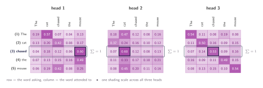
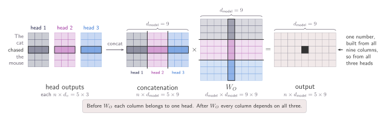

## One budget, two relations

The last chapter closed the loop. The sentence arrives as $X$, three learned matrices turn it into $Q$, $K$ and $V$, and every word walks away with a new representation built out of the whole sentence. Each word receives one row of weights, one distribution, one blend.

Take _chased_. Its row came out 0.04, 0.18, 0.12, 0.06 and 0.60, and reading that row as a set of relations is enough to spot the problem. A verb needs its object, and _mouse_ takes 0.60. A verb also needs its subject, and _cat_ is left with 0.18. The row is a softmax, so it sums to one whatever happens, which means ==every point of weight spent on the object is a point not spent on the subject==. One relation is served well, the other is not, and both arrive in the same vector.

The obvious response is more room: make $d_k$ large so one query can encode both relations. It does not help, and the reason is not capacity. However wide $q$ and $k$ become, the dot product still collapses to one number per pair, and what comes out is still one row. Dropping the softmax so the row need not sum to one is worse: without normalisation there are no proportions left to blend in.

## Run the lookup more than once

If one lookup produces one distribution, two distributions ask for two lookups. That is the whole idea, and it is as blunt as it sounds. Nothing inside the mechanism changes. It runs more than once over the same sentence, each run with its own $W_Q$, $W_K$ and $W_V$. Every run scores its own queries against its own keys, takes its own softmax, and hands _chased_ its own row of weights. Two runs, two budgets, and now one of them can spend most of its weight on _cat_ while the other spends most on _mouse_, with neither paying for the other. Each parallel run is a **head**.

:::figure{#heads_ask_differently}


Row **(3)** _chased_ is framed in all three, and it sums to one in all three. What changes is how that one is spent: 0.60 on _mouse_ in head 1, 0.60 on _cat_ in head 2, and 0.53 kept on _chased_ itself in head 3. Three budgets, not one larger budget.
:::

Nothing new happens inside any head. Writing the $m$-th head out in full:

$$
\text{head}_m = \operatorname{softmax}\!\left(\frac{Q^{(m)} K^{(m)\top}}{\sqrt{d_k}}\right) V^{(m)}
$$

$$
Q^{(m)} = XW_Q^{(m)}, \quad K^{(m)} = XW_K^{(m)}, \quad V^{(m)} = XW_V^{(m)}
$$

with $m$ running from 1 to $h$, and $h = 3$ in the figure. The same $X$ goes into every head, and no head reads what another produced, so the $h$ runs happen side by side rather than one after another. Each returns an $n \times d_v$ matrix, one row per word, exactly as a single head did.

Two loose ends. Three heads look like three times the parameters and three times the work, and each word now walks away with three output vectors where before it had one.

## Splitting the cost

Three heads look expensive only because each one is quietly assumed to be as wide as the single head it replaces. Nothing forces that. The width of a head is a design choice — $d_k$ and $d_v$ were fixed by hand, and training only ever filled matrices of the size it was given. So if $h$ heads are going to run, make each one narrower: $d_k = d_v = d_{\text{model}}/h$. Three heads, each a third as wide, and the cost is the one already being paid for one head.

Concretely, $h = 3$ heads with $d_k = d_v = 3$ in a model $d_{\text{model}} = 9$ wide. Each $W_Q^{(m)}$ is $9 \times 3$ rather than $9 \times 9$, turning the $5 \times 9$ sentence matrix into a $5 \times 3$ matrix of queries. Real models are wider: the original Transformer takes $d_{\text{model}} = 512$ and $h = 8$, which leaves $d_k = d_v = 64$.

The arithmetic works out the same on every axis:

1. **Parameters.** Each head holds three matrices of size $d_{\text{model}} \times (d_{\text{model}}/h)$. Across $h$ heads that is $d_{\text{model}}^{2}$ per role — the count of a single full-width head.
2. **Projection.** Projecting $X$ costs $n \cdot d_{\text{model}} \cdot d_k$ per head, so $n \cdot d_{\text{model}}^{2}$ in total.
3. **Scoring and blending.** $n^{2} \cdot d_k$ per head, so $n^{2} \cdot d_{\text{model}}$ in total.

Multi-head attention is not several attention blocks bolted together. It is one attention block partitioned.

## Putting the heads back together

_chased_ is holding three vectors, one per head, each $d_v$ wide. Write them side by side as a single row: $h$ heads of width $d_{\text{model}}/h$ occupy exactly $d_{\text{model}}$ columns, so concatenating gives an $n \times d_{\text{model}}$ matrix and every word leaves at the width it arrived at.

Concatenation alone is not enough. Each head still owns its own slice — columns 1 to 3 belong to head 1, 4 to 6 to head 2, 7 to 9 to head 3 — and no number in one block has met a number in another. The point of running several heads was to combine perspectives, and side by side is not combined.

So one more learned matrix, $W_O$, of shape $d_{\text{model}} \times d_{\text{model}}$, multiplies the concatenated rows. Every output column is then free to be a mixture of all $h$ blocks, which makes $W_O$ the one place in the whole mechanism where one head meets another. It also corrects the cost argument above: this is a fourth matrix a single head never needed, so the count goes from $3d_{\text{model}}^{2}$ to $4d_{\text{model}}^{2}$. The heads are free; re-joining them is what costs.

:::figure{#concat_project}


The concatenation still has its three blocks and nothing in it has mixed the heads. Multiplying by $W_O$ is what mixes them: the single output cell picked out on the right is built from all nine concatenated columns at once, which is to say from all three heads.
:::

$$
\operatorname{MultiHead}(X) = \operatorname{Concat}(\text{head}_1, \dots, \text{head}_h)\,W_O
$$

:::aside[Concatenation is a sum in disguise]
Cut $W_O$ into $h$ blocks of rows, $W_O^{(m)}$ of shape $d_v \times d_{\text{model}}$, so block $m$ holds exactly the rows that head $m$'s columns multiply against. The concatenation is a row of blocks and $W_O$ is a column of blocks, the one case where a matrix product collapses into a sum:

$$
\operatorname{Concat}(\text{head}_1, \dots, \text{head}_h)\,W_O = \sum_{m=1}^{h} \text{head}_m W_O^{(m)}
$$

Each $\text{head}_m$ is $n \times d_v$ and each $W_O^{(m)}$ is $d_v \times d_{\text{model}}$, so every term is the full width of the output and the $h$ terms are added on top of one another. No head writes into a private slice: each projects its $d_v$ numbers up to all $d_{\text{model}}$ columns, and the output is the sum of $h$ such contributions.
:::

In code the head index is a leading dimension rather than a loop, so the projections happen for every head at once and the softmax runs on $h$ tables instead of one.

```python
def multi_head_attention(X, W_q, W_k, W_v, W_o):
    """X (n, d_model); W_q/W_k/W_v (h, d_model, d_k); W_o (d_model, d_model)."""
    Q, K, V = X @ W_q, X @ W_k, X @ W_v       # (h, n, d_k), no head sees another
    d_k = Q.shape[-1]
    scores = Q @ K.transpose(-2, -1)          # (h, n, n)
    weights = torch.softmax(scores / d_k**0.5, dim=-1)
    heads = weights @ V                       # (h, n, d_v)
    concat = heads.transpose(0, 1).reshape(heads.shape[1], -1)
    return concat @ W_o, weights              # (n, d_model), (h, n, n)
```

## What the heads actually learn

This chapter has talked as though head 1 handles objects and head 2 handles subjects. Nothing built here makes that happen. Look back for the place where a head is told what to look for: there is none. The heads differ because $W_Q^{(m)}$, $W_K^{(m)}$ and $W_V^{(m)}$ start as different random numbers, and they stay different because nothing pulls them back together. No term in the loss asks them to specialise.

So why do they end up different at all? Not because anything rewards difference, but because nothing removes it. Three sets of matrices start at three random points, and gradient descent moves each towards whatever reduces the loss from where it happens to stand.

The figures illustrate what different heads can look like, not what any particular model's heads do. _chased_ leaves this chapter holding one vector, the width it arrived at, now possibly carrying its object and its subject together.

One thing has not been touched: which positions a head is allowed to read. Every head so far reads the entire sentence, every word scoring against every other. The next chapter takes some of that away.
