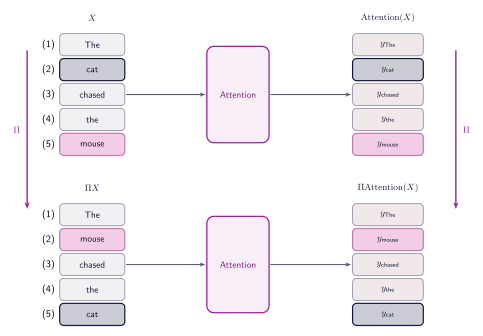
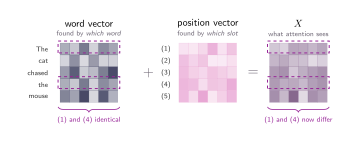
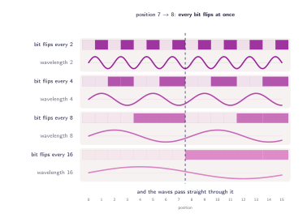
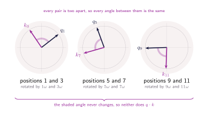

## The sentence scramble

Feed the model _The mouse chased the cat_ instead of _The cat chased the mouse_. Because $W_Q$, $W_K$ and $W_V$ act on each row independently, the same words produce the same queries, keys and values. The dot products and the softmax weights move with them, and every word walks away holding exactly the vector it held before, sitting in a different row. ==Whatever the model understands about this sentence, it has no idea who did the chasing.==

The numbers in this tutorial have been quietly breaking too. The embedding chapter said _the_ is fetched twice and both copies come back identical. If that is so, both occurrences hand over the same key, and the query of **(3)** _chased_ must score them equally — yet every figure gives the first _the_ a weight of 0.04 and the second 0.06. Both cannot be true.

Formally, let $\Pi$ be a permutation matrix, so $\Pi X$ is the sentence with its rows shuffled. The projections are row-wise, so all three shuffle the same way, $Q' = \Pi Q$, $K' = \Pi K$, $V' = \Pi V$, and the scores come out

$$
Q'K'^{\top} = (\Pi Q)(\Pi K)^{\top} = \Pi\,QK^{\top}\,\Pi^{\top}
$$

The softmax runs along each row and neither permutation changes the set of values inside a row, so it commutes with both. Then $\Pi^{\top}\Pi = I$ cancels against $V' = \Pi V$, and the whole mechanism satisfies

$$
\operatorname{Attention}(\Pi X) = \Pi\operatorname{Attention}(X)
$$

Shuffle the input and the output is the old output, shuffled. This is **permutation equivariance**. The only part of the architecture that treats positions differently at all is the mask, and the mask says which words may be read, never where they sit.

:::figure{#permutation_equivariance}

Positions **(1)** to **(5)** stay where they are and only the words move between them. The same five vectors come back on both sides, so the second sentence is the first with two rows traded. The $\Pi$ that went in on the left comes straight back out on the right.
:::

## Where order has to come from

Nothing is wrong with the mechanism. The trouble is what $X$ contains: row $i$ holds the embedding of the word at position $i$ and nothing else, so two copies of a word are two identical rows. No arithmetic downstream can separate them, because the dot product and the softmax only ever see the rows they are handed. The information has to arrive with the input.

The most direct arrangement is to write the position into the vector — one extra coordinate holding the index. It costs a single dimension, needs no training, and makes every row unique. It also fails, and so does every obvious repair:

1. **The raw index.** A score is a sum of $d_k$ products with spread about $\sqrt{d_k}$, so a 64-dimensional model has content scores around $\pm 8$. A word at position 500 contributes a term of order 500, and the weights rank by position instead of reading the words.
2. **The index divided by the length.** Now it lands between 0 and 1, but the third word sits at 0.6 in a five-word sentence and 0.03 in a hundred-word one, and the step between neighbours falls from 0.2 to 0.01. A rule as ordinary as _look at the previous word_ has no fixed numerical form to learn.
3. **Multiplying instead of adding.** Scaling the embedding by the position makes _mouse_ at position 50 fifty times louder than _mouse_ at position 1, so the score measures volume rather than meaning.
4. **One-hot the position.** Every position becomes distinct and nothing else: neighbours sit as far apart as strangers, the width of the model depends on the length of the sentence, and a position past $n$ has no column at all.

## One vector per position

Stop describing a position with a number. Give every position a vector of its own, $d_{\text{model}}$ wide, exactly as wide as the embedding it joins, and add the two. Word **(3)** _chased_ arrives as its own embedding plus the vector belonging to position 3, and the two copies of _the_ finally differ.

A vector buys what a coordinate could not. Spread over $d_{\text{model}}$ numbers, a position is a pattern rather than a magnitude, so two positions can agree in some coordinates and differ in others, and nothing forces the pattern to grow along the sentence. It can stay small enough to colour a score rather than decide it.

What do those vectors hold? The simplest answer: build a table of shape $n_{\text{max}} \times d_{\text{model}}$, fill it with random numbers, and let training sort it out, exactly as for the words themselves. Building $X$ becomes two lookups instead of one.

:::figure{#two_lookups}

One table is indexed by which word this is, the other by which slot it sits in. The two copies of _the_ fetch the same row on the left and different rows in the middle, so what they hand to attention is no longer the same vector. The 0.04 and the 0.06 have just become possible.
:::

This works, and plenty of large models use it. The catch is the table's size. $n_{\text{max}}$ is fixed before training, and there is no row beyond it — a model built for 1024 tokens does not degrade at token 1025, it has nothing to look up. The last rows also get little practice, since long sequences are rare. And because the rows are independent parameters, the model has to learn that position 3 and position 4 are neighbours from scratch, one pair at a time.

:::note[Context length]
$n_{\text{max}}$ is the number in the news. A model with a "context window" of 8,192 tokens is a model whose position table has 8,192 rows: the hard limit on the longest sequence it can read at once.
:::

## Computing the vectors instead of storing them

Both problems come from storing the vectors. A table has finite capacity, and its rows have no intrinsic relationship. So compute the vector for position $p$ from a function instead: no row to exhaust, and the relationship between 3 and 4 is built into the function rather than learned.

One option is binary. Write the position in base 2 and map its bits to coordinates. Each coordinate is 0 or 1, so it never overwhelms the content, every position is unique, and the bits alternate at increasing rates — every step, every two, every four. It is efficient, too: $d$ coordinates cover $2^{d}$ positions where a table of the same width holds $d$.

It also has no gradient. Jumping between 0 and 1 leaves no slope, and the distances are erratic: 7 ($0111$) and 8 ($1000$) are neighbours yet differ in every coordinate, while 0 ($0000$) and 8 differ in one bit despite being eight steps apart. Nearness in the sentence and nearness in the encoding come apart.

Keep what worked — coordinates changing at different rates — and drop the jumping. A flipping bit is a square wave, a continuous wave forced into corners. Replace each bit with a smooth wave of the same wavelength and the coordinate glides between $-1$ and $1$ instead of snapping.

:::figure{#binary_to_sinusoid}

A bit that flips every two steps becomes a wave that completes a cycle every two steps. The rhythm is unchanged. At the dashed line between 7 and 8 every bit flips at once, while the waves pass through the same boundary unbothered.
:::

## Sinusoidal positional encoding

Group the coordinates into pairs. Each pair $j$ holds a sine and a cosine turning at the same frequency:

$$
PE(p, 2j) = \sin(\omega_j \, p), \quad PE(p, 2j + 1) = \cos(\omega_j \, p), \quad \omega_j = \frac{1}{10000^{2j/d_{\text{model}}}}
$$

Here $p$ is the absolute position and $j$ runs to $d_{\text{model}}/2 - 1$. There are no trainable parameters: the vector for position 5, or 5,000,000, is computed on demand.

The real test is not range but relative distance. Language runs on relations like _the adjective just before this noun_, and a query at position 10 looking back at position 7 should be doing the same thing as a query at 40 looking back at 37. The model should learn the relation once, not once per position.

That operation exists, and it is why the formula pairs sines with cosines. Shift a pair from $p$ to $p + k$:

$$
\begin{pmatrix} \sin\omega_j(p+k) \\ \cos\omega_j(p+k) \end{pmatrix} = \begin{pmatrix} \cos\omega_j k & \sin\omega_j k \\ -\sin\omega_j k & \cos\omega_j k \end{pmatrix} \begin{pmatrix} \sin\omega_j p \\ \cos\omega_j p \end{pmatrix}
$$

Every entry of that matrix is built from the offset $k$ alone. The starting point $p$ does not appear. ==Moving three steps is the same small rotation whether it starts at word 7, 37 or 3997.==

:::aside[Where the matrix comes from]
The angle addition formulas, with $a = \omega_j p$ and $b = \omega_j k$, written so both lines are weighted sums of the same two quantities in the same order:

$$
\sin(a+b) = (\cos b)\sin a + (\sin b)\cos a, \qquad \cos(a+b) = (-\sin b)\sin a + (\cos b)\cos a
$$

Two such lines are exactly a matrix times a vector. The $-\sin b$ in the bottom left is the cost of the reordering. The matrix is a rotation — unit columns at right angles — so the pair turns without stretching, and since a rotation is invertible, shifting a position destroys nothing.
:::

## Rotary position embedding

Notice what has and has not been shown. A shift is a fixed rotation, so a relative offset is something the model _can_ express. Nothing makes it do so. The positional vector is added to $X$, and only then does $X$ meet $W_Q$ and $W_K$, so the rotation is something those two learned matrices receive and are under no obligation to pass on. The structure is a property of the input, not a promise about the score.

:::aside[What the projections do to the structure]
The score between positions $m$ and $n$ is $x_m W_Q W_K^{\top} x_n^{\top}$, so everything the model learned about matching collapses into one matrix $M = W_Q W_K^{\top}$. With $x_i = e_i + PE_i$, the product expands into four terms: word against word, word against place, place against word, and place against place. Only the last can carry the rotation. If $M$ were the identity it would be $PE_m \cdot PE_n = \sum_j \cos(\omega_j (n - m))$, a function of the gap alone. But $M$ is learned from scratch, the cancellation breaks, and nothing in training asks it to survive.
:::

The scheme that took over keeps the frequencies and changes where they act. Let $W_Q$ and $W_K$ work first, then rotate the query and the key by an angle set by their positions. A query at position $m$ becomes $R_m q$, where $R_m$ turns each pair by its own angle $m\omega_j$. A rotation leaves a dot product alone, and turning by $m$ then $n$ is turning by $n - m$:

$$
\langle R_m q,\; R_n k \rangle = q^{\top} R_m^{\top} R_n k = q^{\top} R_{\,n-m}\, k
$$

The starting positions cancel. What survives is the gap. Relative position is no longer something the model is merely able to represent; it is the only thing the score can depend on.

:::figure{#rope_rotation}

One pair of coordinates at three places in the sentence. The query and the key both swing round as the positions grow, so nothing about where they point survives. The angle between them does, because each pair is two apart, and that angle is the entire score.
:::

Two things come free. The rotation happens after the projections, so $V$ is never touched and a value goes back to being purely what the word means. And a rotation preserves length, so the positional signal can never grow loud enough to drown the content — which is exactly what went wrong when the index was stored in a coordinate.

## What this finally explains

This chapter opened with two claims that could not both hold. The two copies of _the_ come back from the embedding table identical, and every figure gives them weights of 0.04 and 0.06. Both are true now: the rows leave the table identical and do not stay that way, because something that depends on where they sit is folded in before attention sees them.

The scramble is settled too. _The cat chased the mouse_ and _The mouse chased the cat_ no longer produce the same vectors in a different order, because _cat_ at position 2 and _cat_ at position 5 are no longer the same row going in. The mechanism never changed. It simply stopped being handed a bag of words.

What sits around attention — the residual stream, the normalisation, the feed-forward layer — is the next chapter.
