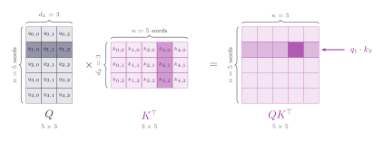
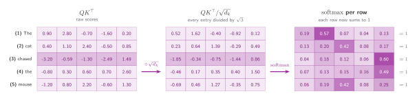
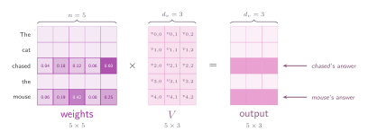

## Every query against every key

Lay the queries out as the rows of a matrix $Q$, then do the same with the keys to get $K$. A sentence of five words, each asking its own question, gives five queries and five keys, so twenty-five query-key pairs are waiting to be scored.

One matrix product computes all of them: ==$QK^{\top}$ is a five by five table whose entry in row $i$, column $j$ is exactly $q_i \cdot k_j$==. Every dot product of the last two chapters, done at once.

:::figure{#matrix_shapes}

Every row of $Q$ meets every column of $K^{\top}$ and produces one entry of the result.
:::

Up to now there has been exactly one query, written by hand: _what did the cat chase?_ From here every word carries its own.

So what is a word asking? Nothing that could be written down as a sentence. A query is a vector, not English, and nobody hands the model a list of questions; it learns whatever directions happen to help. What can be described is how a query behaves. Take word **(3)** _chased_. It is a verb missing its object, and a query that scores highly against _mouse_ behaves like the question this tutorial has been using all along. The hand-written query was standing in for word 3 the whole time. The difference now is that the other four words get one too.

In the figure above:

1. **Query** — a row of $Q$. Row $i$ is the question word $i$ is asking.
2. **Key** — a column of $K^{\top}$, the same thing as a row of $K$. Column $j$ is the label word $j$ wears so it can be found.
3. **Score** — an entry of $QK^{\top}$. Row $i$, column $j$ is how well word $i$'s query matches word $j$'s key.

That explains the shading. The single dark cell is one score, $q_1 \cdot k_3$: the query of the second word against the key of the fourth, one dot product of the kind the last two chapters were spent on. The shaded row it sits in is all five scores for that one query, its match against every word in the sentence including itself. That row is the list of five numbers the similarity chapter ended with, and every other row is the same list for a different word.

Now apply the scaling. Divide the whole matrix by $\sqrt{d_k}$ and run softmax along each row separately, so every row sums to one on its own. Word 2 ends up with its own distribution of attention over the five words, word 3 gets its own, and the matrix as a whole sums to nothing in particular.

:::figure{#attention_pipeline}

Dividing by $\sqrt{d_k}$ changes every entry by the same factor and changes no ordering. The softmax then runs along each row on its own, which is why every row of the last table sums to 1 while the table as a whole sums to 5. Row **(3)** carries the same weights 0.04, 0.18, 0.12, 0.06 and 0.60 used since the first chapter.
:::

The final matrix is a complete set of weights: five rows, each a distribution over the five words. But weights are not an answer. Nothing in that table carries information about the words themselves. It says only how much of each to use, and supplying the content is the job of the values.

## The values matrix

Every word hands over a value vector just as it hands over a key, and stacking those as rows gives $V$, one row per word. Multiplying the weights by $V$ is the last step, and the one that finally produces something worth reading: row $i$ of the result is word $i$'s answer, all five value vectors mixed in the proportions its own row of weights asks for. That is the soft lookup from the dictionary chapter, run five times over, once per word.

:::figure{#values_product}

Here one row multiplies the whole matrix $V$ rather than a single column, and produces a whole row of the output. _chased_ puts 0.60 of its weight on _mouse_, so its answer leans heavily on that one value, while _mouse_ spreads 0.42 onto _chased_ and blends more evenly.
:::

Every row of the weights answers one question: when this word builds its new representation, how much of each other word should it pull in?

So the 0.60 where _chased_ meets _mouse_ says that most of _chased_'s answer is made out of _mouse_'s value. Influence has an exact meaning inside this mechanism: the fraction of one word's output vector that came from another word's value. A verb is incomplete without its object, so after this step the representation of _chased_ is no longer _chased_ in the abstract. It is closer to _chased a mouse_.

## The whole mechanism on one line

Everything from the last three chapters fits on one line:

$$
\operatorname{Attention}(Q, K, V) = \operatorname{softmax}\!\left(\frac{QK^{\top}}{\sqrt{d_k}}\right) V
$$

Read it from the inside out and nothing in it is new. $QK^{\top}$ scores every query against every key. Dividing by $\sqrt{d_k}$ keeps those scores in a range the softmax can work with. The softmax turns each row into weights that sum to one. Multiplying by $V$ blends the values in those proportions.

One thing the formula does not say, and it is the question that has been waiting since the dictionary chapter: where do $Q$, $K$ and $V$ come from? They are made from the sentence itself, by three matrices the model learns during training. That is the next chapter.
