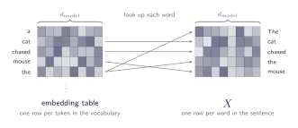
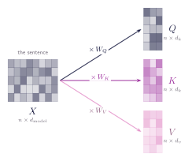
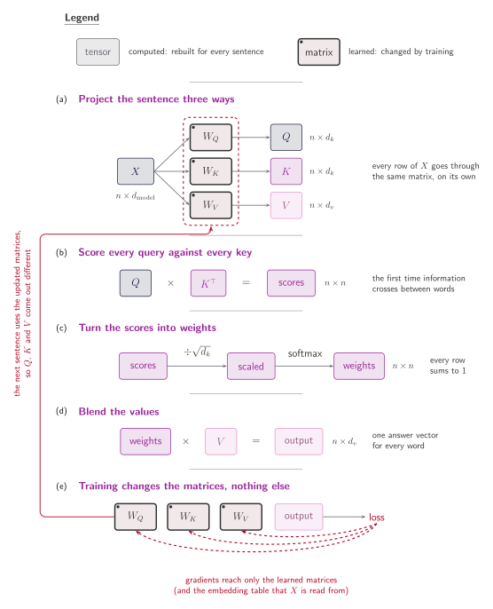

## What a word looks like to the model

Five chapters of vectors, and nothing has said where they come from. To the model a word is a row of numbers it learns to understand. Every word in the vocabulary gets its own vector of length $d_{\text{model}}$, called an embedding. The numbers start as random guesses and are adjusted during training along with everything else.

Stack the embeddings of the five words as rows and the result is the sentence matrix $X$.

:::figure{#embedding_lookup}


Building $X$ is a lookup: each word fetches its row from the table. _the_ is fetched twice and both copies are identical, so at this point the model has no way of telling the two apart. The values in each row are learned, not designed.
:::

So $X$ has $n$ rows and $d_{\text{model}}$ columns: one row per word, one column per dimension. How embeddings are trained, how text is split into tokens, why a learned vector beats a one-hot column — all of that is a subject of its own. From here, $X$ is the sentence written as numbers.

## Where Q, K and V come from

Each of the three matrices every formula so far has taken for granted is made by multiplying $X$ by its own weight matrix:

$$
Q = XW_Q, \qquad K = XW_K, \qquad V = XW_V
$$

==That is where the _self_ in self-attention comes from: the queries, the keys and the values are all built out of the same sequence.==

$W_Q$, $W_K$ and $W_V$ are parameters of the model, like the embeddings: random at first, adjusted by training. They do not depend on the sentence. The same three matrices serve every sentence the model ever sees, and only $X$ changes.

The shapes follow from what each one has to do:

1. $X$ is $n \times d_{\text{model}}$, one row per word.
2. $W_Q$ and $W_K$ are $d_{\text{model}} \times d_k$, so $Q$ and $K$ come out $n \times d_k$.
3. $W_V$ is $d_{\text{model}} \times d_v$, so $V$ comes out $n \times d_v$.

$W_Q$ and $W_K$ must produce the same width, because $QK^{\top}$ only exists if queries and keys are the same length. That constraint first appeared when two vectors needed matching lengths to have a dot product at all. This is where it is enforced.

:::figure{#learned_projections}


All three outputs keep the same five rows, one per word, and all three are narrower than $X$. The projections change the width from $d_{\text{model}}$ down to $d_k$ or $d_v$. Nothing here mixes one word with another; the arrows only change what each row is made of.
:::

The projections are row-wise. Row $i$ of $Q$ is row $i$ of $X$ times $W_Q$, so word $i$'s query is built from word $i$'s embedding and nothing else. The same matrix is applied to every word, and no word's projection looks at any other. All the mixing happens later, in $QK^{\top}$.

## Three matrices, and what training changes

The whole mechanism fits on one page, with one thing marked that no earlier figure has shown: which parts are learned and which are recomputed at every step.

:::figure{#attention_breakdown}


Regular boxes are tensors, rebuilt from scratch for every sentence. Thick outlines with a dot are the learned matrices, which persist and change only during training. $Q$, $K$ and $V$ are not parameters, they are results. What the model owns is $W_Q$, $W_K$ and $W_V$, and the arrow up the left-hand side closes the loop: the updated matrices are the ones the next sentence is projected with.
:::

The dictionary chapter said a key and a value are allowed to be different things, without much reason to care. Here is the reason. $W_Q$, $W_K$ and $W_V$ are separate parameters, so the model can learn one projection that makes a word easy to find and a different one for what that word hands over. Share a single matrix and the two collapse into the same information.

There is a sharper argument. Suppose $W_Q = W_K = W$. Then $Q$ and $K$ are both $XW$, and the score matrix

$$
QK^{\top} = (XW)(XW)^{\top}
$$

is symmetric: entry $(i,j)$ equals entry $(j,i)$, always. Sharing the matrix would force how much _chased_ attends to _mouse_ to be exactly how much _mouse_ attends to _chased_, for every sentence, at every point in training, with no way out. Language is not built that way. A verb needs its object far more than the object needs the verb, and a pronoun needs its antecedent far more than the antecedent needs the pronoun.

## The questions being asked

The projections also change the width. $X$ arrives $d_{\text{model}}$ wide and the queries and keys leave $d_k$ wide, usually with $d_{\text{model}} > d_k$. Those sizes are chosen, not learned: $d_k$ and $d_v$ are fixed when the model is designed, and training fills matrices of that size with whatever numbers turn out to work.

Which raises the question this chapter is named after. If the sizes are chosen and training chooses the contents, what does a word end up asking? A query is a vector, and $W_Q$ is the thing that turns a word into a question, so the question is whatever direction $W_Q$ happens to send that word's embedding in, after a great deal of training. It is not designed at all.

Take _The cat chased the mouse._ Something has to work out that the thing doing the chasing is the cat and the thing being chased is the mouse, rather than the reverse. Nobody writes that rule down. The query belonging to _chased_ is whatever $W_Q$ produces from its embedding, and if scoring highly against _cat_'s key helps the model predict better, gradient descent nudges $W_Q$ until it does. The rule is never stated anywhere; it is the residue of many small corrections.

## Seeing it run

The four steps of the breakdown are four lines of a function.

```python
def attention(X, W_q, W_k, W_v):
    """One head of self-attention. Returns the output and the weights."""
    Q, K, V = X @ W_q, X @ W_k, X @ W_v        # project the same X three ways
    scores = Q @ K.transpose(-2, -1)           # every query against every key
    d_k = Q.shape[-1]
    weights = torch.softmax(scores / d_k**0.5, dim=-1)   # scale, then rows
    return weights @ V, weights                # blend the values
```

The interesting experiment is a task that can only be solved by looking something up, given to a single head that is never told how. Each training example is a tiny store: four entries, each a pair of small integers, a tag and a value; one query tag; and a loss that mentions only the final answer. The store is different in every example, so nothing can be memorised.

The detail that matters is how an entry reaches the model. Each entry is a single token whose embedding is the tag's embedding plus the value's embedding, added together. The query is a token holding only a tag embedding. Nothing marks which part of a token is a tag and which is a value. For the task to be solved, $W_K$ has to learn to read the tag half so that keys are things a tag can match, while $W_V$ has to learn to read the value half so that what gets blended is the answer rather than the label. ==The split between keys and values is not built in. It has to be discovered.==

Watching one fixed example during training, with the store `tags [0, 2, 1, 3]`, `values [3, 5, 5, 1]` and the query tag 2, so the answer lives in entry 1:

| step |  loss |  acc |  e0 |  e1 |  e2 |  e3 |
| ---: | ----: | ---: | --: | --: | --: | --: |
|    0 | 1.800 | 0.20 | .29 | .25 | .20 | .09 |
|   25 | 1.047 | 0.80 | .00 | .73 | .00 | .00 |
|  100 | 0.002 | 1.00 | .00 | .95 | .00 | .00 |
|  400 | 0.000 | 1.00 | .00 | .98 | .00 | .00 |

At step 0 the attention is close to uniform: the head has no idea where to look, which is what random $W_Q$ and $W_K$ buy. By step 25 it puts 0.73 on entry 1, and by the end 0.98, with accuracy at 100 per cent. It has become a dictionary, and nobody told it how.

One head asks one question per word. The next chapter runs several at once, so that different heads can ask different things about the same sentence.
