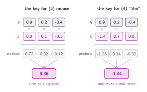
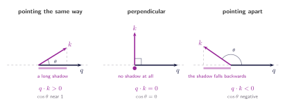
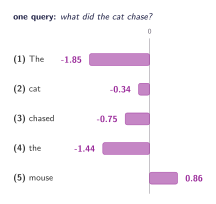

## Two vectors in, one number out

Here is the entire requirement. Two vectors go in, one number comes out, and that number says how alike the two are. One operation already does it: multiply the two vectors element by element and add up the results. That is the dot product.

Before any numbers, be clear about which two vectors these are. The query $q$ is the request itself, the numeric form of _what did the cat chase?_ The key $k$ belongs to one word, and it is whatever makes that word findable. There is one query and one key per word, so ==this multiply-and-add happens once for every word in the sentence, giving each word its own score==. Where the vectors come from is a later chapter; for now, assume someone hands them over.

:::figure{#dot_product_steps}

The dot product, twice, with the same query against two different keys. Multiply position by position, add the products, and one number comes out.
:::

Written out, for vectors of $d$ entries:

$$
q \cdot k = \sum_{i=1}^{d} q_i k_i
$$

Both vectors have to be the same length for the sum to mean anything, which is why every query and every key in a model share one dimension.

## Why that number means similarity

Nothing written down so far says why that sum should have anything to do with similarity. For all the formula reveals, it could be an arbitrary rule that happens to produce different numbers for different inputs.

It is not arbitrary, and a second way of writing the dot product shows why:

$$
q \cdot k = \lVert q \rVert \, \lVert k \rVert \cos\theta
$$

Here $\lVert q \rVert$ and $\lVert k \rVert$ are the lengths of the two vectors and $\theta$ is the angle between them. Same number as before, computed a completely different way, and now the geometry is visible.

The two forms are the same quantity, so nothing has been added — only made visible. The first says how to compute a score, the second says what the score is about: the length of each vector, which the model controls, and the angle between them, which is the part carrying the meaning.

Everything follows from the $\cos\theta$. Two vectors pointing the same way have $\theta = 0$ and $\cos\theta = 1$, the largest it ever gets. Turn one until they sit perpendicular and $\cos\theta = 0$, so the dot product vanishes no matter how long the vectors are. Keep turning until they point in opposite directions and $\cos\theta = -1$, which is where negative scores come from.

:::figure{#dot_product_geometry}

The dot product is the length of the key's shadow on the query, times the length of the query. Drop the key straight down and that shadow is $\lVert k \rVert \cos\theta$. Turn the key past a right angle and the shadow falls the other way, which is what a negative score means.
:::

## One query, five scores

A negative score is worth pausing on, because it is not the same as no match. Zero says the key has nothing to do with the query, perpendicular, no shadow at all. Negative says the key points the other way: it is evidence against, and it will matter once these numbers are turned into weights.

So far the query has met two keys, one at a time. The model does not work that way. It takes the one query and runs the same dot product against every key in the sentence, so five words give five numbers, one per word. That list is what the model is after: which word scores highest, and which lowest.

Those five numbers are not yet weights. They do not add up to anything in particular. Some are negative, and nothing stops one of them reaching 12 or 24 while the others sit near zero. Five values cannot be blended in proportion to a list like that, because _in proportion to_ has no meaning until the numbers are positive and sum to one.

:::figure{#five_scores}

One number per word, drawn either side of zero. The ordering is already right, with _mouse_ on top, so the dot product has done its job. But four of the five are negative and together they come to $-3.52$, which is not a quantity anything can be shared out in proportion to.
:::

A second problem hides in the size of these numbers. The vectors here hold three entries each, so a score is a sum of three products and stays small. Real models use 64 or more, and a sum of 64 products is a far bigger number than a sum of three. ==The scores grow with the dimension purely because there are more terms in the sum==, and that causes trouble the moment they are turned into weights. The next chapter does the turning, and deals with both problems at once.
