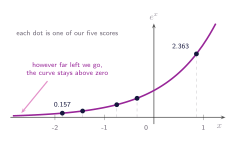
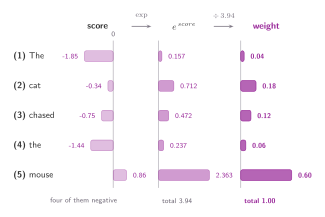
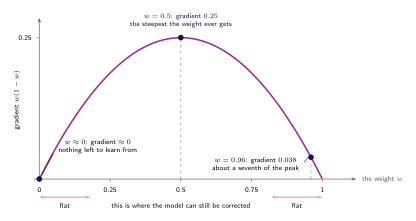

## What a weight has to be

The last chapter ended holding five numbers and a complaint that they were not weights. So what would make them weights? A short wish list. They should be positive. They should add up to one, so that _in proportion to_ means something. And the order should survive: the word that scored highest should still end up with the biggest weight. Anything that manages those three things will do.

## Softmax

The operation that does all three is the softmax, and it has two steps. Raise $e$ to the power of each score, then divide each result by the total of all of them.

$$
\operatorname{softmax}(s)_i = \frac{e^{s_i}}{\sum_{j=1}^{n} e^{s_j}}
$$

The first step is what makes everything positive. $e^{x}$ is positive for every $x$: it never reaches zero and never crosses below it, so nothing had to be clipped and no absolute value was taken.

:::figure{#exponential_positive}

Going left the curve gets closer and closer to the axis without ever arriving, so even a very negative score comes back as a small positive number rather than as zero or as something below it.
:::

Once everything is positive, dividing by the total makes the numbers sum to one. The ordering survives both steps, because $e^{x}$ is increasing, so a bigger score always gives a bigger exponential, and dividing every one of them by the same total cannot reorder them.

:::figure{#softmax_bars}

Exponentiating lifts every bar above zero without changing which is longest, and dividing by the total, 3.94, turns lengths into shares. The weights on the right are the ones in use since the first figure of this tutorial.
:::

## Analysing the spread

Softmax is shift-invariant:

$$
\operatorname{softmax}(s + c) = \operatorname{softmax}(s)
$$

for any constant $c$ added to every score. It follows in one line from the definition, since $e^{c}$ appears once in the numerator and in every term of the denominator, and cancels. ==Softmax never sees the scores themselves, only the differences between them.==

It is not invariant to scaling. Replacing $s$ by $\alpha s$ multiplies every gap by $\alpha$, and that matters because the scale of the scores is not a setting anyone picks. A score is a sum of $d$ products, so wider vectors mean larger scores. The scale drifts as the dimension changes, and because softmax reacts to the size of the gaps, the dimension quietly decides how focused the attention is.

Easier to see than to describe. Take the same five scores, multiply every one by a quarter and then by 3, and run softmax on each. The ordering never moves — _mouse_ stays on top in all three — but the shape of the answer changes completely.

| word       |  × ¼ | as they are |  × 3 |
| ---------- | ---: | ----------: | ---: |
| (1) The    | 0.15 |        0.04 | 0.00 |
| (2) cat    | 0.21 |        0.18 | 0.03 |
| (3) chased | 0.19 |        0.12 | 0.01 |
| (4) the    | 0.16 |        0.06 | 0.00 |
| (5) mouse  | 0.29 |        0.60 | 0.96 |

Consider what the two extremes are. Squashed, every word gets roughly a fifth of the attention, so the answer is a blend of all five values with _mouse_ barely favoured and almost nothing has been selected. Stretched, _mouse_ takes 0.96 and everything else rounds away, which is the exact-match lookup discarded two chapters ago, arrived at by accident. Neither end is any use, and neither was chosen. The dimension chose.

The stretched end costs something specific. The exact match was rejected because it gave no slope, and a nearly one-hot softmax has the same problem in milder form.

:::figure{#gradient_vanishes}

How much gradient a weight has left, plotted against the weight itself. The middle of the range is where the model can still be corrected; both ends are flat.
:::

The derivative of a weight with respect to its own score is $w(1 - w)$, largest around $w = 0.5$ and collapsing as $w$ approaches 0 or 1. At $w = 0.5$ the curve sits at its peak of 0.25; at 0.96 it has already fallen to 0.038, and near 0.00 there is barely any gradient left, so the model can hardly learn that it attended to the wrong word. Sharpening does not only narrow the answer, it makes the mistake hard to correct.

:::aside[Where $w(1-w)$ comes from]
Name the denominator $Z = \sum_j e^{s_j}$, so $w_i = e^{s_i} / Z$. Differentiating $Z$ with respect to one score $s_i$ leaves a single surviving term, $\partial Z / \partial s_i = e^{s_i}$, because every other term is a constant here. The quotient rule then gives

$$
\frac{\partial w_i}{\partial s_i} = \frac{e^{s_i} Z - e^{s_i} e^{s_i}}{Z^{2}} = w_i\,(1 - w_i)
$$

For a different word's score the numerator carries no $s_j$, only the $Z^{-1}$ moves, and

$$
\frac{\partial w_i}{\partial s_j} = -\frac{e^{s_i} e^{s_j}}{Z^{2}} = -w_i w_j \qquad (j \neq i)
$$

Raising one word's score pushes every other word's weight down, which is how the five weights keep summing to one. Both cases are one expression, $\partial w_i / \partial s_j = w_i(\delta_{ij} - w_j)$, and collecting every $i, j$ gives the Jacobian: the table that carries a correction back from the weights to the scores. Every entry is a product of weights, so a distribution like $(0.00, 0.03, 0.01, 0.00, 0.96)$ collapses the whole table and the correction arrives to find nothing that moves.
:::

## Dividing by the square root of the dimension

If the scores grow as the vectors get longer, shrink them by the same amount before the softmax ever sees them. The only question is how much, and the answer is $\sqrt{d_k}$, the square root of the number of entries in each key.

A score is a sum of $d_k$ products, one per position. Suppose the components are roughly independent, centred on zero, with a spread of about 1. Each product is then a number of typical size 1, and adding $d_k$ independent quantities adds their variances: total variance $d_k$, typical spread $\sqrt{d_k}$. A 64-dimensional model produces scores with spread around 8, and a spread of 8 is exactly the right-hand column of the table above. Dividing by $\sqrt{d_k}$ returns the spread to about 1 whatever the dimension.

$$
\text{weights} = \operatorname{softmax}\!\left(\frac{q \cdot k}{\sqrt{d_k}}\right)
$$

Scaling a random variable by $C$ multiplies its variance by $C^{2}$, so bringing a variance of $d_k$ back to 1 needs $C^{2} d_k = 1$, giving $C = 1/\sqrt{d_k}$. Squared, that is $1/d_k$, which cancels the growth exactly.

:::note[What the scaling does not promise]
The assumption of independent, well-behaved components holds at initialisation. Nothing forces a trained model to keep its queries and keys that tidy. $\sqrt{d_k}$ is a sensibly chosen constant that puts the scores in a workable range, not a guarantee that they stay there.
:::

That leaves things much better placed. Sharpness no longer depends on how wide the model happens to be, so a 64-dimensional model and a 512-dimensional one begin equally focused rather than one of them starting out saturated. And a model that wants sharper attention can still have it, by learning to produce larger queries and keys.

What has not been scaled up is the other direction. Everything so far is one query against five keys, worked one dot product at a time. A real model runs every position's query against every key, all at once. The next chapter is that.
