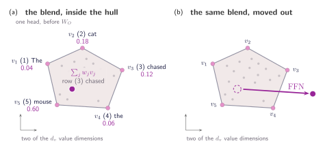
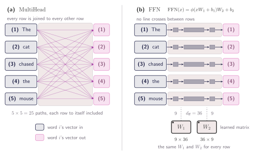
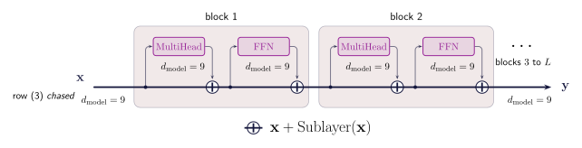
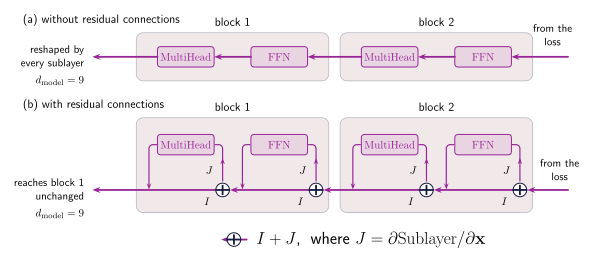
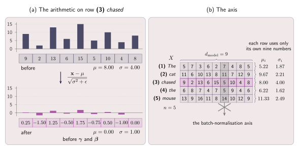
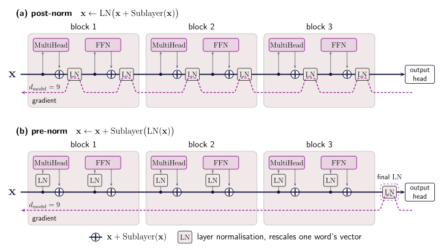
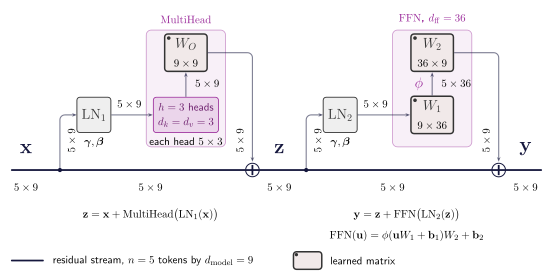

## Two rounds of attention collapse into one

Everything asked for at the start is built. The sentence arrives as $X$ with its positions folded in, each head turns it into $Q$, $K$ and $V$, the mask settles which positions a query may read, and $W_O$ folds the heads back into one vector per word. _chased_ leaves holding 0.60 of _mouse_, 0.18 of _cat_, and a little of the rest.

The masking chapter set the model a task: read _The cat chased the_ and give the word that follows. Answering _mouse_ means using two facts that now sit in the same vector — the subject is a cat, the verb is chased. Attention put both there by averaging, and averaging is not deriving a third fact from two. ==Gathering information and computing with it are different operations, and the model so far does only the first.==

Why not simply run attention again? Its output has the shape of its input, so it can be fed straight back in. Follow a single head and write the weight table as $A$, so one round is

$$
\operatorname{Attention}(X) = A\,V = A\,X\,W_V
$$

where $A$ mixes the rows and $W_V$ reshapes each row on its own. Freeze the weights for a moment and put two rounds one after the other:

$$
A_2\!\left(A_1 X W_V^{(1)}\right) W_V^{(2)} = (A_2 A_1)\, X \,(W_V^{(1)} W_V^{(2)})
$$

$A_2 A_1$ is one $n \times n$ table and $W_V^{(1)} W_V^{(2)}$ is one projection, so two rounds have the form of one. In a real stack $A_2$ is computed from what the first round produced, so the two are not literally identical — but that dependence lives in the proportions of the blend, never in the vectors being blended. Every value crosses the mechanism without passing through a nonlinear function. The softmax decides how much of each word to take, never what any word is.

Geometrically: every row of $A$ is positive and sums to one, so a head's answer is an average of the value vectors, and a head can move a word anywhere inside the region those vectors span and nowhere else.

:::figure{#blend_stays_inside}


A softmax row is positive and sums to one, so one head's answer is always a blend of the value vectors and can never leave the region they span. The feed-forward network is what lets a position land somewhere new.
:::

## Give every word its own network

Attention has already done all the sideways looking, and it is the only part of the model that needs to. So whatever comes next should read one word's vector and nothing else. That step is two matrix multiplications with a function in between:

$$
\operatorname{FFN}(\mathbf{x}) = \phi(\mathbf{x}W_1 + \mathbf{b}_1)W_2 + \mathbf{b}_2
$$

$W_1$ is $d_{\text{model}} \times d_{\text{ff}}$ and $W_2$ is $d_{\text{ff}} \times d_{\text{model}}$, so the vector widens and comes back. The usual choice is $d_{\text{ff}} = 4\,d_{\text{model}}$, which is 36 for the nine-wide example here. $\phi$ is applied to each number on its own, most often ReLU, which replaces negatives with zero.

That makes each column of $W_1$ a small test. It compresses the word's vector to one number, and ReLU zeroes it unless a specific combination of features is present — something carrying both a _cat_ and a _chase_ direction, say. $W_2$ takes whichever tests fired and writes their conclusions back into the vector. Widening to $d_{\text{ff}}$ is room to run thousands of tests at once; narrowing back is packaging the result so the rest of the model can read it.

:::figure{#mix_then_think}


The two sublayers have complementary jobs. Attention is the only place positions talk to each other; the feed-forward network is the only place a position is transformed. A block is one of each.
:::

## Adding instead of replacing

The natural move is to repeat the pair: attention, feed-forward, attention again, as many times as the budget allows. Stacking that way has a cost. Each sublayer hands back a different vector than it was given, so a dozen blocks in a row means the word has been overwritten a dozen times, and anything about it still needed has to be rebuilt at every step.

The fix is to add rather than replace:

$$
\mathbf{x} \leftarrow \mathbf{x} + \operatorname{Sublayer}(\mathbf{x})
$$

or, over the whole sentence, $Z = X + \operatorname{MultiHead}(X)$ and then $Y = Z + \operatorname{FFN}(Z)$. All three matrices are $n \times d_{\text{model}}$, so both additions line up row by row. This is a **residual connection**. Nothing is thrown away: the vector that arrived is still in the sum, and a sublayer with nothing useful to add can return values near zero and let the vector through unchanged.

:::figure{#residual_stream}


The sublayers sit off the main stream rather than blocking it: each takes a copy, does its work, and adds the result back. The stream is a running total that is never overwritten, and because the result must be added to it, every sublayer has to return the width it was given.
:::

The second advantage shows up only during training. A correction travels backward from the loss to every earlier block, and in a plain stack it is reshaped by every sublayer on the way. With the addition, the derivative of $\mathbf{x} + \operatorname{Sublayer}(\mathbf{x})$ is $I + \partial \operatorname{Sublayer} / \partial \mathbf{x}$. That $I$ is an express lane straight past the sublayer's arithmetic.

:::aside[Where the identity comes from]
Write the step one component at a time, $y_i = x_i + f_i(x_1, \ldots, x_d)$, and differentiate against $x_j$. The second term is the sublayer's own Jacobian. The first is $\partial x_i / \partial x_j$, which is 1 when $i = j$ and 0 otherwise, because two components of the input are free to move independently. Ones down the diagonal is the identity, so $\partial \mathbf{y} / \partial \mathbf{x} = I + J$.

A correction $\mathbf{g}$ arriving at the output becomes $\mathbf{g}(I + J) = \mathbf{g} + \mathbf{g}J$: one copy untouched, one through the sublayer. Over $L$ blocks the product $(I + J_L)\cdots(I + J_1)$ expands into every way of picking $I$ or $J_\ell$ from each bracket, and one of those terms picks $I$ every time. ==The correction reaching the first block always contains an exact copy of the one that left the loss==, whatever the $J_\ell$ are doing. Without the residual the product is $J_L \cdots J_1$, which shrinks to nothing or grows without bound.
:::

:::figure{#gradient_path}


Without the additions a correction can only reach block 1 by passing through everything in between. With them it always has a route that passes through nothing at all.
:::

## Keeping the numbers in range

The stream solves one problem and creates another. Crossing $L$ blocks, the vector accumulates $2L$ contributions, so its numbers tend to grow with depth. Queries and keys are built from that stream, $\mathbf{q} = \mathbf{x}W_Q$ and $\mathbf{k} = \mathbf{x}W_K$, so if $\mathbf{x}$ doubles then both double and the score quadruples. Stretched gaps are exactly what took _mouse_ from 0.60 to 0.96 with everything else rounding away, and $w(1-w)$ collapses with it. Dividing by $\sqrt{d_k}$ does not help: it answers growth from the dimension, not growth from depth.

So put the numbers back in range before a sublayer reads them. Take one word's vector, compute the mean of its components and their spread, subtract the mean and divide by the spread:

$$
\mu = \frac{1}{d}\sum_{j=1}^{d} x_j, \quad \sigma^{2} = \frac{1}{d}\sum_{j=1}^{d}(x_j - \mu)^{2}, \quad \operatorname{LN}(\mathbf{x}) = \frac{\mathbf{x} - \mu}{\sqrt{\sigma^{2} + \epsilon}} \odot \boldsymbol{\gamma} + \boldsymbol{\beta}
$$

$\epsilon$ guards against a division by zero when every component is identical. $\boldsymbol{\gamma}$ and $\boldsymbol{\beta}$ are learned vectors of width $d_{\text{model}}$, applied element-wise, so the model is not pinned to zero mean and unit variance — it can learn its own scale and shift, independent of how much depth has accumulated.

One detail carries the whole idea: every sum runs over the features of a single word, $j = 1$ to $d_{\text{model}}$. Not over the words in the sentence, not over the batch. _chased_ is normalised from its own nine numbers and would come out identical if the rest of the batch were thrown away.

That matters because the common alternative, batch normalisation, takes its statistics across the examples in the batch, which breaks here three times over. Sentences are padded, so statistics at a late position would be computed partly over `[PAD]` slots. Sentences differ in length, so how many real words reach a position depends on what else is in the batch. And at generation time there is a single sequence and no batch at all.

:::figure{#layernorm_rows}


Layer normalisation reads nine numbers and writes nine numbers, never once looking at a different row. Whatever scale a word arrives at, it leaves at the same one as every other word.
:::

Where the norm goes is a second decision. The original Transformer normalised the sum, $\mathbf{x} \leftarrow \operatorname{LN}(\mathbf{x} + \operatorname{Sublayer}(\mathbf{x}))$, which is **post-norm**. Almost everything since normalises only the copy the sublayer reads, $\mathbf{x} \leftarrow \mathbf{x} + \operatorname{Sublayer}(\operatorname{LN}(\mathbf{x}))$, which is **pre-norm**. The two differ by one box moved, and that box decides how the gradient flows: in post-norm the norm sits on the stream and rescales every correction travelling back; in pre-norm the stream is untouched. The price is one extra $\operatorname{LN}$ at the very end, since the stream now reaches the output unnormalised.

:::figure{#prenorm_postnorm}


One box moved off the main line. That is the whole difference, and it is what keeps the unbroken path of the previous figures alive through a deep stack.
:::

## The block

Attention to move information between words, a feed-forward network to compute with it, an addition so neither overwrites what came before, a normalisation so the numbers stay in range. A **transformer block** is those four things:

$$
\mathbf{z} = \mathbf{x} + \operatorname{MultiHead}\bigl(\operatorname{LN}_1(\mathbf{x})\bigr), \qquad \mathbf{y} = \mathbf{z} + \operatorname{FFN}\bigl(\operatorname{LN}_2(\mathbf{z})\bigr)
$$

Two sublayers, two norms, two additions. The norms are separate, each with its own $\boldsymbol{\gamma}$ and $\boldsymbol{\beta}$, which is why they carry different subscripts. All of $\mathbf{x}$, $\mathbf{z}$ and $\mathbf{y}$ are $n \times d_{\text{model}}$, so a block hands back exactly what it was given: five words in, five words out, nine numbers each.

:::figure{#transformer_block}


The block in full: two sublayers, two norms, two additions, and a width that never changes. This is the residual stream with the norms placed where the previous figure said to put them.
:::

```python
def layer_norm(X, gamma, beta, eps=1e-5):
    """Statistics from the last axis alone, so every position is on its own."""
    mu = X.mean(dim=-1, keepdim=True)
    var = X.var(dim=-1, unbiased=False, keepdim=True)
    return (X - mu) / torch.sqrt(var + eps) * gamma + beta

def block(X, attn, ffn, ln_1, ln_2, mask=None):
    """One pre-norm block. X is (n, d_model), and so is the result."""
    Z = X + multi_head_attention(layer_norm(X, *ln_1), *attn, mask)
    return Z + feed_forward(layer_norm(Z, *ln_2), *ffn)
```

Each claim above is a line of that function. The sublayer reads `layer_norm(X, ...)` and never the stream, so the norm sits on the branch. What it returns is added rather than substituted. And the result is shaped like `X`, which is what lets the last line of one block be the first argument of the next.

Counting parameters for the nine-wide example: attention holds $W_Q$, $W_K$, $W_V$ and $W_O$, which across all $h$ heads come to $4d_{\text{model}}^{2}$ weights, or 324. The feed-forward holds $W_1$ and $W_2$, which at $d_{\text{ff}} = 4d_{\text{model}}$ come to $8d_{\text{model}}^{2}$, or 648. Two thirds of a block is the part that does not look sideways at all.

Stacking these is the next chapter, along with the two pieces still missing between a stack of blocks and a word.
