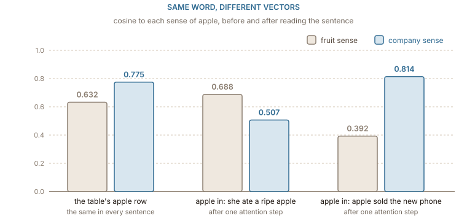

## Let the sentence choose the vector

[The previous chapter](../limits/) ended with three problems that share a cause: the vector for a word is decided once, at training time, and every sentence gets the same one. The fix is to change what an embedding is. Instead of a row looked up by the word alone, make it the output of a function that reads the whole sentence and returns one vector per position.

A static table is a function of one argument: $e(\textit{apple})$. A **contextual embedding** is a function of two, the sentence and the position in it: $e(\textit{she ate a ripe apple},\ 5)$. The same word at the same position in a different sentence can come out as a different vector, and that is the point. The table does not disappear. It becomes the first step of the function: the thing the function starts from before it has read anything.

What the function has to do can be stated with the running example. _apple_ in _she ate a ripe apple_ should come out nearer the fruit than the stored row does, and _apple_ in _apple sold the new phone_ nearer the company. Nothing else about the word has changed; only its neighbours have.

## ELMo reads the sentence in both directions

The first widely used contextual embeddings came from [ELMo](https://arxiv.org/abs/1802.05365), in 2018. Its idea was to borrow the vectors from a language model. A language model reads text left to right and predicts the next word; to do that well, its internal state at each position has to summarise everything before it. ELMo trained two such models, one reading forwards and one reading backwards, each built from recurrent layers (LSTMs) stacked two deep, and fed its input through character-level convolutions, so that, like fastText in [the vocabulary chapter](../subwords/), it had a vector for any string.

The representation of a word at a position is a combination of every layer's state there, forward and backward concatenated. The combination weights are not fixed: each downstream task learns its own mix. Lower layers turned out to carry more about syntax, such as part of speech, and higher layers more about meaning in context, so a task like word-sense disambiguation leaned on the top.

ELMo was used as a drop-in replacement for static vectors: take an existing model for question answering or sentiment, swap its word2vec input for ELMo's output, and retrain. That swap improved every task the paper tried. The limitation was the recurrence. Each direction reads one word at a time, so information from ten words away has to survive ten steps of an LSTM, and the two directions only meet at the end, when their states are concatenated.

## The table becomes layer 0

The transformer encoder removes both limitations. Every position looks at every other position in one step, in both directions at once, through self-attention. [The attention tutorial](../../attention/self_attention/) builds that mechanism from scratch; here only its effect on the embedding matters.

A transformer encoder such as [BERT](https://arxiv.org/abs/1810.04805) starts with the same kind of lookup as every chapter of this book. The text is split into WordPiece tokens, each token fetches its row from a table of 30,522 rows, and two more tables add a vector for each position, because attention on its own cannot tell word order, and one for which of two segments of the input the token belongs to. The result is one vector per token, identical for every occurrence of the token wherever it appears. That is **layer 0**, and it is a static embedding table in everything but name.

Then come the layers. BERT-base stacks 12 of them, each 768 numbers wide. In each layer every position scores every other position, takes a weighted average of their vectors, and adds it to its own, then passes the result through a small feed-forward network. After twelve rounds, the vector at the position of _apple_ has been rewritten twelve times by what the rest of the sentence contains. ==In a contextual model the embedding table is only the starting point; the embedding you use is whatever the layers have made of it==.

What the layers are trained to do is again a guessing game, as in [word2vec](../word2vec/). BERT hides 15% of the input tokens and has to predict them from what remains, so the vector at every position must carry enough about the whole sentence to fill in a blank. The difference from skip-gram is that the guess is made from the entire sentence at once, through all the layers, rather than from one word's row.

## Same word, different vectors

The effect is small enough to compute by hand on the fourteen sentences of the previous chapter, the running ten plus the four about the company. Take the table from that chapter as layer 0: each word's row of context counts, normalised to length 1. The _apple_ row is the average of the two senses, with cosine 0.632 with the fruit and 0.775 with the company.

Now apply one step of attention with no learned weights at all. For _apple_ in a sentence, score each of the other words by its dot product with _apple_'s row, turn the scores into weights with a softmax, and add the weighted average of their rows to _apple_'s own:

$$
\tilde{x}_{\textit{apple}} = x_{\textit{apple}} + \sum_{j \ne \textit{apple}} \operatorname{softmax}_j\!\left(x_{\textit{apple}} \cdot x_j\right) x_j
$$

The sum runs over the other content words of the sentence, and the first term keeps the original row, the residual connection every transformer layer has. In _she ate a ripe apple_ the other words are _ate_ and _ripe_, with scores 0.183 and 0.335 and weights 0.462 and 0.538. In _apple sold the new phone_ they are _sold_, _new_ and _phone_, with weights 0.344, 0.328 and 0.328.

:::figure{#contextual_apple}

One step of reading the sentence reverses the lean of the stored row when the sentence is about fruit, and strengthens it when the sentence is about phones. The table row is the same in both cases; only the neighbours differ.
:::

In the fruit sentence, _apple_ now has cosine 0.688 with the fruit and 0.507 with the company: the lean has reversed. In the company sentence it has 0.392 with the fruit and 0.814 with the company. The two contextual vectors for the same word have a cosine of 0.891 with each other. They are still recognisably the same word, and they are no longer the same vector.

Real models do this with learned projections, many heads and many layers, and the separation is far stronger. [Ethayarajh](https://arxiv.org/abs/1909.00512) measured it across BERT, ELMo and GPT-2: on average, less than 5% of the variation in a word's contextual vectors can be explained by a single static vector for that word, and the upper layers are the most context-specific. The same study found a side effect worth knowing about: contextual vectors from these models crowd into a narrow cone, so that even unrelated words have a high cosine with each other. A high raw cosine between two BERT vectors does not by itself mean they are similar, which is one reason the models of the next chapter are trained specifically to make cosine meaningful.

## A vector per token is not yet a vector per sentence

Contextual embeddings answer the question the static table could not: what does this word mean here. _apple_ next to _ripe_ and _apple_ next to _phone_ are now different vectors, antonyms can be separated by what the rest of the sentence says, and a rare word's vector is built from its pieces and then from its surroundings.

What comes out, though, is one vector per token. A search engine, a deduplication job or a question-answering system usually wants one vector for a whole sentence or document, so that a query and a passage can be compared with a single cosine. Averaging the token vectors of a model trained to fill in blanks turns out to give poor sentence vectors, for reasons connected to that narrow cone. [The last chapter](../reading_a_model/) is about the models built for that job: how they pool tokens into one vector, what they are trained on, and how to tell whether one is any good.
