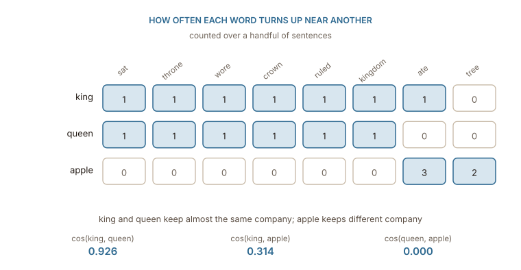

## Nobody has to define anything

The previous chapter established a clear requirement without providing the actual solution. Words need to share dimensions, and words that behave similarly need to adopt similar values within those dimensions. The missing piece is figuring out exactly what decides which words behave alike in the first place.

The answer comes directly from linguistics. Just look at where specific words naturally appear.

> The ___ sat on the golden throne.
>
> The ___ ruled the kingdom for years.
>
> An ___ fell on Isaac Newton's head.

Word like _king_ and _queen_ easily fit the first two blanks, while the third blank clearly points to _apple_, thanks to [the story of Newton and the falling apple](https://en.wikipedia.org/wiki/Isaac_Newton%27s_apple_tree). A reader probably does not need to consult a dictionary or a history book to figure out what belongs in each gap. The surrounding text provides all the necessary clues because words with specific meanings naturally appear in specific surroundings.

This concept is known as the **distributional hypothesis**. [Zellig Harris](https://www.aclweb.org/aclwiki/Distributional_Hypothesis) formalized this idea in 1954 by claiming that a difference in meaning directly corresponds to a difference in distribution. [J. R. Firth](https://en.wikipedia.org/wiki/John_Rupert_Firth) also captured that idea by stating that a word is known by the company it keeps. Neither of these linguists had access to a computer, they simply observed that context serves as a highly accurate proxy for meaning. As long as a system can measure that proxy, it can capture the underlying meaning.

This insight makes the entire problem solvable. True meaning is incredibly difficult to define and practically impossible to annotate at a massive scale. Context is entirely different in each situation. It sits in plain sight within every sentence ever written, and counting those occurrences is a task computers can handle perfectly.

## Counting the company

We can take this idea quite literally. The process involves picking a vocabulary, reading a massive pile of text, and counting how often other words appear near each target word. The definition of "near" usually means looking inside a window of a few words on either side. This window size is just a tunable parameter rather than an absolute rule.

A handful of sentences is enough to see the shape of the result. Count over these ten, ignoring the most common function words:

```python
corpus = [
    "the king sat on the golden throne",
    "the queen sat on the golden throne",
    "the king wore a heavy crown",
    "the queen wore a jewelled crown",
    "the king ruled the kingdom for years",
    "the queen ruled the kingdom wisely",
    "she ate a ripe apple",
    "he ate an apple from the tree",
    "the apple fell from the tree",
    "the king ate an apple",
]
```

Each word now has a row of counts, one column per context word. That row is a vector, and unlike a one-hot vector it was not assigned — it was measured.

:::figure{#cooccurrence}


The rows are the first embeddings in this book. They have shared columns, so two words can take similar values in the same place, which is exactly what one-hot ruled out.
:::

Now that every word is a row of numbers, comparing two words means comparing two rows. What is wanted out of that comparison is a single number saying how alike they are: high when two words keep the same company, low when they keep none of it, and somewhere in between when they overlap only partly. That number is a **similarity score**, and it is what turns the table above from a pile of counts into something that can answer a question. The scale runs from 0 to 1 here, where 1 means two rows agree completely about which contexts matter and 0 means they have no context in common at all.

These similarity scores use cosine instead of a standard straight-line distance. It helps to understand exactly why this specific math is necessary. Raw word counts mix two completely different signals together. They track which specific contexts a word appears in, but they also track how often the author used that word overall. A highly common word generates a row of massive numbers, while a rare word generates a row of very small numbers. Calculating a simple straight-line distance between them mostly just measures that massive gap in frequency rather than any difference in meaning.

Cosine fixes this problem by completely ignoring the overall magnitude of the numbers and comparing only the direction of the vectors. Two different words will score a perfect 1.0 as long as the relative shape of their rows matches, regardless of their absolute totals. This geometric trick is what allows words like _throne_ and _crown_ to act as solid evidence for _king_ regardless of how many times kings are actually mentioned in the text.

Written out, the score between two rows $a$ and $b$ is

$$
\cos(a, b) = \frac{\sum_i a_i b_i}{\sqrt{\sum_i a_i^{2}}\;\sqrt{\sum_i b_i^{2}}}
$$

The numerator multiplies the two rows column by column and adds the results, so a column only contributes when **both** words appear in that context. The denominator is the length of each row, and dividing by it is what removes the frequency signal: stretch either row by any factor and the numerator and the denominator grow by the same factor, leaving the score unchanged.

Work it through for _king_ $=(1,1,1,1,1,1,1,0)$ and _queen_ $=(1,1,1,1,1,1,0,0)$. Six columns hold a 1 in both rows and contribute $1 \times 1$ each, while the last two contribute nothing, so the numerator is 6. The lengths are $\sqrt{7}$ and $\sqrt{6}$, because _king_ has seven non-zero counts and _queen_ has six. That gives

$$
\cos(\textit{king}, \textit{queen}) = \frac{6}{\sqrt{7}\,\sqrt{6}} = \frac{6}{\sqrt{42}} = 0.926
$$

The same arithmetic on _king_ and _apple_ has a single column in common, _ate_, where the counts are 1 and 3, so the numerator is 3 and the score is $3 / (\sqrt{7}\sqrt{13}) = 0.314$. For _queen_ and _apple_ no column holds a non-zero count in both rows, the numerator is 0, and the score is 0 whatever the lengths are.

The numbers say what the sentences said. _king_ and _queen_ have nearly the same row, so the cosine between them is 0.926. _apple_ shares only one column with _king_, because of the single sentence where a king ate one, and that is worth 0.314. _queen_ and _apple_ never meet at all, so their score is 0.000.

Nothing in that calculation knows what a monarch is. It counted words near other words, and similarity fell out.

## Raw counts are a bad measure

As stated before, raw counts are not very appealing. Let's go further into the why. The table above is small and tidy, but at scale, counts misbehave in a specific way given that the most common words dominate every row.

The word _the_ appears beside almost every noun in English, so a column for _the_ carries a large count for every word and distinguishes none of them. Meanwhile _throne_ appears rarely, and when it does appear beside _king_ it is far more informative than a hundred counts of _the_. Raw frequency ranks these the wrong way round: it rewards the uninformative column precisely because it is everywhere.

The usual repair is to score each cell by how surprising the pairing is, rather than how often it happens. **Pointwise mutual information** compares the probability of seeing two words together against the probability of seeing them together by chance:

$$
\operatorname{PMI}(w, c) = \log \frac{P(w, c)}{P(w)\,P(c)}
$$

If _king_ and _throne_ turn up together far more often than their individual frequencies would predict, the ratio is large and the cell scores high. If _king_ and _the_ turn up together exactly as often as chance would suggest, the ratio is 1 and the log is 0, however enormous the raw count. ==A pairing is informative when it is more common than chance, not when it is common.==

In practice the negative values are usually clipped to zero, giving positive PMI, because a reliable estimate that two words avoid each other needs far more data than the estimate that they attract.

## Too big, and mostly empty

Two major problems remain. The first issue is **sheer size**. The co-occurrence table requires one row and one column for every single vocabulary entry. A modest 50,000-word vocabulary creates a massive matrix containing 2.5 billion individual cells. That footprint is actually worse than the one-hot vectors it was meant to replace.

The second issue is **emptiness**. Almost every possible pair of words will never appear together in the text, meaning almost every single cell holds a zero. The actual signal sits in a very thin scattering of non-zero entries. Furthermore, any two rare words look completely identical since their rows are filled entirely with zeros. They look similar due to a total lack of evidence rather than a lack of actual difference.

Both problems point toward the exact same solution. The genuinely useful information hidden inside that enormous table is much smaller than the table itself. The matrix must be compressed. The goal is to retain just a few hundred columns instead of fifty thousand, carefully choosing them so the new compressed rows preserve as much of the original geometric relationship as possible. Classical linear algebra achieves this using a technique called [singular value decomposition](https://en.wikipedia.org/wiki/Singular_value_decomposition). The next chapter takes a completely different route to arrive at the exact same destination.
