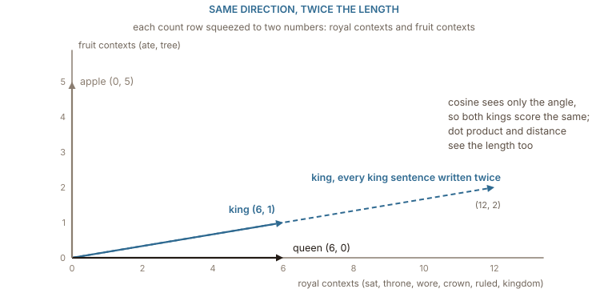
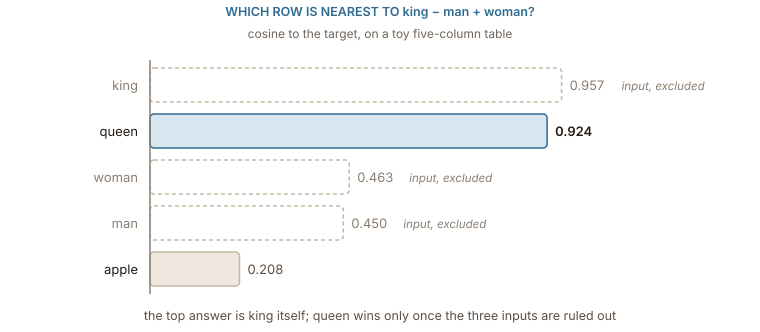

## Three ways to say two vectors are close

Every chapter so far has ended with a table of vectors, one row per word, and a claim that words which behave alike end up close. "Close" has been doing a lot of work without being pinned down. There are three common ways to turn two rows into one number, and they disagree more often than you would expect.

The **dot product** multiplies the rows column by column and adds the results. The **Euclidean distance** subtracts one row from the other and measures the length of what is left. **Cosine similarity**, which [the distributional chapter](../distributional/) used to get 0.926 for _king_ and _queen_, is the dot product divided by both lengths. Run all three on the three count rows from that chapter:

| pair         | dot product | cosine | distance |
| ------------ | ----------: | -----: | -------: |
| king, queen  |           6 |  0.926 |    1.000 |
| king, apple  |           3 |  0.314 |    3.742 |
| queen, apple |           0 |  0.000 |    4.359 |

On these three pairs the measures happen to agree about the order: _king_ and _queen_ are the closest pair, _queen_ and _apple_ the furthest. Two of them are similarities, where bigger means closer, and one is a distance, where smaller means closer, but the ranking is the same. That agreement is luck: the three measures react differently to how long a row is, and the lengths of these rows are not an accident.

Each measure answers a different question. Distance asks how far apart two points are. Cosine asks whether two arrows point the same way, ignoring how long they are. The dot product asks both at once: it is the cosine multiplied by the two lengths, so it rewards pointing the same way and it rewards being long.

## Length is mostly frequency

The length of a row, its **norm**, is the square root of the dot product of the row with itself. For the three count rows it is $\sqrt{7} = 2.646$ for _king_, $\sqrt{6} = 2.449$ for _queen_ and $\sqrt{13} = 3.606$ for _apple_. Nothing about royalty or fruit decides those numbers. They count how many times each word turned up next to the eight context words, which is to say how often the word was used.

That is easy to see by changing only the frequency. Write every sentence about the king out twice. Nothing about how _king_ is used has changed; the corpus just mentions him more. The row doubles, every count going from 1 to 2 and from 0 to 0:

| king vs queen  | original | king written twice |
| -------------- | -------: | -----------------: |
| length of king |    2.646 |              5.292 |
| dot product    |        6 |                 12 |
| cosine         |    0.926 |              0.926 |
| distance       |    1.000 |              3.162 |

Cosine does not move. The dot product doubles and the distance more than triples, although the word means exactly what it meant before.

:::figure{#length_vs_direction}


Summing the six royal columns and the two fruit columns squeezes each row to two numbers, enough to draw. Writing the king's sentences twice doubles the arrow without turning it, which is why cosine is the measure that ignores how often a word was used.
:::

The dot product has a stranger failure hiding in the original table. _queen_ scores 6 against itself and 6 against _king_: by dot product, _queen_ is exactly as similar to _king_ as it is to _queen_. With a longer row for _king_ it would be more similar to _king_ than to itself. A measure where a word is not its own nearest neighbour is measuring something other than resemblance.

Trained embeddings keep the same habit. [Schakel and Wilson](https://arxiv.org/abs/1508.02297) found that the length of a word2vec vector is tied to how often the word occurs and how consistently it is used: words seen once or twice keep short vectors, and so do the very commonest words, whose contexts are so varied that their updates pull in every direction. So ==in a raw embedding table, direction carries the meaning and length carries mostly how often the word was seen==. The standard move is to divide every row by its norm before comparing anything. Once every row has length 1, the three measures stop disagreeing, because the squared distance between two unit vectors $\hat{a}$ and $\hat{b}$ depends only on their cosine:

$$
\lVert \hat{a} - \hat{b} \rVert^{2} = 2 - 2\cos(a, b)
$$

The distance between unit rows is a decreasing function of the cosine, and the dot product of unit rows is the cosine itself. On the normalised count rows the distances come out 0.385, 1.171 and 1.414 for the three pairs, which is exactly $\sqrt{2 - 2 \times 0.926}$, $\sqrt{2 - 2 \times 0.314}$ and $\sqrt{2}$. After normalisation there is one ranking, not three.

## Directions that mean something

Closeness is one number per pair. The claim that made word2vec famous is about something more: that the _difference_ between two vectors can mean something, and mean the same thing in different places. The offset from _man_ to _woman_ is supposed to be roughly the offset from _king_ to _queen_, so that the four words form a rough parallelogram.

The ten sentences cannot show this: they never mention a man or a woman. So the rest of this chapter uses a small table for the five-word vocabulary of [the one-hot chapter](../one_hot/), five columns wide, written by hand to behave the way trained vectors do. No column is a clean feature; each word is a mixture.

| word  |   1 |   2 |    3 |   4 |   5 |
| ----- | --: | --: | ---: | --: | --: |
| king  | 2.0 | 0.5 |  0.2 | 0.1 | 0.0 |
| queen | 1.7 | 0.4 | −0.2 | 0.1 | 1.0 |
| man   | 0.4 | 1.6 |  0.2 | 0.2 | 0.0 |
| woman | 0.3 | 1.5 | −0.2 | 0.3 | 0.2 |
| apple | 0.1 | 0.3 |  0.0 | 2.0 | 0.1 |

The two offsets are $\textit{woman} - \textit{man} = (-0.1, -0.1, -0.4, 0.1, 0.2)$ and $\textit{queen} - \textit{king} = (-0.3, -0.1, -0.4, 0.0, 1.0)$. They share the step down in column 3, but _queen_ also has something of its own in column 5 that _woman_ does not. The cosine between the two offsets is 0.743: the same direction, roughly, and not exactly. That is what real embeddings look like. The parallelogram is never a parallelogram, only something leaning towards one.

## What king − man + woman ≈ queen really measures

The analogy test turns the parallelogram into a question. Start at _king_, subtract _man_, add _woman_, and look for the row nearest to where you land. Written with $a$ = _man_, $b$ = _king_ and $c$ = _woman_, the answer is the word $x$ whose unit row has the highest cosine with the target. This method is called **3CosAdd**:

$$
x^{*} = \arg\max_{x \,\notin\, \{a,\, b,\, c\}} \cos\!\left(x,\; \hat{b} - \hat{a} + \hat{c}\right)
$$

Two things in that line matter more than the arithmetic. The first is the condition under the $\arg\max$: the three input words are not allowed to be the answer. Run the search on the toy table without that condition and the ranking comes out like this:

:::figure{#analogy_scores}


The nearest row to king − man + woman is king. The analogy "works" only because the convention removes the three words you typed before the search is run.
:::

The target is closest to _king_ itself. Subtracting _man_ and adding _woman_ moves the point, but not far enough to leave _king_ behind, and this is the normal situation with real vectors too. [Linzen](https://aclanthology.org/W16-2503/) showed that on standard analogy sets, baselines that ignore the offset altogether, such as returning the nearest neighbour of $b$ with the inputs excluded, already get a substantial share of some categories right, and [Nissim, van Noord and van der Goot](https://aclanthology.org/2020.cl-2.7/) showed how often the excluded input would otherwise have won. The exclusion rule is not a detail. It does a good part of the work.

The second thing is what the cosine with the target adds up to. Because every row has been normalised, the target's length is the same for every candidate, and ranking by the cosine is the same as ranking by a sum of three cosines:

$$
\cos(x, b) - \cos(x, a) + \cos(x, c)
$$

So ==an analogy is not a search along a meaning direction; it is a vote between three similarities==: be like _king_, be unlike _man_, be like _woman_. For the toy table the three terms are:

| candidate | + cos with king | − cos with man | + cos with woman |   sum |
| --------- | --------------: | -------------: | ---------------: | ----: |
| king      |           1.000 |         −0.478 |            0.408 | 0.929 |
| queen     |           0.850 |         −0.384 |            0.430 | 0.897 |
| woman     |           0.408 |         −0.958 |            1.000 | 0.450 |
| apple     |           0.131 |         −0.271 |            0.342 | 0.202 |

_king_ wins on the first term by a margin, 1.000 against 0.850, that the other two terms cannot make up. _queen_ wins the analogy only because it is very like _king_ to begin with, and slightly more like _woman_ and less like _man_ than _king_ is. The gender offset is a small correction on top of a large similarity.

That also explains why the result is fragile. A different scoring rule, **3CosMul** from [Levy and Goldberg](https://aclanthology.org/W14-1618/), multiplies the three similarities instead of adding them, so one large term cannot drown the others; on this table it puts _queen_ first even without the exclusion, 0.955 against 0.951 for _king_. And small changes to one row flip the answer. Lower _queen_'s private fifth column from 1.0 to 0.6 and _queen_ scores 0.977 and beats _king_ outright, exclusion or not; raise it and _queen_ slides further behind. Nothing about gender changed between those tables. What changed is how much _queen_ has that _king_ does not.

None of this means the offsets are empty. The two differences in the table do point roughly the same way, and in large trained models many such offsets are consistent enough to be useful. It means a single analogy is a weak instrument: it measures a sum of similarities, under a convention that hides the most common answer, and a reported success can come from the geometry you hoped for or from the words around it.

## Nearest neighbours are one matrix product

Almost everything done with an embedding table, from the analogy test to finding related words, reduces to one operation: given a vector, find the rows closest to it. With every row normalised, that is a single matrix-vector product followed by a sort. The table times the query gives one cosine per word; the largest are the neighbours.

```python
import numpy as np

def neighbours(table, words, query, k=5):
    """Rows of `table` with the highest cosine to `query`."""
    unit = table / np.linalg.norm(table, axis=1, keepdims=True)
    scores = unit @ (query / np.linalg.norm(query))
    best = np.argsort(-scores)[:k]
    return [(words[i], round(float(scores[i]), 3)) for i in best]
```

On a vocabulary of 50,000 words with 300 columns, one query costs 15 million multiply-adds, which a laptop does in milliseconds. For millions of rows, as in search over documents, exact search gets expensive and systems switch to approximate indexes that check only a promising fraction of the rows and occasionally miss a true neighbour. The quantity they approximate is still the cosine from this chapter.

All of it rests on an assumption that has gone unexamined since [the first chapter](../intro/): that the word you are looking up has a row. Ask for the neighbours of _kingdoms_, or of _qeen_ typed in a hurry, and the table has nothing to multiply. The next chapter is about that gap, and about why modern tables are built out of pieces of words rather than whole ones.
