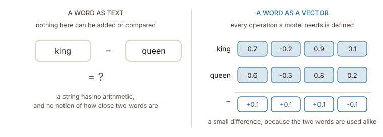
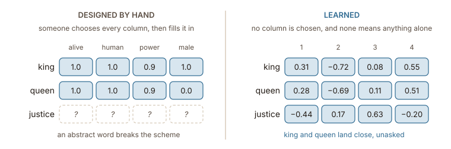

## A model only knows how to multiply numbers

Strip a neural network down and what remains is multiplication and addition arranged in matrices and repeated. Every layer takes numbers in, multiplies them by weights, adds them up, and passes numbers on. There is no step anywhere in that machinery that reads a word in a conventional manner as humans do.

The initial challenge in any language model is a translation problem. The input is text, the machine requires numbers, and an intermediary process must bridge the two. ==Whatever a word becomes upon entry dictates what the model is able to notice about it==.

Consider the words _king_ and _queen_. They contain four and five letters respectively, but extracting meaningful information from this length metric is impossible. The word _kilo_ also has four letters, and the word _quilt_ has five. Counting shared letters to measure word similarity fails to provide an accurate semantic signal.

:::figure{#word_as_vector}

Once a word is represented as a row of numbers, the operations defining a neural network can be applied to it directly. The difference between two words stops being an unanswerable question and becomes a precise mathematical quantity.
:::

Replacing each word with a numerical array provides a clear method for calculating similarity. Under this framework, similarity becomes a dot product and difference becomes subtraction. An entire vocabulary transforms into a table accessible via matrix multiplication. That specific list of numbers is an ==embedding==, and this book explores its origins.

## What the numbers have to carry

Assigning any set of numbers to words lets the basic math run, but most of these assignments completely miss the actual goal. Think about numbering a dictionary alphabetically where the animal _aardvark_ gets the number 1 and _zebra_ gets 30,000. This is a perfectly valid translation that allows all the arithmetic to work perfectly. The catch is that this approach tricks the model into thinking _cat_ and _cap_ are close neighbors just because they both start with "ca" and differ by one letter. Simultaneously, this alphabetical setup forces identical concepts like _cat_ and _kitten_ to sit thousands of units apart simply because they begin with different letters.

So the requirement is sharper than "turn words into numbers". The arrangement has to put words that behave alike near each other, because near is the only thing a model can cheaply measure. Everything downstream — a classifier deciding on a sentiment, an attention head deciding which word to read, a search engine matching a query to a document — reduces to comparing vectors and finding some closer than others.

That gives three things to ask of an embedding, and the rest of this book keeps returning to them:

1. **Similar words sit close together.** Not because anyone placed them there, but because whatever produced the vectors put them there.
2. **The space has room for structure.** Closeness alone is a single number; a good space also has directions that mean something, so that relations between words survive as relations between vectors.
3. **Every word gets one.** Including the rare ones, the misspelled ones, and the ones the model has never seen.

None of these is of course free and each has an interesting theory behind it.

## Written by hand, or learned

One potential method for constructing these representations involves manual feature engineering. A researcher could establish specific dimensions such as whether an entity is alive, whether it is an animal, its relative size, or its formality level. Each word would then receive a specific value. The word _king_ might receive an animacy score of 1 and a power score of 0.9. The word _queen_ might receive the same two values and differ only in a column someone remembered to add for gender.

This works for a little while. However, it requires someone to decide in advance which features actually matter, fill in tens of thousands of rows by hand, and figure out how to score abstract words like _justice_ or _nevertheless_. Worse still, the chosen features are the only things the model will ever see. If a human forgets to include a specific dimension, the model simply cannot make that distinction.

The alternative is to treat these numbers like any other model parameter. The system starts them at random and lets the training process adjust them. No one declares what any given column means. ==The matrix is filled in by whatever reduces the loss==, and figuring out what the dimensions ended up measuring is left for later. That is a strange tradeoff to say the least, as the system gives up the ability to explain what a single number means in exchange for not having to decide everything in advance.

:::figure{#designed_vs_learned}

The left table can be read and cannot be finished. The right one can be finished and cannot be read. Only one of them puts _king_ and _queen_ side by side without being told to.
:::
