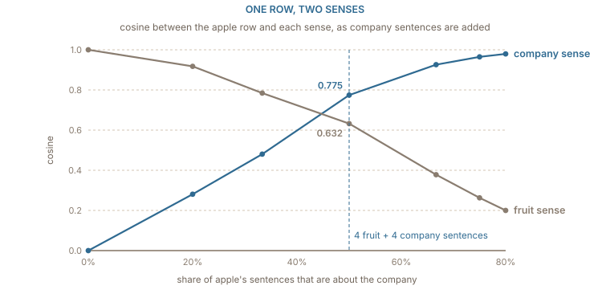

## One row for two meanings

The ten sentences use _apple_ in one sense only: a fruit that is eaten, grows on a tree, and falls from it. Real text is not so tidy. Much of the text that mentions _apple_ is about the company, and a table with one row per word has one row for both. Once text is lowercased, as the running corpus is, _Apple_ the company and _apple_ the fruit are the same string; and even with capitals kept, the fruit is capitalised too whenever it opens a sentence.

To see what happens to the row, add four sentences in which _apple_ is the company:

```python
company = [
    "apple released a new phone",
    "apple sold the new phone",
    "the company apple released a laptop",
    "the company apple sold the laptop",
]
```

Count contexts over the fourteen sentences the same way [the distributional chapter](../distributional/) did, whole sentence as the window, function words ignored. Split the count by which kind of sentence it came from, and _apple_ turns out to have two rows that have nothing in common:

| context from      | columns with a non-zero count                           | length |
| ----------------- | ------------------------------------------------------- | -----: |
| fruit sentences   | king 1, ate 3, ripe 1, tree 2, fell 1                   |  4.000 |
| company sentences | released 2, new 2, phone 2, sold 2, company 2, laptop 2 |  4.899 |

The cosine between the two is 0.000: no context word appears in both kinds of sentence. They are two different words that happen to be spelled the same. The table, though, only ever sees the spelling, and stores their sum.

## The row is a weighted average of its senses

Adding the two rows gives the single _apple_ row the table actually learns. Because the two sense rows share no columns, the cosine of the sum with either sense has a simple form: it is that sense's length divided by the length of the sum,

$$
\cos(f + c,\; f) = \frac{\lVert f \rVert}{\lVert f + c \rVert}, \qquad \lVert f + c \rVert = \sqrt{\lVert f \rVert^{2} + \lVert c \rVert^{2}}
$$

with $f$ the fruit row and $c$ the company row. So the stored row leans towards whichever sense has the longer row, and the length of a sense's row grows with how often that sense is used. Here the fruit sense has length 4.000 and the company sense 4.899, the sum has length 6.325, and the _apple_ row has cosine 0.632 with the fruit and 0.775 with the company. Four sentences each, and the company already wins, because its sentences carry more context words per mention.

Vary the balance and the row slides between the two senses:

:::figure{#sense_mixture}


The single row is not either meaning. It sits between them, pulled towards the sense that is used more, and by the time one sentence in five is about fruit the fruit is barely there.
:::

With no company sentences the row is the fruit, cosine 1.000. With one company sentence in five it is still mostly fruit, 0.918 against 0.281. With four company sentences to every fruit one it has cosine 0.980 with the company and only 0.200 with the fruit. [Arora and colleagues](https://arxiv.org/abs/1601.03764) showed that trained word2vec and GloVe vectors behave the same way: ==the vector of an ambiguous word is approximately a sum of one vector per sense, each weighted by how often that sense occurs==, and the individual senses can be partly recovered from it.

What the average costs shows in the neighbours. Rank every word in the fourteen sentences by cosine with the _apple_ row: the top six are _released_ and _sold_ (0.447), then _new_, _phone_, _company_ and _laptop_ (0.400), and only then _ripe_ (0.335) and _tree_ (0.258). A model that reads _she ate a ripe apple_ gets, as its first impression of _apple_, a vector whose nearest neighbours are about phones. The minority sense is still in the row, but it has to be recovered from the context by whatever layers come after the lookup, and a model with no layers after the lookup cannot recover it at all.

## Opposites keep the same company

The distributional hypothesis says that words used in the same contexts have similar meanings. The trouble is what "similar" is allowed to mean. Consider six sentences:

```python
tea = ["the tea was hot",  "the tea was cold",
       "the soup was hot", "the soup was cold",
       "the bath was hot", "the bath was cold"]
```

Count contexts for _hot_ and _cold_ and the two rows are identical: both appear once each with _tea_, _soup_ and _bath_, and three times with _was_. Their cosine is 1.000. By the only evidence the method uses, _hot_ and _cold_ are the same word.

Real corpora are not quite this symmetric, but close. Antonyms fill the same slots in the same sentences, _good_ and _bad_ both describe films, _buy_ and _sell_ both take a price, and embeddings trained on context place them among each other's nearest neighbours. What the vectors capture is closer to "can be substituted here" than to "means the same". Substitutable words are often synonyms and often opposites, and the geometry cannot tell which.

This is not a defect a bigger corpus would fix. Opposites differ in exactly the respect that context does not record: which way the sentence turns out. Telling them apart takes a signal that does, such as a sentiment label, a dictionary of antonyms, or a model that reads the rest of the sentence and sees whether the tea was drunk or sent back.

## The corpus's habits become the geometry

The first number in this book is a small example of something larger. _king_ has a cosine of 0.314 with _apple_, while _queen_ has 0.000. Nothing about kings makes them fruit-adjacent. One sentence, _the king ate an apple_, put them together, and no sentence put a queen and an apple together. Remove that one sentence and _king_ and _apple_ drop to 0.000, while _king_ and _queen_ become identical rows with cosine 1.000. Replace it with _the queen ate an apple_ and the two numbers swap: _queen_ and _apple_ get 0.314, _king_ and _apple_ 0.000.

Scale that up and it becomes a well-documented problem. ==An embedding learns whatever regularities its corpus contains, including the ones nobody would endorse==. If a profession is written about mostly with one pronoun, its vector moves towards that pronoun's direction. [Bolukbasi and colleagues](https://arxiv.org/abs/1607.06520) found gendered occupation pairs in word2vec vectors trained on news text and proposed removing a gender direction from words that should not have one. [Caliskan, Bryson and Narayanan](https://doi.org/10.1126/science.aal4230) showed that the associations measured by psychologists' implicit-association tests reappear as cosine similarities in GloVe vectors trained on web text.

Two cautions keep this honest. First, measuring bias with analogies inherits every fragility of [the analogy test](../geometry/), including the rule that excludes the input words; [Nissim, van Noord and van der Goot](https://aclanthology.org/2020.cl-2.7/) showed that some widely quoted biased analogies are produced by that rule rather than by the vectors. Measurements that average many cosines at once, as the association tests do, depend less on any single choice of words than one analogy does. Second, removing a direction afterwards hides the association from that particular probe without necessarily removing it from the space; neighbouring words often still cluster the way they did. The reliable lesson is the one the king and the apple teach: the table is a record of the text, and it records what the text happened to say.

## What the static table cannot do

The three problems in this chapter have one cause. The table gives each word a row, the row is fixed after training, and whatever the word means in a particular sentence has to be squeezed out of that fixed row by the reader. _apple_ is an average of fruit and company, _hot_ and _cold_ are indistinguishable without the rest of the sentence, and the row for any word carries the accidents of the corpus with it.

The way out is to stop asking the table for the final vector. Keep the table as a starting point, then let the model read the sentence and adjust each word's vector to its surroundings, so that _apple_ next to _ripe_ and _apple_ next to _phone_ come out as different vectors. That is the idea behind contextual embeddings, and [the next chapter](../contextual/) builds one, one attention step at a time, from the same fourteen sentences.
