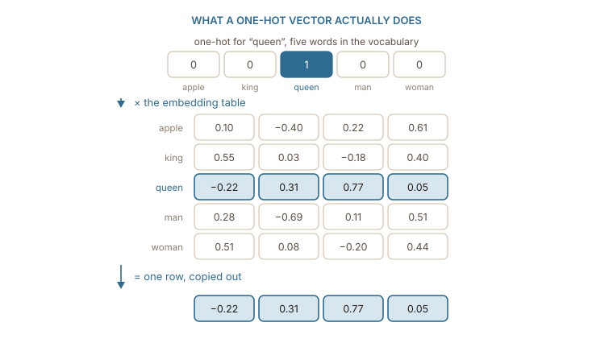
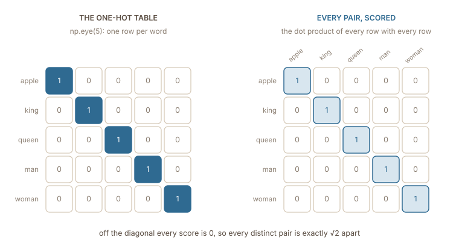
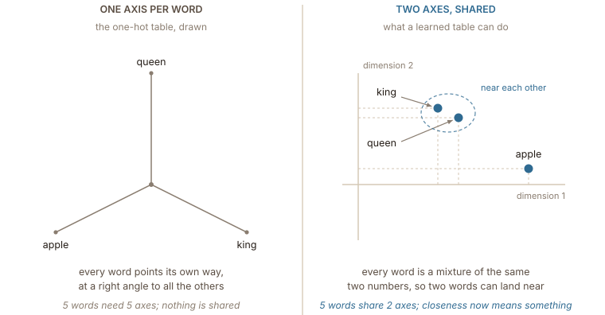

## One column per word

The previous chapter established the need for numbers but left the exact values open. The most literal approach is to establish a fixed order for the vocabulary and assign every word a vector equal in length to that vocabulary. This vector holds a 1 in the word's own position and a 0 everywhere else. This structure is known as a **one-hot** vector. A five-word vocabulary makes it small enough to print in full:

| word  | vector          |
| ----- | --------------- |
| apple | (1, 0, 0, 0, 0) |
| king  | (0, 1, 0, 0, 0) |
| queen | (0, 0, 1, 0, 0) |
| man   | (0, 0, 0, 1, 0) |
| woman | (0, 0, 0, 0, 1) |

This method requires zero manual decisions. No one has to judge how powerful a _king_ is or how formal the word _nevertheless_ sounds. The entire encoding derives strictly from the vocabulary list itself. That simplicity makes this approach worth examining because it serves as the absolute baseline that any new scheme must beat.

## What it gets right

This setup gets two distinct things right.

The first success is that every word is entirely distinguishable. No two words share a vector. This guarantees no identity information is lost during the input phase. Regardless of what goes wrong later, the model always knows exactly which word it received.

The second success is that the lookup operation is computationally free. Imagine stacking the vocabulary embeddings to form the rows of a matrix $W$ and multiplying a one-hot row vector by it. Every row of $W$ gets multiplied by zero except for one. The final product is simply that single matching row copied directly out. ==A one-hot vector multiplied by a matrix is a direct row selection==, as the figure below illustrates.

:::figure{#one_hot_lookup}


The operation involves four multiplications by zero and one multiplication by one. This mechanism explains why an embedding table operates as a lookup table.
:::

This selection trick is exactly why one-hot vectors remain important to understand. An `nn.Embedding` layer in PyTorch performs this exact multiplication with the arithmetic skipped. It simply takes an integer index and returns the corresponding row.

## Where it fails

Taking the product of any two different one-hot vectors reveals a major issue. Every single position contains a zero in at least one of the two vectors. This forces every product to be zero, meaning the final sum is always zero.

```python
import numpy as np

vocab = ["apple", "king", "queen", "man", "woman"]
I = np.eye(len(vocab))           # one row per word: the one-hot table
onehot = dict(zip(vocab, I))

print(onehot["king"] @ onehot["queen"])  # 0.0
print(onehot["king"] @ onehot["apple"])  # 0.0
print(onehot["king"] @ onehot["king"])   # 1.0

# every distinct pair sits exactly the same distance apart
print(np.linalg.norm(onehot["king"] - onehot["queen"]))  # 1.414...
print(np.linalg.norm(onehot["king"] - onehot["apple"]))  # 1.414...
```

Read the last two lines from the code above. The words _king_ and _queen_ differ by one feature and turn up in the same sentences; _king_ and _apple_ have nothing in common at all. The encoding puts both pairs at exactly $\sqrt{2}$, and it would say the same of _king_ and _photosynthesis_. ==Every pair of words is equally similar, which is to say the encoding carries no similarity at all.==

:::figure{#one_hot_matrix}


Scoring every word against every word gives back the table it started from. The 1s are each word matched with itself, and the zeros are every other pair.
:::

That breaks the **first** of the three requirements from the last chapter. There is no direction to move in, no sense in which one pair is closer than another, and nothing for a model to generalise from. A model that learns something about _king_ learns nothing whatsoever about _queen_.

The **second** failure is size. The vector's length is the size of the vocabulary, so a realistic vocabulary of 50,000 entries gives every word a 50,000-dimensional vector holding a single 1. Feed that into a layer that produces 300 numbers and the weight matrix has 15 million entries.

The **third** is what happens at the edges. A word that was not in the vocabulary when the order was fixed has no position to put its 1 in. There is no nearest row, no partial match, no graceful degradation — the scheme simply has no answer.

## What the failure points at

The actual problem is not that the vectors consist of zeros and ones. The fatal flaw is that the encoding dedicates an entire dimension to every single word and restricts each dimension to belong exclusively to that one word. ==Assigning one word per axis guarantees that no two words can ever share anything==. Sharing requires two words to have a value in the exact same position, and this encoding structure strictly forbids that overlap.

:::figure{#axis_vs_shared}


Drawn as directions, one-hot gives every word its own axis, so no two words can lean the same way. Fewer axes than words forces each word to be a mixture of them, and mixtures can resemble one another.
:::

So the repair is to let words share dimensions. Give the space far fewer dimensions than there are words, and ==every word has to be described as some combination of them rather than getting an axis to itself==. Words that behave alike can then take similar values in the same columns, and similarity becomes expressible for the first time.
