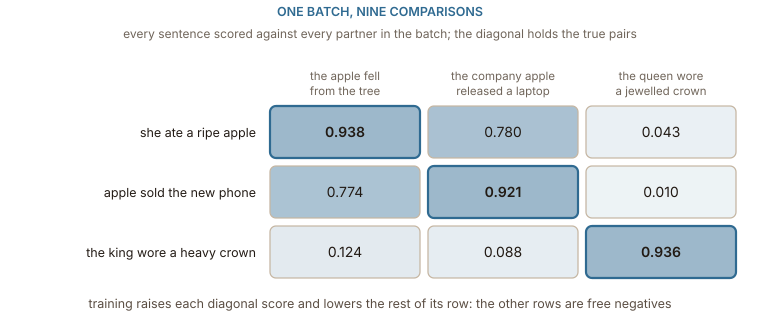
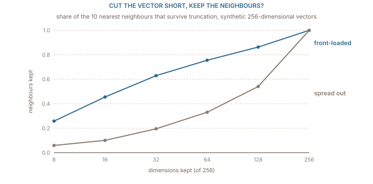

## From token vectors to one sentence vector

A contextual encoder, as [the previous chapter](../contextual/) built it, returns one vector per token. Most uses of embeddings today want one vector per text: a search query compared against a million passages, two support tickets checked for duplicates, a document placed in a cluster. The model that produces that single vector is a **sentence encoder**, and almost every "embedding model" offered by a library or an API is one.

The step from many vectors to one is called **pooling**. The two common choices are to take the vector at one designated position (BERT prepends a `[CLS]` token for this purpose) or to take the mean of all the token vectors. [Sentence-BERT](https://arxiv.org/abs/1908.10084) compared them and made the mean its default. Pooling is not the hard part, though. The same paper found that mean-pooled vectors from BERT as it comes out of pre-training do worse at judging sentence similarity than simply averaging GloVe word vectors. A model trained to fill in blanks has no reason to make the cosine between two whole sentences mean anything.

The toy pipeline from the last chapter can be turned into a sentence encoder by adding the pooling step: look up the fourteen-sentence count rows, run the one attention step on every word, average the results, and normalise the average to length 1. Four sentences through it give these cosines:

| sentence pair                                               | cosine |
| ----------------------------------------------------------- | -----: |
| _she ate a ripe apple_ / _the apple fell from the tree_     |  0.938 |
| _she ate a ripe apple_ / _apple sold the new phone_         |  0.780 |
| _the apple fell from the tree_ / _apple sold the new phone_ |  0.774 |
| _she ate a ripe apple_ / _the queen wore a jewelled crown_  |  0.043 |

The two fruit sentences are the closest pair, and the crown is far from everything, which is right. But a sentence about eating fruit and a sentence about selling phones score 0.780, because they share the word _apple_ and the average is dominated by it. An untrained sentence vector is a bag of its words' vectors, and it inherits every ambiguity of [the static table](../limits/). Training is what separates them.

## Trained on pairs that should match

Sentence encoders are trained on pairs of texts that ought to end up close: a question and the passage that answers it, a sentence and its paraphrase, a title and its article, two sentences labelled as saying the same thing. Sentence-BERT started from pairs in natural-language inference datasets; later models add hundreds of millions of pairs mined from the web, such as posts and their replies or queries and the pages people clicked.

The loss is **contrastive**. Take a batch of $B$ pairs, encode every text, and score each first text against every second text in the batch. The true partner should score highest in its row; the other $B-1$ second texts, which belong to other pairs, serve as negatives at no extra cost. With $s_{ij}$ the cosine between first text $i$ and second text $j$, the loss for the batch is

$$
\mathcal{L} = -\frac{1}{B}\sum_{i=1}^{B} \log \frac{\exp(s_{ii}/\tau)}{\sum_{j=1}^{B} \exp(s_{ij}/\tau)}
$$

which is a softmax over each row, asked to put its weight on the diagonal. The temperature $\tau$ sets how sharply the scores are compared. This **in-batch negatives** trick is what made training on large collections of pairs cheap, and it appears in retrieval models such as [DPR](https://arxiv.org/abs/2004.04906) as well as in sentence encoders. The [self-supervised learning tutorial](../../self_supervised_learning/info_nce/) treats contrastive losses in their own right, including where the negatives come from and why the temperature matters.

:::figure{#in_batch_negatives}

The diagonal wins every row, but the fruit and company sentences are only a margin apart. Contrastive training is paid to widen exactly that margin, and it gets the negatives from the rest of the batch.
:::

On the toy batch every diagonal already wins its row, so the loss is already modest: 0.754 at $\tau = 1$, where the correct partner gets probabilities of 0.442, 0.441 and 0.534, and 0.031 at $\tau = 0.05$, where the same scores give 0.959, 0.950 and 1.000. A low temperature turns a margin of 0.16, the gap between 0.938 and 0.780, into a confident choice. What training changes is the scores themselves: it pulls the fruit sentence away from the phone sentence until the word they share no longer decides the cosine. ==A sentence encoder is a contextual encoder whose output geometry has been trained directly, so that cosine means "these texts go together"==.

## Normalised outputs, and how many dimensions

Most sentence encoders return vectors of length 1, or are meant to be used after normalising. That settles the choice from [the geometry chapter](../geometry/): with unit vectors the dot product is the cosine, and distance is a fixed function of it. On the toy encoder the distance between the two fruit sentences is 0.353, which is $\sqrt{2 - 2 \times 0.938}$. A vector database that offers "dot product", "cosine" or "Euclidean" as options will rank normalised vectors identically under all three, so the choice matters only if some vectors are not normalised. If the model card says to normalise, normalise.

The dimension is the other number on the model card. BERT-base produces 768 numbers per token and BERT-large 1,024, and encoders built on them inherit those widths; smaller distilled encoders use fewer. More dimensions can hold more distinctions, and they cost storage and search time in direct proportion, which matters once there are hundreds of millions of documents.

[Matryoshka representation learning](https://arxiv.org/abs/2205.13147) makes that a choice at use time instead of at training time. The contrastive loss is applied not only to the full vector but also to its first 8, 16, 32 and so on coordinates, each prefix normalised on its own. The model learns to put the most important information first, so a stored vector can be cut short and still work. An ordinary model gives no such guarantee: its information is spread over all the coordinates, and the first 64 are no more important than any other 64.

:::figure{#matryoshka_truncation}

Truncation is cheap only when the model was trained for it. The same geometry with its information spread evenly keeps a third of the neighbours at 64 dimensions; front-loaded, it keeps three quarters.
:::

The figure uses synthetic vectors to isolate the effect: 2,000 random points in 256 dimensions whose early coordinates carry more variance than late ones, and the same points rotated so that every coordinate carries an equal share. Both sets have exactly the same cosines at full length. Cut to 64 dimensions and renormalise, and the front-loaded set keeps 76% of each point's ten nearest neighbours; the spread-out set keeps 33%. At 16 dimensions the numbers are 46% and 10%. Only truncate a model whose documentation says it was trained for it, and check the result on your own data.

## Judging a model: benchmarks, then your own data

Published comparisons of embedding models mostly come from [MTEB](https://arxiv.org/abs/2210.07316), the Massive Text Embedding Benchmark, which gathers 58 datasets over 8 kinds of task in 112 languages. Two of the tasks correspond directly to the uses in this chapter. **Semantic textual similarity** gives pairs of sentences with human similarity ratings and asks whether the model's cosines put the pairs in the same order; the score is a rank correlation. **Retrieval** gives queries and a collection of documents with the relevant ones marked, and asks whether the relevant documents come near the top when documents are ranked by cosine; the main score, nDCG@10, rewards relevant documents in the first ten results and more so the higher they appear. The toy batch above is the smallest possible retrieval test: three queries, three documents, and every query's best match is its own partner, a recall at 1 of 1.0.

The benchmark's own authors found that no single model was best at every task, which is the first thing to remember when reading a leaderboard. A model can lead the average while being mediocre at the one task you care about, and the average hides that. Several other questions matter as much as the headline number:

- **What was it trained on?** A model trained on web question-answer pairs may do poorly on legal clauses or source code. Domain shift is the most common reason a well-ranked model disappoints.
- **How long an input does it read?** Every encoder has a maximum number of tokens and silently ignores the rest. A document longer than that limit is represented by its opening only.
- **Does it expect instructions or prefixes?** Some models, such as the [E5](https://arxiv.org/abs/2212.03533) family, were trained with `query: ` and `passage: ` prepended, and they perform worse if the prefixes are left out. Queries and documents are not interchangeable for these models.
- **What does a vector cost?** Dimensions times bytes per number times number of documents, plus the time to encode them all.

The most reliable judgement is also the cheapest to set up. Collect a few dozen real queries, mark the documents that should answer them, embed everything with two or three candidate models, and count how often the right document lands in the top few. ==A benchmark tells you which models are worth trying; only your own queries tell you which one to use==.

## What the vector still leaves out

Every chapter of this tutorial has narrowed the same question: how a piece of text becomes a list of numbers whose geometry means something. One-hot vectors gave identity and nothing else; counts and prediction gave similarity; pieces gave coverage; attention gave context; contrastive training on pairs turned the whole text into one vector whose cosine answers a practical question. What a sentence vector still flattens is structure inside the text: which entity did what to which, what is negated, what order things happened in. Those survive in the per-token vectors of the encoder, and models that need them, from rerankers that read the query and document together to the language models that generate text, keep the tokens rather than pooling them away. [The attention tutorial](../../attention/self_attention/) is the place to follow that thread, from the lookup table that every chapter here began with to the layers that read it.
