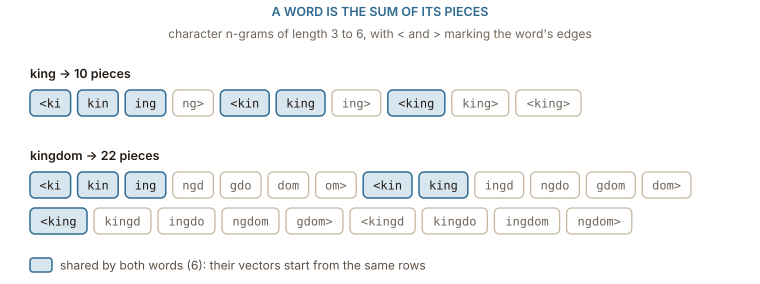
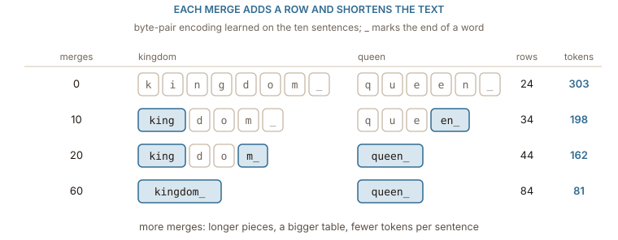

## A table has a fixed number of rows

Every table in this book so far has one row per word, and the list of words was fixed before training started. That was the third failure of [the one-hot baseline](../one_hot/): a word that was not in the vocabulary has no position, and so no vector. Learning the table instead of writing it by hand fixed similarity. It did nothing for this.

The problem is not only about exotic words. Count the ten sentences of the running corpus: 62 words in all, but only 26 different ones, and 9 of those 26 appear exactly once: _fell_, _for_, _he_, _heavy_, _jewelled_, _ripe_, _she_, _wisely_ and _years_. A third of the vocabulary rests on a single sentence each. Real corpora have the same shape at every scale: a few words are used constantly, and a long tail of words is seen once or twice. Whatever vector a word in that tail gets was fitted to one or two contexts, which is barely more evidence than none.

Beyond the tail are the words that never appear at all. A corpus that contains _king_ and _kingdom_ may not contain _kings_ or _kingly_. People mistype, so _qeen_ turns up in real text. New names and products appear every week. The usual word-level answer is a single reserved row, often written `[UNK]`, that every unknown word maps to. That keeps the arithmetic running and throws away everything about the word: _kings_, _qeen_ and _photosynthesis_ all become the same vector.

What a reader does with an unfamiliar word is look inside it. _kings_ is _king_ plus a plural; _qeen_ is almost _queen_. The spelling carries information that a row-per-word table cannot use, because it treats every word as an indivisible symbol. The two ideas in this chapter both open the word up.

## A word is the sum of its pieces

[fastText](https://arxiv.org/abs/1607.04606), from the same group that built word2vec, keeps the skip-gram game from [the prediction chapter](../word2vec/) and changes only what a word's vector is made of. Mark the edges of the word, `<` before its first letter and `>` after its last, and cut it into every run of 3 to 6 characters. Each of those **character n-grams** gets its own row in a table, and the word's vector is the sum of the rows of its pieces, plus one row for the whole word:

$$
v_{\textit{word}} = \sum_{g \,\in\, G(\textit{word})} z_{g}
$$

where $G(\textit{word})$ is the set of pieces and $z_g$ is the row for piece $g$. Training updates the piece rows instead of a single word row, so every occurrence of _king_ also trains `kin`, `ing` and `<king`.

:::figure{#fasttext_ngrams}

_king_ and _kingdom_ share six pieces, so their vectors are built partly from the same rows before training has decided anything about either. Spelling becomes a prior on meaning.
:::

The sharing is what solves the tail. _king_ has 10 n-grams, the last of which is already the whole word between its two markers; _kingdom_ has 22 plus its whole-word row. Six n-grams are common to both. The unseen _kings_ has 14 n-grams, and six of them are the same six, so it gets a vector without ever appearing in the corpus: the sum of rows that were trained on _king_, _kingdom_ and anything else beginning with `<kin`. The misspelled _qeen_ has 10 n-grams and shares three with _queen_ (`een`, `een>` and `en>`), which is not much, but it is not zero, and it points in the right direction.

The cost is the number of pieces. Every word contributes a dozen or more, and across a large corpus the distinct n-grams run into the millions. fastText does not store a row for each: it hashes every n-gram into a fixed number of buckets, two million in the original paper, and lets unrelated pieces that land in the same bucket share a row. The collisions add noise, and training averages most of it away.

fastText makes every string representable, and ==a vector built from pieces gives rare and unseen words the evidence their spelling carries==. But the output is still one vector per word, looked up through a word-shaped process. The approach that took over in transformer models goes one step further and stops treating the word as the unit at all.

## Building a vocabulary from merges

**Byte-pair encoding**, brought to language models by [Sennrich, Haddow and Birch](https://arxiv.org/abs/1508.07909), builds a vocabulary of pieces from the bottom up. Start with single characters. Count every pair of adjacent symbols in the corpus, merge the most frequent pair into a new symbol, and repeat. Each merge adds one entry to the vocabulary. After enough merges, frequent words are single symbols and rare words are spelled out of a few frequent fragments.

Run it on the ten sentences, with `_` marking the end of each word so that a piece knows whether it ends a word. The corpus uses 23 different letters, so the starting vocabulary has 24 symbols. The first merges, with the number of times each pair occurs:

| merge | new symbol | pair count |
| ----: | ---------- | ---------: |
|     1 | `e_`       |         30 |
|     2 | `th`       |         16 |
|     3 | `the_`     |         14 |
|     4 | `n_`       |         11 |
|     5 | `ro`       |          6 |
|     6 | `ng`       |          6 |
|     7 | `ki`       |          6 |
|     8 | `king`     |          6 |

The first merge is `e` at the end of a word, because _the_, _throne_, _apple_, _ate_, _tree_ and _wore_ all end that way. Three merges in, _the_ is a single symbol, since it occurs 14 times. By merge 8 _king_ is one symbol, built as `ki` plus `ng`. No merge was chosen because it is a word; every merge was chosen because it was frequent, and frequent strings tend to be words or the common parts of words.

:::figure{#bpe_merges}

Each merge adds a row to the table and removes symbols from the text. _kingdom_ goes from eight pieces to one, and the corpus from 303 tokens to 81.
:::

The learned merges are then applied, in order, to any text. A word the corpus never contained still comes apart into known pieces. After 20 merges, _kings_ becomes `king` `s` `_` and _kingly_ becomes `king` `l` `y` `_`: both start from the row for _king_. The typo is less lucky. _qeen_ becomes `q` `e` `en_`, while _queen_ by then is the single symbol `queen_`, so the two share no pieces at all. Byte-pair encoding guarantees a spelling for every string; it guarantees nothing about how close a misspelling lands.

**WordPiece**, the variant BERT uses, runs the same loop with a different score. Instead of merging the most frequent pair, it merges the pair whose count is highest relative to how often its parts occur on their own, $\operatorname{count}(ab) / (\operatorname{count}(a)\,\operatorname{count}(b))$. On the ten sentences that changes the first merge completely. `e_` occurs 30 times but scores only 0.010, because both halves are everywhere. The winner is `vy` from _heavy_, which occurs once but scores 0.333, because `v` never appears anywhere else. Next come `qu` (0.200) and `ki` (0.125). WordPiece prefers pieces that behave as a unit. It also marks pieces that continue a word, rather than pieces that end one, writing them with a `##` prefix: _kings_ might come out as `king` `##s`.

## How big should the vocabulary be?

Every merge adds a row to the embedding table and shortens the text the model has to read. The vocabulary size is a dial between those two costs, and the ten sentences already show the trade:

| vocabulary              | table rows | corpus length in tokens |
| ----------------------- | ---------: | ----------------------: |
| characters only         |         24 |                     303 |
| after 10 merges         |         34 |                     198 |
| after 20 merges         |         44 |                     162 |
| after 40 merges         |         64 |                     116 |
| after 60 merges         |         84 |                      81 |
| whole words (no pieces) |         26 |                      62 |

The last row looks like the winner here, with few rows and the shortest text, but only because ten sentences have a tiny vocabulary. On real text, the whole-word row is the one with hundreds of thousands of entries, most of them in the tail, and it still has no answer for the next unseen word. The character row is the opposite extreme: a table small enough to print, every string covered, and sequences several times longer, which costs more in every layer that reads them. Attention in particular compares every position with every other, so its cost grows with the square of the sequence length.

Real systems settle in between. BERT uses a WordPiece vocabulary of 30,522 entries and GPT-2 a byte-pair vocabulary of 50,257. At 768 columns, BERT's table alone holds 23,440,896 numbers and GPT-2's 38,597,376. ==The vocabulary size trades rows in the table against the length of every sequence the model will ever read==, and the answer depends on the languages involved: a vocabulary learned mostly on English cuts other languages into many more, shorter pieces, and those languages pay for it in sequence length.

Pieces solve the problem of coverage completely. Every string gets a representation, and rare words borrow evidence from common ones. What they do not change is the table itself: `apple` is still one row, looked up the same way whether the sentence is about fruit or about phones. The next chapter looks at what happens to that row when one word has two meanings.
