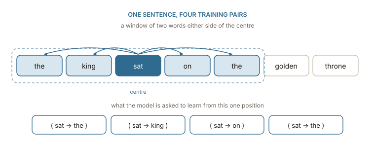
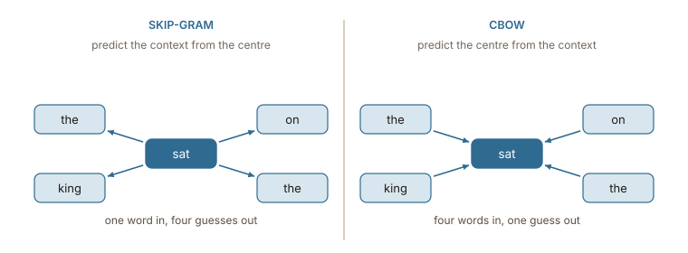

## Stop counting, start guessing

The previous chapter built a massive table of counts and then admitted it was too large and mostly empty. The standard fix involves compressing that table after the fact. A model called [word2vec](https://www.tensorflow.org/text/tutorials/word2vec) takes a completely different path by never building the table in the first place.

Every word starts with a short vector of random numbers spanning a few hundred dimensions. The system then plays a simple game on every sentence. Given one specific word, the model must guess which words appear near it. Every time the guess is wrong, the system nudges the vectors so the same guess becomes slightly more accurate the next time around. This process simply repeats over a few billion words of text until training finishes.

The training loop never explicitly mentions meaning. ==The vectors are not designed to describe words, they simply become whatever numbers make the guessing game work best==. Semantic similarity emerges anyway for the exact same reason it emerged from the raw counts. Two words appearing in similar places require the exact same guesses, meaning the training process naturally pushes their vectors into the exact same mathematical space.

## The game, precisely

Slide a window along the text. The word in the middle is the **centre**, the words around it are its **context**, and each centre-context pairing becomes one training example.

:::figure{#skipgram_pairs}


One position in one sentence produces four pairs. A corpus of a billion words produces billions of them, which is why the vectors can be short and still be pinned down.
:::

Generating the pairs is the whole of the data preparation:

```python
def pairs(tokens, window=2):
    """Every (centre, context) pair the sliding window produces."""
    for i, centre in enumerate(tokens):
        lo, hi = max(0, i - window), min(len(tokens), i + window + 1)
        for j in range(lo, hi):
            if j != i:
                yield centre, tokens[j]

list(pairs("the king sat on the golden throne".split()))[:4]
# [('the', 'king'), ('the', 'sat'), ('king', 'the'), ('king', 'sat')]
```

There are two ways to play this game, and word2vec is really the name of both of them. They use the same window and the same vectors, and differ only in which side of the window is the question and which is the answer.

:::figure{#skipgram_vs_cbow}


The same five words, the same window, opposite directions. Everything else about the training is identical.
:::

### Skip-gram: the centre guesses its neighbours

Both architectures are built from the same two matrices, and it is worth naming them before separating the methods.

The first is the **embedding matrix** $W$, of shape $\lvert\mathcal{V}\rvert \times N$: one row per vocabulary entry, $N$ numbers wide. This is the table the whole book is about, and $N$ is a choice, typically 100 to 300. The second is the **output matrix** $W'$, of shape $N \times \lvert\mathcal{V}\rvert$: one column per vocabulary entry, used for scoring rather than for representing. Every word therefore owns a row of $W$ and a column of $W'$.

Skip-gram runs a single word through them. The centre word arrives as a one-hot vector, which the one-hot chapter showed is a row selection rather than a multiplication, so what actually happens is a lookup: row $c$ of $W$, a vector of $N$ numbers. Call it $h$, the hidden layer, though nothing non-linear happens to it — skip-gram has no activation function in the middle.

That single vector is then scored against every column of $W'$, producing one number per vocabulary entry, and a softmax turns those numbers into a distribution over the whole vocabulary:

$$
P(o \mid c) = \operatorname{softmax}\!\left(h^{\top} W'\right)_o, \qquad h = W_{c}
$$

The training signal is the difference between that distribution and the answer. For a window of four context words the same prediction is compared against four different answers, giving four separate updates from one position, and each update adjusts both row $c$ of $W$ and the columns of $W'$ involved.

With a toy vocabulary of 5 words and $N = 3$: $W$ is $5 \times 3$, the lookup gives a vector of 3 numbers, $W'$ is $3 \times 5$, and the output is 5 scores. With a real vocabulary those become $50{,}000 \times 300$ and $300 \times 50{,}000$ — about 30 million numbers, which is most of what a word2vec model is.

The objective, over the whole corpus of $T$ positions and a window of $m$ either side, is to make every real context word as likely as possible:

$$
\frac{1}{T}\sum_{t=1}^{T}\ \sum_{-m \le j \le m,\; j \ne 0} \log P(w_{t+j} \mid w_t)
$$

Because a rare word gets its own gradient update once per context word it ever appears beside, its vector is shaped by every occasion it appeared at all. That is what makes skip-gram the better choice on small corpora and on rare words, and also the slower one: each window costs four updates instead of one.

### CBOW: the neighbours guess the centre

CBOW — continuous bag of words — turns the arrows round, and the only structural change is what feeds the hidden layer.

All four context words arrive as one-hot vectors, each one selecting its own row of the same matrix $W$. Those rows are then **averaged** into a single vector, and that average is the hidden layer:

$$
h = \frac{1}{2m}\sum_{-m \le j \le m,\; j \ne 0} W_{w_{t+j}}
$$

From there the machinery is identical: $h$ is scored against every column of $W'$ and softmaxed, but now the answer being predicted is the centre word rather than a neighbour.

$$
P(w_t \mid \text{context}) = \operatorname{softmax}\!\left(h^{\top} W'\right)_{w_t}
$$

The averaging is where the name comes from and where the trade-off lives. A bag has no order, so _the king sat on_ and _on sat king the_ produce exactly the same $h$, and the four words are smeared into one summary before anything is predicted. One window produces one prediction and one update, which makes CBOW several times faster to train and well suited to frequent words, where examples are plentiful. Rare words suffer for the same reason: a rare word's row is averaged in with three others, so the gradient that reaches it is a quarter of a signal that was already about something else.

|                    | skip-gram            | CBOW                 |
| ------------------ | -------------------- | -------------------- |
| input              | one word             | $2m$ words, averaged |
| predicts           | each context word    | the centre word      |
| updates per window | one per context word | one                  |
| speed              | slower               | faster               |
| rare words         | handled well         | diluted by averaging |

Both are in the original 2013 paper. Skip-gram with negative sampling is the combination that became the default, which is why the rest of this chapter follows it.

## Scoring a pair

The two matrices are the reason every word ends up with two vectors rather than one. Row $w$ of $W$ is the word as a centre, written $v_w$; column $w$ of $W'$ is the same word as a context, written $u_w$. Keeping the two roles apart is a modelling convenience, and it is the centre vectors that are kept at the end and shipped as the embedding table.

Written that way, the score of a pairing is the dot product $v_c \cdot u_o$, high when the two vectors point the same way, and the softmax of the previous section spells out as:

$$
P(o \mid c) = \frac{\exp(v_c \cdot u_o)}{\sum_{w \in \mathcal{V}} \exp(v_c \cdot u_w)}
$$

which is exactly the operation from the attention book, applied to a different problem. It also cannot be computed. That denominator is the scoring against every column of $W'$ described above, and it runs over the whole vocabulary, so a single training pair costs 50,000 dot products. There are billions of pairs.

## Negative sampling

The fix is to change the question. Instead of asking _which of the 50,000 words appears here_, ask a yes-or-no question: **did this pair come from the corpus, or did I make it up?**

For each real pair, draw a handful of fake ones by keeping the centre and replacing the context word with a random word — typically 5 to 20 of them for a small corpus, 2 to 5 for a large one. The model has to score the real pair high and the fakes low:

$$
\log \sigma(v_c \cdot u_o) + \sum_{i=1}^{k} \log \sigma(-v_c \cdot u_{n_i})
$$

where $\sigma$ is the logistic function and $n_1 \dots n_k$ are the sampled fakes. The first term rises as the real pairing scores higher; each term in the sum rises as a fake pairing scores lower.

Now one training pair costs $k + 1$ dot products instead of 50,000, and only $k + 1$ columns of $W'$ are touched by the update rather than all of them. ==The expensive normalisation disappears because the model never has to say how likely a word is, only whether a pairing looks real.==

Two details matter more than they look. The fakes are drawn from a distribution flattened by raising the word frequencies to the power $3/4$, which samples rare words more often than their raw frequency would. And very frequent words are randomly discarded from the training data altogether, which both speeds training and stops _the_ from dominating every window — the same problem PMI was solving in the previous chapter, handled here by throwing data away rather than by reweighting it.

## What comes out, and what it has to do with counting

Training ends with a matrix of centre vectors, one row per word, a few hundred columns wide. That matrix is the embedding table from the first chapter, and it was never designed, counted, or compressed — it was fitted.

The obvious question is whether this has anything to do with the co-occurrence table of the last chapter, given how different the two procedures look. It does, and exactly. Levy and Goldberg showed in 2014 that skip-gram with negative sampling is implicitly factorising a matrix whose cells hold the pointwise mutual information of each word-context pair, shifted by $\log k$. The counting route and the predicting route are two ways of arriving at the same object: one builds the matrix and decomposes it, the other approximates the decomposition without ever writing the matrix down.

That equivalence is worth holding onto, because it explains why both families produce vectors with the same character. What it does not explain is the geometry those vectors turn out to have — that _king_ and _queen_ end up close is expected by now, but the space also has directions that mean something, which nothing in the training objective asked for. The next chapter is about what is actually in there.
