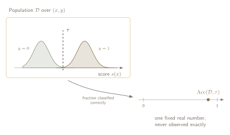
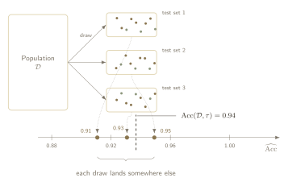

Arguably, one of the most important parts of a learning system is judging whether the system has, actually, learned. Every time I study a new topic I struggle with the same thing: _knowing whether I have really understood it_. One of my high school mathematics teachers used to say that the more you study mathematics, the more you realise how little you know. That thought stayed with me. This is not a discussion about what intelligence is, or anything close to AGI, but the question survives at a much smaller scale:

> How do we know that the simple model we just trained has learned anything at all?

There is a great deal of mathematics behind that question. I am not a mathematician, so this section skips most of it and keeps one distinction. Every evaluation number is two things at once:

1. It is an **estimator**. The test set is a sample, not the world, so the number that comes out of it is a guess. Every guess comes with error.
2. It is a **decision**. Before a single prediction is scored, the formula has already chosen which mistakes count as bad, how common the positive class is, and where to draw the line.

The first (estimator) is usually acknowledged, if only by a confidence interval. The second (decision) sometimes it is not, because it does not appear in the reported number. This tutorial pulls the two apart, one metric at a time, asking of each what does it estimate, when is that the quantity of interest, and what breaks when it is not.

:::note[Scope]
Much of the recent discourse around machine learning evaluation centers on large language models, where simply defining a "correct" answer is a significant hurdle. This tutorial takes a different path. We focus on classification tasks where the true label is explicitly **known**. The central question is not how to handle ambiguous ground truth, but how to measure a model's ability to cleanly separate classes. Especially in the challenging context of long-tailed distributions.
:::

:::note[Notation]

| Symbol   | Meaning                                                                                                                                                                                             |
| -------- | --------------------------------------------------------------------------------------------------------------------------------------------------------------------------------------------------- |
| $f$      | The trained model, held fixed throughout any single evaluation.                                                                                                                                     |
| $s(x)$   | The score the model assigns to input $x$. A real number, where larger means more evidence for the positive class. It is not assumed to be a probability unless a section says so.                   |
| $\tau$   | The decision threshold. The classifier predicts positive when $s(x) \geq \tau$. In this tutorial $\tau$ is always a threshold and never a temperature.                                              |
| $\pi$    | The prevalence, $\pi = P(Y = 1)$: the fraction of positives in whichever population is currently under discussion. Which population that is will matter a great deal later.                         |
| $c$      | The error-cost ratio, $c \in (0,1)$. The calibrated probability at which acting and not acting have equal expected value. Later sections show that choosing $\tau$ is the same act as choosing $c$. |
| $P$, $N$ | The number of positive and negative examples in a finite sample. Sample quantities, not population ones, which is exactly the distinction the next section draws.                                   |
| :::      |

## The estimand and the estimate

Let's start by analysing the following sentence:

> "Accuracy is 0.94"

Read quickly, that is one number. Read carefully, it is two, and nothing in the sentence says which of them is being reported.

1. The first object is a property of the population. This is the **estimand**.
   - Fix the model $f$, the threshold $\tau$, and the distribution $\mathcal{D}$ that inputs and labels are drawn from. Every draw $(X, Y)$ carries a label $Y \in \{0, 1\}$ and receives a prediction

     $$
     \widehat{Y} \;=\; \mathbf{1}[s(X) \geq \tau] \;\in\; \{0, 1\},
     $$

     where $\mathbf{1}$ is the indicator function and equals $1$ when the score clears the threshold and $0$ when it does not. Both sides are now plain numbers, so asking whether they agree is a well-posed question, and the probability that they do is one fixed real number:

     $$
     P_{(X,Y) \sim \mathcal{D}}\big(\widehat{Y} = Y\big).
     $$

   - It exists before any data is collected.
   - It does not move when a different test set is drawn.
   - No experiment ever reveals it exactly.

:::figure{#estimand}

The **estimand**. Fixing $f$, $\tau$ and $\mathcal{D}$ pins one real number that no test set ever reveals exactly.
:::

2. The second object is what came out of the test set. This is the **estimate**.
   - Count the correct predictions, divide by the number of examples, report 0.94.
   - That number is a random variable.
   - Draw a different test set from the same distribution and it lands somewhere else.

:::figure{#estimate}

The **estimate**. Each draw from the same $\mathcal{D}$ lands somewhere else. The dashed line is the **estimand** it is chasing and is not the average of these three test sets. It is where the draws would centre if every possible test set were drawn, which is a different and much larger claim.
:::

Every complaint about a metric is a complaint about one of the two, let's dive further into this.

- _"Accuracy was 0.94 on the test set and 0.71 once the model was deployed."_ → a claim about an **estimand**.
  - If this model is deployed into a medical clinic the scenario there is not the test set. Patients arrive at a different rate, so 0.71 is a correct measurement of a different number.
  - A larger clinical set perhaps would still have said 0.94.
- _"Accuracy was 0.94 on this split and 0.89 on the next one."_ → a claim about an **estimate**.
  - Nothing about the world changed between the two runs. The same population was sampled twice and returned two different answers.
  - A larger test set would have brought them closer together.

The phrase "metrics are unreliable under class imbalance" collapses both into a single complaint. A target that moves needs a different remedy from a measurement that is noisy, and the phrase hides which of the two is at hand.

## The decision hiding in the formula

Let's now imagine that everything the previous section asked for is granted: the test set is enormous, the sampling error has vanished, and 0.94 is the estimand itself, known exactly.

> Is that enough?

No. The number says how often the model was right. It does not say what _right_ was taken to mean, and that was settled before a single prediction was scored.

Perhaps this is still a bit abstract, so let's break it down and take the two settlements one at a time.

### Settlement one: where to draw the line

Accuracy is computed from predictions, but a model does not produce predictions. It produces $s(x)$, a real number. Something has to turn that number into a yes or a no, and that something is the threshold $\tau$.

$$
\text{predict positive when } s(x) \geq \tau
$$

That threshold may have been tuned with great care, or inherited from whatever the surrounding code happened to do for example $\tau = 0.5$. The reported $0.94$ does not say which, because it does not carry $\tau$ with it. And $\tau$ matters: the same model, on the same population, has a different accuracy at every value of it. As we change $\tau$ the model will of course change its behavior.

So ==0.94 is not the accuracy of the model==. It is the accuracy of the model at **one point** on a curve, and the curve was never shown.

:::figure{#threshold_sweep}
![Two stacked panels sharing a horizontal axis. The upper panel shows one population of scores: a tall negative class holding eighty percent of the data and a short positive class holding twenty percent, with three vertical lines marking candidate thresholds. Arrows beneath the middle line mark everything to its left as called zero and everything to its right as called one. The lower panel plots accuracy against the threshold as a single curve, with a dot where each of the three lines meets it, reading 0.75, 0.94 and 0.91. The 0.94 dot is highlighted as the value that was reported.](../../figures/threshold_sweep.svg)

Move $\tau$ left and the model turns eager, calling almost everything positive. Move it right and the model turns cautious, until it calls nothing positive at all and accuracy settles at $0.80$. Every point on the curve is the same model, on the same population, with the same scores.
:::

### Settlement two: what a mistake is worth

There are two ways to be wrong. The model can call a negative case positive, or it can call a positive case negative. Accuracy counts both, adds them together, and divides. Each one costs exactly the **same** and we can say something like **"one unit of wrongness"**.

That is not a fact about the model. It is a claim about the world, and a strong one. In a screening programme it says that missing a cancer and sending a healthy person for an unnecessary scan are equally bad outcomes. Written out as a sentence, that is a claim most people would reject on sight. Written as a metric, it goes unintuitively unchecked.

The two settlements are also not independent. Call $c$ the relative cost of the two kinds of mistake. For a score that is a calibrated probability, fixing $c$ fixes where $\tau$ should go. _At the probability where acting and not acting break even._

Equal costs put that break-even point at one half. So the familiar $\tau = 0.5$ is not a neutral starting point. It is the correct threshold under two conditions. One that the score is calibrated, and two that the two mistakes **cost the same**. Later sections go into this. For now it is enough to see that the threshold and the cost are one choice wearing two hats. So _$0.94$ does not only hide where the line was drawn_, it hides whether that was the right place to draw it at all.

### Settlement three: who is in the room

Accuracy asks how often the model is right. _Right about whom, though?_

Every case in the test set gets exactly one vote, so the answer belongs to whichever class brought the most cases. In a population that is eighty percent negative, the negatives cast eighty percent of the votes, and the accuracy is mostly a report on how well the model handles them.

Hold $f$ fixed and $\tau$ fixed. Leave every score exactly where it was, and simply recruit more negative items (e.g., healthy patients). Not one person already in the study gets a different score. The accuracy moves anyway, because the average is now being taken over a different crowd.

Push the recruiting far enough and the arithmetic turns absurd. Take a population that is ninety-nine percent negative, so $\pi = 0.01$, and a model that answers negative every single time, ignoring its input entirely. It scores $0.99$. It has learned nothing at all, and the metric calls it **excellent**.

:::figure{#same_model_two_crowds}

One hundred cases in each grid, and the same model in both: it answers negative every time and never looks at its input. Nothing about it improves from left to right. Only the crowd changed, and the number nearly doubled.
:::

The usual conclusion drawn from that example is that accuracy is _broken_. This expression might be a bit much and it is worth resisting.

Accuracy answered exactly the _question it was asked_. That is, on this population, at this threshold, counting both mistakes the same, how often is the model right? The answer is $0.99$, and it is correct.

This also settles a debt from earlier. Accuracy was $0.94$ on the test set and $0.71$ in the clinic example, and the reason is now visible. The clinic holds a different mix of people. Accuracy averages over whoever is in the room, so changing the room changes the number, and no quantity of extra data closes the gap, because the two numbers were never measuring the same thing.

Which leaves the settlement itself: ==a number that moves with the crowd is partly reporting the crowd==. Accuracy tells us something about the **model** and something about the **population** at the same time, added together, with no way to pull the two apart.

## What a defensible number states

Three different things went wrong across this page, and the rest of the tutorial depends on keeping them apart. They look alike from a distance and they have nothing in common up close.

1. **The estimand moved.** The clinic was not the test set, so $0.94$ and $0.71$ were never measuring the same quantity. A larger test set does not help.
2. **The estimate scattered.** Three test sets drawn from one population returned $0.91$, $0.93$ and $0.95$. Here a larger test set does help, and it is the only one of the three that it helps.
3. **The settlements went unexamined.** A threshold, a cost, and a prevalence were fixed before any prediction was scored. No quantity of data touches this, and neither does a better model.

Only the third is a criticism of the metric, and even then it is a gentle one. Each settlement is a problem because it was made in silence, not because it was made at all. Somebody has to decide these things. Written down, all three are ordinary engineering decisions:

- the prevalence the model will meet where it is deployed,
- what each kind of mistake costs,
- and where the threshold sits, given the first two.

A number reported next to those three is a claim that can be checked, argued with, and acted on. A number reported alone is _a claim about a population, a cost structure, and an operating point that nobody wrote down_.

Every section that follows does the same thing to a different metric. It asks which of the three that metric hands over, and which it decides on its own.
