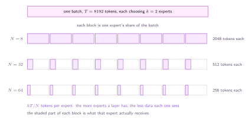

Everything so far has been about one token. One token has a router, $k$ experts, and a well defined answer. Batches are where sparse layers actually live, and a batch does not have a well defined answer, because the tokens have to share.

The difficulty is not the mathematics. It is that the router produces a different number of tokens for each expert, on every step, and the hardware underneath wants a rectangle whose size was fixed before the step began.

## The shrinking batch

Start with a problem that appears before any hardware does. A dense layer trained on a batch of $T$ tokens updates its weights from all $T$ of them. In a sparse layer each expert only sees the tokens that chose it, so with $k$ experts per token and $N$ experts in the layer, each expert receives roughly

$$
\frac{k\,T}{N} \quad \text{tokens}
$$

and that is if the routing is perfectly even, which it is not. The original paper calls this the _shrinking batch problem_, and the arithmetic is unkind: every expert you add makes every expert worse informed.

:::figure{#shrinking_batch}

The parameter count rises with $N$ and the data per parameter falls with $N$. Capacity is not free even before any hardware is involved.
:::

The standard answer is to make the batch bigger, which is why sparse models are trained with data and model parallelism together: split the batch across $D$ devices and put different experts on different devices, and each expert then sees $kTD/N$ tokens per step. The number of tokens per expert is a thing you now have to engineer, and it is the reason the next paragraph exists.

## Capacity

An accelerator wants to do the same operation on a fixed-size block of data. The memory has to be allocated before the routing is known, so each expert is given a buffer with room for a fixed number of tokens, decided in advance. That number is the **expert capacity**:

$$
C \;=\; \frac{T}{N} \times c
$$

- $T$ is the **number of tokens** in the batch, or in the group, and $N$ the number of experts.
- $c$ is the **capacity factor**, the slack we allow. $c = 1$ gives each expert exactly its even share. ST-MoE recommends $1.25$ during training and $2.0$ at evaluation.

The capacity factor is the price of imbalance, paid in advance and in full. At $c = 2$ every expert's buffer is twice the size it would need if routing were perfectly even, so half of the allocated compute is padding in the average case, and we pay for it whether or not the routing turns out to be lopsided.

GShard adds a wrinkle worth knowing about, because it changes what balance even means. Rather than one capacity for the whole batch, it partitions the tokens into $G$ groups of $S = T/G$ tokens and applies the capacity within each group. Balance is enforced locally, per group, not globally, so a token's fate depends on the few thousand tokens it was grouped with rather than on the batch as a whole.

## What happens to a dropped token

When more tokens choose an expert than its buffer can hold, the surplus is _dropped_. The word is exact. The computation is skipped, and the token's representation is passed straight to the next layer through the residual connection, unchanged.

It is worth being clear about what that means, because "dropped" sounds like a failure and it is really a silent no-op. Nothing errors. The loss does not spike. That token simply did not receive a feed-forward block at that layer, and if it happens at every layer the token passes through the whole model untouched by any expert.

:::figure{#capacity_overflow}

Five tokens dropped and five slots empty, in the same step. Imbalance is not a shortage of capacity, it is capacity in the wrong place.
:::

That figure is the argument for the whole of the next page. ==Nothing was over capacity on average, and a quarter of the batch was still thrown away==, because the tokens went where the router sent them and the router had no reason to spread them out.

## The loss now depends on the batch

One consequence deserves stating on its own, because it breaks an assumption every other part of the model is built on.

In a dense network, a sample's forward pass does not depend on which other samples it was batched with. The batch is a convenience for the hardware. Once capacity exists, that is no longer true: whether a token is processed by its expert or dropped depends on how many _other_ tokens in its group chose the same expert. Reshuffle the batch and the same token gets a different answer.

Three things follow, and all of them are the price of the same fact.

1. **Training is no longer deterministic in the usual way.** Two runs that differ only in batch composition compute different functions of the same token.
2. **Evaluation is not the same operation as training.** Serving one sequence at a time changes the group, so the field raises the capacity factor at evaluation rather than leave it alone.
3. **The cheapest fix is to make imbalance unlikely.** If the routing is close to even, the buffers are close to full, few tokens are dropped, and $c$ can stay near one.

The third is the one the field took. It is not a fix to the routing mechanism, which is untouched, and it is not a fix to the objective, which still does not care. It is an extra term in the loss whose only job is to make the histogram flat, and it is the next page.
