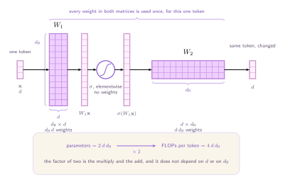

A transformer layer is split into two fundamentally different halves. The **attention mechanism** routes information across positions, deciding how tokens relate to one another and mixing their context. The **feed-forward block** (FFN) that follows, however, is entirely localized. It takes a single token's representation in isolation, expands its dimensionality, applies a non-linear transformation, and compresses it back down.

This section focuses on that second half. While attention captures contextual relationships, the FFN contains the vast majority of the model's parameters. And Mixture of Experts architectures are a promising direction to resolve that computational constraint.

## Where the parameters are

Let's start with the attention half, which learns four projections, each of them a square matrix $d \times d$. The queries $W_Q$, the keys $W_K$, the values $W_V$, and the output projection $W_O$ that mixes the heads back together. That is

$$
\text{attention parameters} \;=\; 4d^{2}
$$

The famous part of attention, the $T \times T$ table of scores $\operatorname{softmax}(QK^{\!\top}\!/\sqrt{d_k})$ that says how much each token reads from each other token, is _computed_, not stored. It holds no parameters at all. Its size is set by $T$, the number of tokens in the sequence, which is a property of the input rather than of the model itself.

Now the feed-forward block. It learns two rectangular matrices, $d_{\text{ff}} \times d$ on the way up and $d \times d_{\text{ff}}$ on the way back, and with the conventional $d_{\text{ff}} = 4d$ that is

$$
\text{feed-forward parameters} \;=\; 2\,d\,d_{\text{ff}} \;=\; 8d^{2}
$$

Twice the attention block, from two matrices against four. Put the two halves side by side and ==two thirds of every layer's parameters sit in the FFN half==.

:::figure{#transformer_block}

The two halves hold their cost in different places. Attention's expense is the score table, which grows with the sequence. The feed-forward block's expense is twice as large.
:::

The imbalance alone is not a problem. Parameters are what a model knows, and a layer that keeps two thirds of its knowledge in one place is **not** obviously worse than one that spreads it. The problem is what happens to those parameters at run time.

## Two matrices and a nonlinearity

Write $\mathbf{x} \in \mathbb{R}^{d}$ for one token's representation on the way out of attention. The feed-forward block is

$$
\operatorname{FFN}(\mathbf{x}) = W_2\, \sigma\!\left(W_1 \mathbf{x} + \mathbf{b}_1\right) + \mathbf{b}_2
$$

- $d$ is the **model width**, the dimension every token carries between layers.
- $d_{\text{ff}}$ is the **inner width**, how far the block expands before it comes back. Conventionally $d_{\text{ff}} = 4d$.
- $W_1 \in \mathbb{R}^{d_{\text{ff}} \times d}$ is the **expansion**, and $W_2 \in \mathbb{R}^{d \times d_{\text{ff}}}$ the **projection** back down.
- $\mathbf{b}_1 \in \mathbb{R}^{d_{\text{ff}}}$ and $\mathbf{b}_2 \in \mathbb{R}^{d}$ are the biases, and $\sigma$ is the nonlinearity.

Two limitations of this formulation are fundamental to understanding Mixture of Experts.

1. **The computation is entirely independent per token.** As shown in the diagram's $T \times d$ input block, a single token is just one $d$-dimensional vector sliced from the sequence, so a sequence of $T$ tokens results in $T$ isolated forward passes.
2. **Every single token is forced through the identical matrices $W_1$ and $W_2$.** The standard layer possesses no mechanism to tailor its weights for specific tokens or to leave any part of the network unactivated.

:::aside[The gated variants, which have three matrices]
Recent models usually replace this block with a gated variant, in which a third matrix produces a gate that multiplies the expansion elementwise before the projection. Mixtral, for instance, is built from SwiGLU blocks, and picks $d_{\text{ff}} = 14336$ rather than the round $4d$ we use here.

Nothing on this page changes. The parameter count picks up a factor of three over two, the cost per token picks up the same factor, and every sentence below about the two counts moving together survives untouched. We use the two matrix form because the arithmetic is cleaner and the conclusion is identical.
:::

## The same number twice

First, let's count the parameters. The matrix $W_1$ contains $d_{\text{ff}} \cdot d$ parameters and $W_2$ contains another $d \cdot d_{\text{ff}}$. The biases contribute $d_{\text{ff}} + d$, which we drop because it is smaller by a factor of $d$.

$$
\text{parameters} \;=\; 2\, d\, d_{\text{ff}}
$$

Now, let's count the computational work. Multiplying an $m \times n$ matrix by a vector requires $mn$ multiplications and $mn$ additions, totalling $2mn$ **floating point operations (FLOPs)**. The feed-forward block does two such products, one with $W_1$ and one with $W_2$, and the nonlinearity and the biases add $O(d_{\text{ff}})$ work, which is again smaller by a factor of $d$.

$$
\text{FLOPs per token} \;=\; 4\, d\, d_{\text{ff}}
$$

Put the two side by side and an interesting relation shows up:

$$
\text{FLOPs per token} \;=\; 2 \times \text{parameters}
$$

The factor of two accounts for one multiplication and one addition per weight. It does not depend on $d$, it does not depend on $d_{\text{ff}}$, and it is not an approximation. It follows from the dense nature of the network: ==because every single token interacts with every single parameter==, the computational cost per token is rigidly locked at two operations per parameter and there is no arrangement of the layer that changes that.

The diagram below illustrates this computation for a single $d$-dimensional input vector $\mathbf{x}$. As the token expands through $W_1$ and compresses through $W_2$, it is forced to interact with the entire grid of weights. There are no bypassed regions or conditionally activated paths. Every single parameter across both matrices demands exactly one multiply and one add, yielding a fixed factor of two that is entirely unaffected by the scale of $d$ or $d_{ff}$.

:::figure{#dense_ffn}

The two counts are read off the same picture, because they are counting the same thing: every weight in both matrices is used once per token.
:::

It helps to see it with real numbers. At $d = 4096$, and so $d_{\text{ff}} = 16384$, each matrix holds $67{,}108{,}864$ (67 million) weights, making the computational cost of a single block immense. Four billion parameters in the feed-forward blocks alone, and every single one of them multiplied by something for every token in the batch, at every step of training.

| Quantity        |   One block |    32 layers |
| --------------- | ----------: | -----------: |
| Parameters      | 134,217,728 | 4.29 billion |
| FLOPs per token | 268,435,456 | 8.59 billion |

## Turning the only knob

If we want to increase the capacity of the feed-forward block, the most direct approach is to increase $d_{\text{ff}}$. Doubling $d_{\text{ff}}$ successfully doubles the parameter count, but it simultaneously doubles the FLOPs per token. Increasing the residual stream width $d$, or stacking additional layers, retrieves us the same result. Every structural adjustment available in a dense transformer scales parameter count and compute cost by the exact same factor.

If we analyze this on the graph below, we can see that every possible dense feed-forward configuration is trapped on a single linear trajectory. There is no architectural knob in a dense layer that allows to step off this line and reach the empty region of higher capacity without a proportionally higher compute cost.

:::figure{#width_cost}

Three widths, one line. The shaded region underneath is **empty**, meaning no setting of any knob in a dense layer puts a model there.
:::

## What we would want instead

So the thing to attack is not the size of the block. It is the ratio. We want a layer that holds a great deal of parameters and uses only a few of them on any given token, so that the parameter count and the cost per token can be raised and left alone independently.
