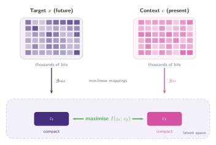
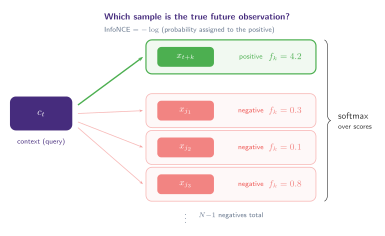

## Contrastive Predictive Coding

> "In this paper we propose the following: first, we compress high-dimensional data into a much more compact latent embedding space in which conditional predictions are easier to model. Secondly, we use powerful autoregressive models in this latent space to make predictions many steps in the future. Finally, we rely on Noise-Contrastive Estimation for the loss function in similar ways that have been used for learning word embeddings in natural language models, allowing for the whole model to be trained end-to-end."

The overall goal of [Oord et al. (2018)](https://arxiv.org/abs/1807.03748) is to **learn representations that encode the underlying shared information between different parts of a high-dimensional signal**, while discarding low-level information and noise that is more local.

### The problem with predicting in input space

One natural approach to self-supervised learning is to predict future observations directly in the raw input space. Given a context $c$ (for example, the past frames of a video), we could try to model the conditional distribution $p(x \mid c)$ over future observations $x$.

This runs into two difficulties:

1. **Unimodal losses are not useful.** Mean-squared error and cross-entropy penalise every pixel or token equally, regardless of whether the error is in a semantically meaningful feature or in irrelevant noise.
2. **Generative models are expensive.** Powerful conditional generative models _can_ capture the full distribution, but they are computationally intensive and tend to **waste capacity modelling local, low-level details of $x$ while ignoring the context $c$**.

Consider images as a concrete example. A single image may contain thousands of bits of information, but the high-level latent variable we care about (say, the object category) requires only about 10 bits for 1,024 classes. Modelling $p(x \mid c)$ directly forces the model to predict all those thousands of bits, most of which are irrelevant to the shared structure between $x$ and $c$.

### The CPC solution: encode, then maximise mutual information

Instead of predicting in the input space, CPC (Contrastive Predictive Coding) encodes both the target $x$ (future) and the context $c$ (present) into compact distributed vector representations via non-linear learned mappings. The encoder $g_{enc}$ maps the target observation into a latent vector $z_t = g_{enc}(x_t)$, while an autoregressive model $g_{ar}$ summarises the context into $c_t = g_{ar}(z_{\leq t})$.

The training objective is to **maximally preserve the mutual information of the original signals $x$ and $c$ in this latent space**. Mutual information between two random variables $x$ and $c$ is defined as

$$
I(x;\, c) = \sum_{x,\, c} p(x, c) \log \frac{p(x \mid c)}{p(x)}
$$

The ratio inside the logarithm, $p(x \mid c) / p(x)$, measures **how much knowing $c$ changes our belief about $x$**.

When $c$ is informative about $x$, the conditional $p(x \mid c)$ concentrates on the values of $x$ that are consistent with $c$, making this ratio large. When $c$ tells us nothing, $p(x \mid c) = p(x)$ and the ratio equals one (contributing zero to the sum).

By maximising the mutual information between the encoded representations (which is bounded by the Mutual Information between the original input signals), the model learns to extract the underlying latent variables that $x$ and $c$ have in common, while discarding the details specific to each.

:::figure{#cpc_latent_space}


Instead of predicting in the high-dimensional input space, CPC encodes both the target $x$ and context $c$ into compact latent representations $z_t$ and $c_t$, then maximises the mutual information $I(z_t;\, c_t)$ between them.
:::

### Formal Contrastive Predictive Coding

Let us now rewrite the intuition above in the paper's formal notation. A non-linear encoder $g_{\text{enc}}$ maps each observation $x_t$ to a latent representation $z_t = g_{\text{enc}}(x_t)$. An autoregressive model $g_{\text{ar}}$ then summarises all latent vectors up to time $t$ into a single context vector $c_t = g_{\text{ar}}(z_{\leq t})$.

As argued above, we do not predict future observations $x_{t+k}$ directly with a generative model $p_k(x_{t+k} \mid c_t)$. **Instead we model a density ratio that preserves the mutual information** between $x_{t+k}$ and $c_t$:

$$
f_k(x_{t+k},\, c_t) \;\propto\; \frac{p(x_{t+k} \mid c_t)}{p(x_{t+k})}
$$

- $f_k(x_{t+k},\, c_t)$ is the **score function** that measures how compatible a future observation $x_{t+k}$ is with the current context $c_t$. The subscript $k$ indicates that we use a different scoring function for each time step into the future.
- $p(x_{t+k} \mid c_t)$ is the **conditional density** of the future observation given the context. This is what a generative model would try to compute directly.
- $p(x_{t+k})$ is the **marginal density** of the future observation, regardless of context. Dividing by this term removes the "base rate" of $x_{t+k}$, so that $f_k$ only reflects what $c_t$ tells us about $x_{t+k}$.
- $\propto$ stands for "proportional to" (up to a multiplicative constant). The density ratio does not have to integrate to one, so $f$ can be unnormalised.

Although any positive real score function could be used, the paper chooses a simple log-bilinear model:

$$
f_k(x_{t+k},\, c_t) = \exp\!\big(z_{t+k}^\top W_k\, c_t\big)
$$

A separate linear transformation $W_k^\top c_t$ is used for each future step $k$. Alternatively, non-linear networks or recurrent models could replace this bilinear form.

By modelling the density ratio $f(x_{t+k}, c_t)$ and inferring $z_{t+k}$ with an encoder, we relieve the model from having to reconstruct the full high-dimensional distribution over $x_{t+k}$. Although we cannot evaluate $p(x)$ or $p(x \mid c)$ directly, **we _can_ sample from these distributions**, which allows us to use techniques such as Noise-Contrastive Estimation that are based on comparing the target value with randomly sampled negative values.

### What this means in plain terms

Putting it all together, CPC works in three steps:

1. **Compress.** Given a sequence of observations (audio frames, image patches, text tokens), compress each one into a small vector $z_t$, then build a summary $c_t$ of everything seen so far.
2. **Score.** The score function $f_k$ takes the context $c_t$ and a candidate future observation $x_{t+k}$, and returns a number: high if $x_{t+k}$ is a plausible continuation, low if it is not. Because $f_k$ is proportional to the density ratio $p(x \mid c) / p(x)$, a high score means $x_{t+k}$ is _more likely given this context than it would be on average_.
3. **Discriminate.** ==Given the context so far, can the model pick out what actually comes next from a set of random alternatives?== The model never needs to reconstruct pixels or tokens; it only needs to tell real continuations apart from random ones.

## InfoNCE Loss

We now have all the ingredients: an encoder that produces latent vectors $z_t$, a context summary $c_t$, and a score function $f_k$ that measures how compatible a candidate is with the context. The question is: **how do we turn this into a training objective?**

The idea is simple. Given a context $c_t$, we draw one **positive** sample $x_{t+k}$ (the true future observation) and $N{-}1$ **negative** samples $\{x_{j_1}, \dots, x_{j_{N-1}}\}$ drawn randomly from the data. We then ask the model to identify the positive among all $N$ candidates. This is a $(1\text{-out-of-}N)$ classification task.

:::figure{#infonce_classification}


InfoNCE as classification. The context $c_t$ scores each candidate via $f_k$. The loss is the negative log-probability assigned to the correct positive (green) by a softmax over all scores.
:::

The loss for a single prediction is the negative log-probability that the softmax assigns to the positive sample:

$$
\mathcal{L}_{\text{InfoNCE}} = -\log \frac{f_k(x_{t+k},\, c_t)}{\displaystyle f_k(x_{t+k},\, c_t) + \sum_{x_j \in X_{\text{neg}}} f_k(x_j,\, c_t)}
$$

Substituting the log-bilinear form $f_k(x, c_t) = \exp(z^\top W_k\, c_t)$, this becomes:

$$
\mathcal{L}_{\text{InfoNCE}} = -\log \frac{\exp(z_{t+k}^\top W_k\, c_t)}{\displaystyle \exp(z_{t+k}^\top W_k\, c_t) + \sum_{x_j \in X_{\text{neg}}} \exp(z_j^\top W_k\, c_t)}
$$

### Reading the equation

Let us unpack this piece by piece:

- **Numerator** $\exp(z_{t+k}^\top W_k\, c_t)$: the score assigned to the _positive_ sample. The dot product $z_{t+k}^\top W_k\, c_t$ measures how well the true future aligns with the context. We want this to be **large**.
- **Denominator**: the sum of scores over _all_ candidates (one positive + $N{-}1$ negatives). This acts as a partition function, normalising the scores into a valid probability distribution via softmax.
- **The ratio** is therefore the probability the model assigns to the correct positive:

  $$
  p(\text{positive} \mid c_t) = \frac{\exp(z_{t+k}^\top W_k\, c_t)}{\sum_{j} \exp(z_j^\top W_k\, c_t)}
  $$

- **The $-\log$** converts this probability into a cross-entropy loss. When the model is confident and correct, $p \to 1$ and $\mathcal{L} \to 0$. When it fails, $p \to 0$ and $\mathcal{L} \to \infty$.

### Temperature $\tau$

In practice, a temperature hyperparameter $\tau > 0$ is added to control the **sharpness** of the softmax distribution. The loss becomes:

$$
\mathcal{L}_{\text{InfoNCE}} = -\log \frac{\exp(z_{t+k}^\top W_k\, c_t\; /\; \tau)}{\displaystyle \sum_{j} \exp(z_j^\top W_k\, c_t\; /\; \tau)}
$$

- **$\tau \to 0$ (sharp):** The distribution becomes nearly one-hot. The model must be very confident. Hard negatives (those with high similarity to the context) dominate the gradient.
- **$\tau \to \infty$ (uniform):** All candidates contribute equally. The loss becomes less discriminative and the learning signal is weak.
- **Typical values:** $\tau \in [0.05, 0.5]$. SimCLR uses $\tau = 0.5$; MoCo uses $\tau = 0.07$.

## Gradient Analysis

Let $s_j = z_j^\top W_k\, c_t / \tau$ denote the scaled score for candidate $j$, and let $p_j = \text{softmax}(s_j)$ be the probability the model assigns to candidate $j$. The gradient of $\mathcal{L}_{\text{InfoNCE}}$ with respect to the context $c_t$ is:

$$
\frac{\partial \mathcal{L}}{\partial c_t} = -\frac{1}{\tau}\left(W_k^\top z_{t+k} - \sum_{j} p_j \cdot W_k^\top z_j \right)
$$

The gradient pushes $c_t$ towards the positive representation $W_k^\top z_{t+k}$ and away from the probability-weighted average of all candidates. Hard negatives (those with high $p_j$) dominate the repulsion, so the model learns most from its mistakes.

For a negative sample $z_j$:

$$
\frac{\partial \mathcal{L}}{\partial z_j} = \frac{p_j}{\tau} \cdot W_k\, c_t
$$

Only negatives that the model confuses with the positive (high $p_j$) receive a meaningful gradient signal.

:::aside[Deriving both gradients step by step]

We start from the InfoNCE loss written in terms of scaled scores. Let $s_j = z_j^\top W_k\, c_t / \tau$ for each candidate $j$, with $j = 0$ denoting the positive ($z_0 = z_{t+k}$). The loss is:

$$
\mathcal{L} = -\log \frac{\exp(s_0)}{\sum_j \exp(s_j)} = {\color{#462C7D} -s_0} + {\color{#D552A3} \log \sum_j \exp(s_j)}
$$

where the second form follows from $\log(a/b) = \log a - \log b$ and $\log(\exp(s_0)) = s_0$.

#### Step 1: Gradient with respect to the scores

The loss has two terms. We differentiate each with respect to an arbitrary score $s_j$:

**First term:** ${\color{#462C7D} -s_0}$ is a function of $s_0$ only. Its derivative with respect to $s_j$ is $-1$ when $j = 0$ and $0$ otherwise. We write this compactly as $-\mathbf{1}[j = 0]$, where $\mathbf{1}[\cdot]$ is the indicator function (equals 1 when the condition is true, 0 otherwise).

$$
\frac{\partial}{\partial s_j}{\color{#462C7D}\big(-s_0\big)} = {\color{#462C7D} -\mathbf{1}[j = 0]}
$$

**Second term:** ${\color{#D552A3} \log \sum_m \exp(s_m)}$. This is the log-sum-exp function. The sum runs over all candidates $m = 0, 1, \dots, N{-}1$, so it contains a term $\exp(s_j)$ for the specific $j$ we are differentiating with respect to. All other terms $\exp(s_m)$ with $m \neq j$ are constants with respect to $s_j$ and vanish under differentiation.

Let $S = \sum_m \exp(s_m)$. By the chain rule, $\frac{\partial}{\partial s_j} \log S = \frac{1}{S} \cdot \frac{\partial S}{\partial s_j}$. Since the only term in $S$ that depends on $s_j$ is $\exp(s_j)$, and $\frac{\partial}{\partial s_j} \exp(s_j) = \exp(s_j)$:

$$
\frac{\partial}{\partial s_j} {\color{#D552A3} \log \sum_m \exp(s_m)} = {\color{#D552A3} \frac{\exp(s_j)}{\sum_m \exp(s_m)} = p_j}
$$

**Combining both terms:**

$$
\frac{\partial \mathcal{L}}{\partial s_j} = {\color{#462C7D} -\mathbf{1}[j = 0]} + {\color{#D552A3} p_j}
$$

For the positive ($j = 0$): $\;\partial \mathcal{L} / \partial s_0 = p_0 - 1$. For any negative ($j \neq 0$): $\;\partial \mathcal{L} / \partial s_j = p_j$.

#### Step 2: Gradient with respect to $c_t$

Since $s_j = z_j^\top W_k\, c_t / \tau$, we have $\partial s_j / \partial c_t = W_k^\top z_j / \tau$. Applying the chain rule:

$$
\frac{\partial \mathcal{L}}{\partial c_t} = \sum_j \frac{\partial \mathcal{L}}{\partial s_j} \cdot \frac{\partial s_j}{\partial c_t} = \sum_j \big(-\mathbf{1}[j = 0] + p_j\big) \cdot \frac{W_k^\top z_j}{\tau}
$$

Splitting the sum into the indicator term and the $p_j$ term:

$$
\frac{\partial \mathcal{L}}{\partial c_t} = -\frac{W_k^\top z_{t+k}}{\tau} + \frac{1}{\tau}\sum_j p_j \cdot W_k^\top z_j
$$

Factoring out $-1/\tau$:

$$
\boxed{\frac{\partial \mathcal{L}}{\partial c_t} = -\frac{1}{\tau}\left(W_k^\top z_{t+k} - \sum_j p_j \cdot W_k^\top z_j\right)}
$$

This confirms the result above: the gradient points from the weighted average of all candidates towards the positive.

#### Step 3: Gradient with respect to $z_j$ (a negative)

For a specific negative $z_j$ (where $j \neq 0$), only the score $s_j$ depends on $z_j$. We have $\partial s_j / \partial z_j = W_k\, c_t / \tau$. Applying the chain rule:

$$
\frac{\partial \mathcal{L}}{\partial z_j} = \frac{\partial \mathcal{L}}{\partial s_j} \cdot \frac{\partial s_j}{\partial z_j} = p_j \cdot \frac{W_k\, c_t}{\tau}
$$

which gives:

$$
\boxed{\frac{\partial \mathcal{L}}{\partial z_j} = \frac{p_j}{\tau} \cdot W_k\, c_t}
$$

When $p_j \approx 0$ (the model correctly ignores this negative), the gradient vanishes. When $p_j$ is large (the model confuses this negative with the positive), the gradient pushes $z_j$ away from $W_k\, c_t$.

:::

## Connection to Mutual Information

The name "InfoNCE" comes from Noise-Contrastive Estimation applied to mutual information. The key theoretical result from [Oord et al. (2018)](https://arxiv.org/abs/1807.03748) is:

$$
I(x;\, c) \geq \log(N) - \mathcal{L}_{\text{InfoNCE}}
$$

Minimising InfoNCE maximises a lower bound on the mutual information $I(x;\, c)$ between the target and context. The bound is capped at $\log(N)$, where $N$ is the total number of candidates (one positive + $N{-}1$ negatives). This motivates using large batch sizes: ==more negatives raise the ceiling on how much mutual information the loss can capture.==

As $N \to \infty$ the bound becomes tight and the estimator recovers the true mutual information.

## InfoNCE in PyTorch

A minimal implementation of InfoNCE following the CPC framework. We simulate a sequence of observations, encode them, build context vectors with a GRU, and train using the InfoNCE loss to predict future latent representations.

```python
# infonce_example.py
import torch
import torch.nn as nn
import torch.nn.functional as F
import torch.optim as optim

# ── Synthetic data: random sequences ────────────────────────────

def sample_sequences(batch_size=32, seq_len=16, input_dim=40):
    """Generate random sequences (e.g. audio frames, image patches)."""
    return torch.randn(batch_size, seq_len, input_dim)

# ── CPC model ───────────────────────────────────────────────────

class CPCModel(nn.Module):
    def __init__(self, input_dim=40, z_dim=64, c_dim=128, pred_steps=4):
        super().__init__()
        self.pred_steps = pred_steps

        # g_enc: non-linear encoder x_t -> z_t
        self.encoder = nn.Sequential(
            nn.Linear(input_dim, 128),
            nn.ReLU(),
            nn.Linear(128, z_dim),
        )

        # g_ar: autoregressive model z_{<=t} -> c_t
        self.autoregressive = nn.GRU(z_dim, c_dim, batch_first=True)

        # W_k: one linear prediction head per future step
        self.predictors = nn.ModuleList(
            [nn.Linear(c_dim, z_dim, bias=False) for _ in range(pred_steps)]
        )

    def forward(self, x):
        # Encode all observations: (batch, seq_len, z_dim)
        z = self.encoder(x)

        # Autoregressive context: (batch, seq_len, c_dim)
        c, _ = self.autoregressive(z)

        return z, c

# ── InfoNCE loss ─────────────────────────────────────────────────

def infonce_loss(z, c, predictors, pred_steps, n_negatives=16, tau=0.07):
    """
    z: (batch, seq_len, z_dim) — encoded observations
    c: (batch, seq_len, c_dim) — context vectors
    """
    batch_size, seq_len, z_dim = z.shape
    losses = []

    for k in range(1, pred_steps + 1):
        # Maximum timestep from which we can predict k steps ahead
        t_max = seq_len - k

        # Context at time t: (batch, t_max, c_dim)
        c_t = c[:, :t_max, :]

        # Positive: true future z_{t+k} for each t: (batch, t_max, z_dim)
        z_pos = z[:, k : k + t_max, :]

        # W_k * c_t: predicted future representation: (batch, t_max, z_dim)
        pred = predictors[k - 1](c_t)

        # Score positives: z_{t+k}^T W_k c_t / tau → (batch, t_max, 1)
        pos_scores = (pred * z_pos).sum(dim=-1, keepdim=True) / tau

        # Sample random negatives from other positions in the batch
        neg_idx = torch.randint(
            0, batch_size * seq_len, (batch_size, t_max, n_negatives)
        )
        z_flat = z.reshape(-1, z_dim)
        z_neg = z_flat[neg_idx]  # (batch, t_max, n_negatives, z_dim)

        # Score negatives: z_j^T W_k c_t / tau → (batch, t_max, n_negatives)
        neg_scores = torch.einsum("btd,btnd->btn", pred, z_neg) / tau

        # Concatenate: positive first, then negatives
        # → (batch, t_max, 1 + n_negatives)
        logits = torch.cat([pos_scores, neg_scores], dim=-1)

        # Label = 0: the positive is always at index 0
        labels = torch.zeros(batch_size, t_max, dtype=torch.long)

        # InfoNCE = cross-entropy over the candidates
        loss_k = F.cross_entropy(
            logits.reshape(-1, logits.size(-1)), labels.reshape(-1)
        )
        losses.append(loss_k)

    return torch.stack(losses).mean()

# ── Training loop ────────────────────────────────────────────────

model = CPCModel()
optimizer = optim.Adam(model.parameters(), lr=3e-4)

for step in range(3000):
    x = sample_sequences()

    z, c = model(x)
    loss = infonce_loss(z, c, model.predictors, model.pred_steps)

    optimizer.zero_grad()
    loss.backward()
    optimizer.step()

    if (step + 1) % 500 == 0:
        print(f"Step {step + 1:4d} | loss = {loss.item():.4f}")

# Expected output: loss ≈ 2.83 = ln(17)
# With random data there is no temporal structure to learn,
# so the model cannot do better than chance: 1/17 ≈ 5.9%
```

A few things to notice:

- We compute `pos_scores` and `neg_scores` separately, then concatenate them with the positive first. **Since the positive is always at index 0, the label is simply `0` and the loss reduces to `F.cross_entropy`.**
- Each prediction step $k$ has its own linear head `predictors[k-1]`, corresponding to $W_k$ in the paper. This computes $W_k^\top c_t$, the predicted future representation.
- Negatives are sampled randomly from all encoded observations in the batch. Each query gets `n_negatives` random candidates, scored via `einsum`.
- The temperature `tau=0.07` sharpens the softmax. Both positive and negative scores are divided by $\tau$ before the cross-entropy.

## Four things to keep from InfoNCE

1. InfoNCE is a softmax cross-entropy over similarity scores: classify the true future observation among random negatives.
2. Temperature $\tau$ controls the sharpness of the distribution and which negatives matter most.
3. The gradient is dominated by hard negatives, meaning samples the model currently confuses with the positive.
4. Minimising InfoNCE maximises a lower bound on mutual information $I(x;\, c)$, bounded by $\log(N)$.
