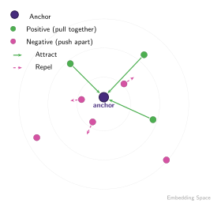
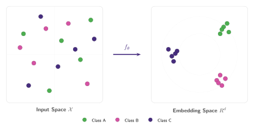
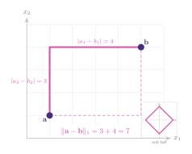
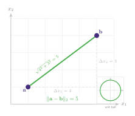
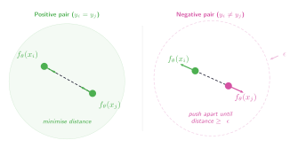

## The Core Intuition

Rather than mapping inputs to fixed class labels, contrastive learning shapes **representation space** directly:

- **Pull Together** representations of semantically similar examples (**positives**).
- **Push Apart** representations of semantically different examples (**negatives**).

==The result is an embedding space where proximity encodes semantic similarity, learned entirely from structure of the data rather than from explicit labels.==

:::figure{#contrastive_intuition}

Pull positives together, push negatives apart in the embedding space.
:::

## Contrastive Training Objectives

Given a set of input samples $\{x_i\}$ with labels $y_i \in \{1, ..., L\}$ we seek an encoder $f_{\theta}: \mathcal{X} \rightarrow \mathbb{R}^d$ such that:

- Examples from the **same class** have **similar embeddings**.
- Examples from **different classes** have **dissimilar embeddings**.

Let's unpack each piece of this formulation:

- **Input samples $\{x_i\}$** — the raw data points: images, sentences, audio clips, etc. Each $x_i$ lives in some input space $\mathcal{X}$ (e.g. $\mathbb{R}^{224 \times 224 \times 3}$ for images).
- **Labels $y_i \in \{1, \ldots, L\}$** — the class each sample belongs to. In supervised contrastive learning these define what counts as "same" vs "different". In self-supervised learning, we replace labels with data augmentations to define positives.
- **Encoder $f_\theta$** — a neural network (e.g. ResNet, ViT) with learnable parameters $\theta$. It maps each high-dimensional input into a compact representation.
- **$\mathcal{X} \rightarrow \mathbb{R}^d$** — the encoder maps from the input space $\mathcal{X}$ to a $d$-dimensional vector space. Typical values: $d = 128$ or $d = 256$. This is the _embedding space_ where we measure similarity.
- **Parameters $\theta$** — the weights and biases of the network. Training adjusts $\theta$ so that the geometry of $\mathbb{R}^d$ reflects semantic relationships: nearby points share meaning, distant points do not.

:::figure{#encoder_mapping}

The encoder $f_\theta$ maps from a high-dimensional input space, where classes are interleaved, to a compact embedding space where same-class points cluster together.
:::

How can we then force our encoder $f_\theta$ to enforce this separation in our embedding space? One of the earliest answers came from [Chopra et al., 2005](https://doi.org/10.1109/CVPR.2005.202):

> "The idea is to learn a function that maps input patterns into a target space such that the $L_1$ norm in the target space approximates the 'semantic' distance in the input space."

::::aside[$L_1$ vs $L_2$ distances]
Distance metrics measure how far apart two points $\mathbf{a}$ and $\mathbf{b}$ are in $\mathbb{R}^d$. Two of the most common are the $L_1$ and $L_2$ norms.

#### $L_1$ distance (Manhattan)

Sum of the absolute differences along each dimension. It measures distance as if you were walking on a grid, where only horizontal and vertical moves are "allowed":

$$
\| \mathbf{a} - \mathbf{b} \|_1 = \sum_{k=1}^{d} |a_k - b_k|
$$

In 2D, the set of points at $L_1$ distance 1 from the origin forms a **diamond** (rotated square). The $L_1$ norm is more robust to outliers in individual dimensions because it doesn't square the differences.

:::figure{#l1_distance}

$L_1$ distance follows axis-aligned paths.
:::

#### $L_2$ distance (Euclidean)

The straight-line distance between two points:

$$
\| \mathbf{a} - \mathbf{b} \|_2 = \sqrt{\sum_{k=1}^{d} (a_k - b_k)^2}
$$

In 2D, the set of points at $L_2$ distance 1 from the origin forms a **circle**. Squaring the differences means large deviations in any single dimension are penalised heavily.

:::figure{#l2_distance}

$L_2$ distance is the straight-line distance.
:::

#### Why does it matter here?

The contrastive loss from [Chopra et al., 2005](https://doi.org/10.1109/CVPR.2005.202) uses $L_1$, while many modern methods (SimCLR, MoCo) use $L_2$ or cosine similarity. The choice affects how the embedding space is shaped:

- $L_1$ encourages **sparse** representations $\rightarrow$ dimensions can independently be zero.
- $L_2$ encourages **smooth** representations $\rightarrow$ points spread evenly on a hypersphere.
- **Cosine similarity** ($= L_2$ on normalised vectors) ignores magnitude entirely and only compares direction.
  ::::

## The Contrastive Loss

A great resource to build intuition for contrastive learning is [Weng, 2021](https://lilianweng.github.io/posts/2021-05-31-contrastive/). The blog post retrieves a quite intuitive equation to understand what we're trying to learn:

$$
\mathcal{L}_{\text{cont}}(\mathbf{x}_i, \mathbf{x}_j, \theta) = \underbrace{\color{#4CAF50}\mathbb{1}[y_i = y_j] \| f_\theta(\mathbf{x}_i) - f_\theta(\mathbf{x}_j) \|_2^2}_{\text{pull together}}
$$

$$
+ \underbrace{\color{#D552A3}\mathbb{1}[y_i \neq y_j] \max\!\big(0,\; \epsilon - \| f_\theta(\mathbf{x}_i) - f_\theta(\mathbf{x}_j) \|_2\big)^2}_{\text{push apart}}
$$

where $\epsilon$ is a hyperparameter defining the lower bound distance between samples of different classes. Let's break this down term by term:

- **$\color{#4CAF50}\mathbb{1}[y_i = y_j]$** — an indicator function that equals 1 when the two samples belong to the **same class**, and 0 otherwise. This "activates" the first term only for positive pairs.
- **$\color{#4CAF50}\| f_\theta(\mathbf{x}_i) - f_\theta(\mathbf{x}_j) \|_2^2$** — the squared Euclidean distance between the embeddings. When this term is active (same class), minimising the loss **pulls the representations together**.
- **$\color{#D552A3}\mathbb{1}[y_i \neq y_j]$** — the opposite indicator: equals 1 when the samples belong to **different classes**. This activates the second term only for negative pairs.
- **$\color{#D552A3}\max(0,\; \epsilon - \| f_\theta(\mathbf{x}_i) - f_\theta(\mathbf{x}_j) \|_2)^2$** — a hinge-like term. If the distance between negatives is already greater than $\epsilon$, this term is zero (they're far enough). If the distance is _less_ than $\epsilon$, the loss **pushes them apart** until they reach the margin.
- **$\epsilon$ (margin)** — controls how far apart negative pairs need to be. Too small and the embedding space is cramped; too large and the model wastes capacity enforcing unnecessary separation.

:::figure{#contrastive_loss}

**Left**: positive pairs are pulled together by minimising their distance. **Right**: negative pairs are pushed apart until their distance exceeds the margin $\epsilon$.
:::

Now that the intuition has been built, the [next sections](../nce/) will cover the methods that have been proposed across the literature to achieve better separation between negative and positive classes.
