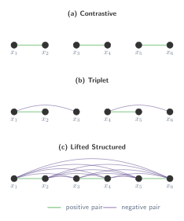

## Triplets waste most of the batch

> "We present a novel structured loss function designed to take full advantage of the training batches in the embedding learning problem."

[Song et al. (2016)](https://arxiv.org/abs/1511.06452) introduced a loss function that addresses a key limitation of triplet loss: **each triplet update only considers one positive and one negative per anchor, wasting the vast majority of pairwise information available in a mini-batch**.

To see why this matters, consider the progression of metric learning losses. Contrastive loss operates on _pairs_: it pulls matching pairs together and pushes non-matching pairs apart, one pair at a time. Triplet loss improves on this by considering _triplets_ (anchor, positive, negative), giving the network a relative comparison. But the lifted structured loss goes further: it considers ==all pairwise distances in the entire mini-batch simultaneously==.

## From triplets to batch-wise comparisons

In triplet loss, each gradient update considers one anchor, one positive, and one negative. If we have a mini-batch of $B$ examples, there are $O(B^2)$ pairwise relationships between them. Triplet loss only uses $O(B)$ of these relationships per update. The rest of the information is simply discarded.

The lifted structured loss exploits _all_ positive and negative pairs in the batch simultaneously. For each positive pair $(i, j)$, it considers every negative that is close to either $i$ or $j$, turning a sparse training signal into a dense one.

:::figure{#batch_comparisons}


Connections used by each loss within a mini-batch. Contrastive loss uses isolated pairs; triplet loss uses sparse triplet connections; lifted structured loss uses all pairwise relationships.
:::

## The loss function

Let $D_{ij} = \|f(\mathbf{x}_i) - f(\mathbf{x}_j)\|_2$ denote the Euclidean distance between the embeddings of examples $i$ and $j$. Let $P$ be the set of positive pairs (pairs with the same label) and $\alpha$ the margin.

For each positive pair $(i, j) \in P$, the lifted structured loss first computes a per-pair cost:

$$
\tilde{J}_{i,j} = \max\!\left(\max_{(i,k):\, y_{ik}=0} \alpha - D_{ik},\;\; \max_{(j,l):\, y_{jl}=0} \alpha - D_{jl}\right) + D_{ij}
$$

Let us unpack each piece:

- $D_{ij}$ is the distance between the positive pair. We want this to be **small**.
- $\max_{(i,k):\, y_{ik}=0} \alpha - D_{ik}$ finds the **hardest negative** for point $i$: the negative $k$ that is closest to $i$ (largest margin violation).
- Similarly, $\max_{(j,l):\, y_{jl}=0} \alpha - D_{jl}$ finds the hardest negative for point $j$.
- The outer $\max$ takes the worst violation from either side. This is the key insight: we guard _both_ members of the positive pair, not just the anchor.
- $\alpha - D_{ik}$ means: if a negative $k$ is closer than the margin $\alpha$, it contributes a positive value; if it is already far enough away, it contributes a negative value (which will be clipped).

The total loss over all positive pairs is then:

$$
J = \frac{1}{2|P|} \sum_{(i,j) \in P} \max\!\big(0,\; \tilde{J}_{i,j}\big)^2
$$

The squared hinge $\max(0, \cdot)^2$ serves two purposes:

1. It ensures that satisfied pairs (where all negatives are far enough) contribute zero loss.
2. Compared to the standard hinge $\max(0, \cdot)$, the squared version produces **smoother gradients near zero**, which helps optimisation.

## Smooth approximation

The nested $\max$ in $\tilde{J}_{i,j}$ is not smooth: it selects a single hardest negative and ignores the rest. This creates discontinuous gradients that can make optimisation unstable. The authors replace it with a **log-sum-exp** approximation:

$$
\tilde{J}_{i,j} = \log\!\left(\sum_{(i,k):\, y_{ik}=0} \exp\!\big(\alpha - D_{ik}\big) + \sum_{(j,l):\, y_{jl}=0} \exp\!\big(\alpha - D_{jl}\big)\right) + D_{ij}
$$

The log-sum-exp function is a classic smooth approximation to the $\max$ operator. Recall that for any set of values $\{z_1, \ldots, z_n\}$:

$$
\max_k z_k \;\leq\; \log \sum_k \exp(z_k) \;\leq\; \max_k z_k + \log n
$$

So the log-sum-exp is an upper bound on the max, and it is tight when one value dominates. Crucially, it is **everywhere differentiable**, which gives gradient-based optimisers a smooth landscape to work with. It also means that near-hard negatives (not just the single hardest) can contribute to the gradient, providing a richer training signal.

## Lifted Structured Loss in PyTorch

Here is a minimal implementation of the smooth version of the lifted structured loss. Given a batch of embeddings and their labels, we compute the full pairwise distance matrix and apply the loss over all positive pairs.

```python
# lifted_structured_loss.py
import torch
import torch.nn.functional as F

def lifted_structured_loss(embeddings, labels, margin=1.0):
    """
    Lifted structured loss (smooth approximation).

    Args:
        embeddings: (B, D) tensor of L2-normalised embeddings.
        labels:     (B,) tensor of integer class labels.
        margin:     float, the margin alpha.

    Returns:
        Scalar loss.
    """
    # Pairwise Euclidean distance matrix: (B, B)
    dists = torch.cdist(embeddings, embeddings, p=2)

    # Masks for positive and negative pairs
    labels = labels.unsqueeze(0)
    pos_mask = (labels == labels.T).float()
    neg_mask = (labels != labels.T).float()

    # Remove self-pairs from positive mask
    pos_mask.fill_diagonal_(0)

    # For each point i, compute logsumexp over its negatives
    # Set non-negative entries to -inf so they don't contribute
    neg_exponents = margin - dists  # (B, B)
    neg_exponents = neg_exponents * neg_mask + (-1e9) * (1 - neg_mask)
    lse_per_row = torch.logsumexp(neg_exponents, dim=1)  # (B,)

    # For each positive pair (i, j): J_ij = lse_i + lse_j + D_ij
    # We build this for all pairs, then mask to positives
    # lse_per_row[i] + lse_per_row[j] approximates the nested max
    # But the paper sums inside one log, so we use:
    # log(exp(lse_i) + exp(lse_j)) + D_ij
    lse_i = lse_per_row.unsqueeze(1).expand_as(dists)
    lse_j = lse_per_row.unsqueeze(0).expand_as(dists)
    combined_lse = torch.logaddexp(lse_i, lse_j)

    J_ij = combined_lse + dists  # (B, B)

    # Squared hinge over positive pairs
    loss_mat = torch.clamp(J_ij, min=0).pow(2) * pos_mask

    num_pos = pos_mask.sum()
    if num_pos == 0:
        return torch.tensor(0.0, device=embeddings.device)

    return loss_mat.sum() / (2 * num_pos)
```

A few things to notice:

- `torch.cdist` computes the full $B \times B$ pairwise distance matrix in one call, which is efficient on GPU.
- `torch.logsumexp` computes the smooth max over negatives for each point, and `torch.logaddexp` combines the two sides of the positive pair.
- We mask out self-pairs and non-positive pairs so that the loss is only computed over genuine positive pairs.
- The squared hinge `clamp(..., min=0).pow(2)` zeros out satisfied pairs and smooths the gradient near the boundary.
