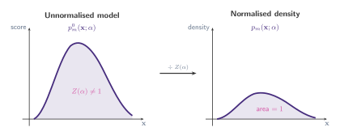
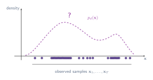
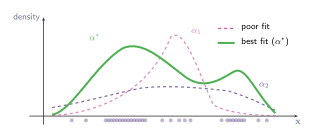

## What problem does NCE solve?

> "The idea is to perform nonlinear logistic regression to discriminate between the observed data and some artificially generated noise, using the model log-density function in the regression nonlinearity."

[Gutmann and Hyvärinen (2010)](https://proceedings.mlr.press/v9/gutmann10a.html) consider the problem of estimating **unnormalised statistical models**. Before diving into their solution, we need to understand what this problem actually involves. We will unpack four ideas: **(1)** What an unnormalised model is; **(2)** What it means to observe data from an unknown density; **(3)** How we structure our search with a parameterised family; **(4)** And what it means for the true density to live inside that family.

### (1) What is an unnormalised statistical model?

A **probability density function must integrate to one**. This is the basic rule that makes probabilities meaningful: if we sum up the likelihood of every possible outcome, the total must be exactly one.

In many practical settings, however, we can only write down a function that tells us the _relative_ likelihood of different inputs. We call this function the **unnormalised model** and denote it $p_m^0(\mathbf{x};\alpha)$. Let us break this notation apart:

- $\mathbf{x} \in \mathbb{R}^n$ is the **input vector**. What $\mathbf{x}$ represents depends on the domain. It could be a vector of pixel intensities in an image, a sequence of word embeddings, sensor readings from a robot, or any other high-dimensional observation we want to model.
- $\alpha$ is the **parameter vector** that controls the shape of the model. For a Gaussian, $\alpha$ would contain the mean and covariance. For a neural network, $\alpha$ would be the collection of all weights and biases. Changing $\alpha$ changes which inputs the model considers likely.
- $p_m^0(\mathbf{x};\alpha)$ is the **unnormalised score** that the model assigns to input $\mathbf{x}$. The superscript $0$ distinguishes it from the normalised density $p_m$; it signals that this is the "raw" form before dividing by $Z(\alpha)$. It is always non-negative, and higher values mean the model considers $\mathbf{x}$ more plausible. Crucially, these scores do not need to sum (or integrate) to one across all possible $\mathbf{x}$.

To turn these raw scores into a valid probability density, we divide by the normalisation constant (also called the _partition function_):

$$
p_m(\mathbf{x};\alpha) = \frac{p_m^0(\mathbf{x};\alpha)}{Z(\alpha)}, \qquad Z(\alpha) = \int p_m^0(\mathbf{u};\alpha)\,d\mathbf{u}
$$

Here $Z(\alpha)$ is simply the total area under the unnormalised curve. After dividing by $Z(\alpha)$, the resulting function $p_m(\mathbf{x};\alpha)$ integrates to one and is a proper density.

The difficulty is that computing $Z(\alpha)$ requires evaluating an integral over the entire input space. In low dimensions this may be feasible, but when $\mathbf{x}$ lives in a high-dimensional space (images, audio, text), the integral quickly becomes intractable.

This is not a minor inconvenience; it is the central obstacle that NCE is designed to overcome. The problem arises across many model families, including Markov random fields, energy-based models, and deep generative networks.

:::figure{#unnormalised_model}


An unnormalised model (left) assigns scores that do not integrate to one. Dividing by the partition function $Z(\alpha)$ yields a valid probability density (right).
:::

### (2) The unknown data density

Suppose we observe $T$ samples of a random vector $\mathbf{x} \in \mathbb{R}^n$, collected into a dataset $\mathbf{X} = (\mathbf{x}_1, \dots, \mathbf{x}_T)$. These samples were generated by some process whose probability density we denote $p_d(\mathbf{x})$. We cannot evaluate $p_d$ directly; that is, **all we have access to are the samples themselves**.

The task of _density estimation_ is to use these samples to learn a model that approximates $p_d$. In other words, we want to find a function that tells us how likely any given $\mathbf{x}$ is under the data-generating process, using only the finite set of observations we have collected.

:::figure{#unknown_density}


We observe samples (dots) but do not know the density $p_d$ that generated them. The dashed curve represents the true but unknown density.
:::

### (3) Parameterised families

To make the estimation problem tractable, we choose a _parameterised family_ of candidate densities $\{p_m(\mathbf{x};\alpha)\}_\alpha$, where $\alpha$ is a vector of parameters. Each value of $\alpha$ produces a different density. Changing $\alpha$ changes the shape of the model: it might shift a peak, widen a mode, or redistribute probability mass across the input space.

The estimation problem then reduces to a search: _which value of $\alpha$ makes $p_m(\mathbf{x};\alpha)$ best match the observed data?_

:::figure{#parameterised_family}


A parameterised family of densities. Each value of $\alpha$ produces a different candidate. The task is to find the $\alpha$ whose density best matches the data.
:::

### (4) The true parameters

We make one key assumption: the true data density **belongs to our model family**. Formally, there exists some parameter vector $\alpha^*$ such that

$$
p_d(\mathbf{x}) = p_m(\mathbf{x};\alpha^*)
$$

This is the _well-specified_ (or _realisable_) setting. It means the **model family is rich enough to contain the true density as one of its members**. The goal of estimation is to recover $\alpha^*$ from the observed data.

With all four pieces in place, we can now state the problem precisely: given samples from an unknown density $p_d$, and given a parameterised family of unnormalised models $\{p_m^0(\mathbf{x};\alpha)\}_\alpha$, find the parameters $\alpha^*$ without having to compute the intractable partition function $Z(\alpha)$.

## The normalisation constraint

Any solution $\hat{\alpha}$ to this estimation problem must yield a properly normalised density $p_m(.;\hat{\alpha})$, meaning

$$
\int p_m(\mathbf{u};\hat{\alpha})\,d\mathbf{u} = 1
$$

Here $\hat{\alpha}$ denotes our _estimate_ of the true parameters $\alpha^*$. The hat notation signals that $\hat{\alpha}$ **is a quantity we compute from data, as opposed to the fixed but unknown ground truth $\alpha^*$**. A good estimator produces an $\hat{\alpha}$ that is close to $\alpha^*$.

This normalisation requirement defines a constraint on the optimisation problem. In principle, the constraint can always be satisfied by dividing by $Z(\alpha)$ as we saw earlier. In practice, however, computing $Z(\alpha)$ is the very thing we cannot do.

## Why not maximum likelihood?

A natural first idea would be to treat $Z(\alpha)$ as an additional parameter of the model and estimate it alongside $\alpha$ using Maximum Likelihood Estimation (MLE). This does not work: the likelihood can be made arbitrarily large by letting $Z(\alpha)$ approach zero, so MLE has no finite optimum.

:::aside[Maximum Likelihood Estimation (MLE)]

MLE is the most widely used principle for fitting a statistical model to data. Given observed samples $\mathbf{x}_1, \dots, \mathbf{x}_T$ and a model density $p_m(\mathbf{x};\alpha)$, MLE chooses the parameters that make the observed data as probable as possible:

$$
\hat{\alpha}_{\text{MLE}} = \arg\max_\alpha \prod_{t=1}^{T} p_m(\mathbf{x}_t;\alpha)
$$

Taking the logarithm (which does not change the maximiser) gives the more common form:

$$
\hat{\alpha}_{\text{MLE}} = \arg\max_\alpha \sum_{t=1}^{T} \log p_m(\mathbf{x}_t;\alpha)
$$

#### Why does MLE fail for unnormalised models?

Substituting $p_m(\mathbf{x};\alpha) = p_m^0(\mathbf{x};\alpha) / Z(\alpha)$ into the log-likelihood gives

$$
\sum_{t=1}^{T} \log p_m^0(\mathbf{x}_t;\alpha) - T \log Z(\alpha)
$$

If we treat $Z(\alpha)$ as a free parameter (instead of computing it from the integral), nothing prevents the optimiser from setting $Z(\alpha) \to 0$. This makes $-T\log Z(\alpha) \to +\infty$, so the objective grows without bound. MLE therefore has no finite solution in this setting.

:::

This failure has motivated methods that estimate the model directly through $p_m^0(.;\alpha)$, bypassing the integral that defines $Z(\alpha)$. Two prominent examples are _contrastive divergence_ ([Hinton, 2002](https://www.cs.toronto.edu/~hinton/absps/tr00-004.pdf)) and _score matching_ ([Hyvärinen, 2005](https://www.jmlr.org/papers/volume6/hyvarinen05a/hyvarinen05a.pdf)).

[Gutmann and Hyvärinen (2010)](https://proceedings.mlr.press/v9/gutmann10a.html) propose a different approach. Their key insight is to **recast density estimation as a binary classification problem**: learn to discriminate between samples from the true data distribution $\mathbf{x}$ and samples from an artificially generated noise distribution $\mathbf{y}$. Both the parameters $\alpha$ and the normalisation constant can be estimated by maximising the same objective function. Because the method relies on noise with which the data is contrasted, they call it _noise-contrastive estimation_ (NCE).

## Noise-Contrastive Estimation (NCE)

### Definition of the estimator

We saw that treating $Z(\alpha)$ as a free parameter breaks MLE. NCE takes a different route: instead of estimating $Z(\alpha)$ through an integral, it absorbs the normalisation constant into the model as a learnable parameter. Concretely, we define

$$
\ln p_m(.;\theta) = \ln p_m^0(.;\alpha) + c
$$

**Why work in log-space?**

- Normalisation means dividing by $Z(\alpha)$: $\;p_m = p_m^0 / Z(\alpha)$.
- Taking logs turns the division into a subtraction: $\;\ln p_m = \ln p_m^0 - \ln Z(\alpha)$.
- So the scalar $c$ plays the role of $-\ln Z(\alpha)$, and the additive form is simply the log-space version of dividing by the partition function.

Here $\theta = \{\alpha, c\}$ groups together the original model parameters $\alpha$ and the new scalar $c$. The parameter $c$ serves as an estimate of the negative log-partition function, i.e. $c \approx -\ln Z(\alpha)$. Note that **$p_m(.;\theta)$ will only integrate to one for some specific choice of $c$; for all other values it remains unnormalised.** The estimation procedure itself will drive $c$ toward the correct value.

Next, we introduce a _noise distribution_ $p_n(.)$ from which we can both sample and evaluate the density. Denote by $X = (\mathbf{x}_1, \dots, \mathbf{x}_T)$ the observed dataset, consisting of $T$ observations of $\mathbf{x}$, and by $Y = (\mathbf{y}_1, \dots, \mathbf{y}_T)$ an artificially generated dataset of noise $\mathbf{y}$ with distribution $p_n(.)$.

The NCE estimator $\hat{\theta}_T$ is defined as the $\theta$ that maximises the following objective function:

$$
J_T(\theta) = \frac{1}{2T} \sum_{t} \Big[ \ln h(\mathbf{x}_t;\theta) + \ln \big(1 - h(\mathbf{y}_t;\theta)\big) \Big]
$$

where

$$
h(\mathbf{u};\theta) = \frac{1}{1 + \exp[-G(\mathbf{u};\theta)]}
$$

$$
G(\mathbf{u};\theta) = \ln p_m(\mathbf{u};\theta) - \ln p_n(\mathbf{u})
$$

The function $h(\mathbf{u};\theta)$ is the logistic sigmoid applied to the log-ratio $G(\mathbf{u};\theta)$. If we denote the logistic function by $\sigma(.)$, we can write $h(\mathbf{u};\theta) = \sigma(G(\mathbf{u};\theta))$.

Intuitively, $G(\mathbf{u};\theta)$ compares _how likely a point $\mathbf{u}$ is under the model versus under the noise_.

- When the model assigns higher density than the noise, $G$ is positive and $h$ is close to 1.
- When the noise assigns higher density, $G$ is negative and $h$ is close to 0.

The objective $J_T$ rewards the model for correctly assigning high $h$ to data points and low $h$ to noise points. Take a look at the figure below which illustrates this process:

:::figure{#nce_objective}


The NCE objective as binary classification. **Top:** the model density $p_m$ and noise density $p_n$. **Middle:** the classifier output $h(\mathbf{u};\theta)$, which is close to 1 where $p_m > p_n$ and close to 0 where $p_n > p_m$. **Bottom:** data points should fall in the high-$h$ region, noise points in the low-$h$ region.
:::

Notice that $p_m(\mathbf{u};\theta)$ and $p_n(\mathbf{u})$ play very different roles. The model density $p_m$ is what we are trying to learn; its shape changes as we update $\theta$. The noise density $p_n$, on the other hand, is fixed and known. **We choose it ourselves (for example, a Gaussian)** and use it to generate the artificial samples $Y$. The classifier $h$ succeeds when the model density is high where data actually appears and low everywhere else, which is exactly what a good density estimate should do.

### Connection to supervised learning

The objective $J_T$ may look familiar: it is the log-likelihood of a logistic regression model that discriminates the observed data $X$ from the noise $Y$. This connection to supervised learning provides the central intuition behind NCE: **by learning to tell data apart from noise, we learn the statistical structure of the data itself**.

To make this connection explicit, consider the union of both datasets, $U = (\mathbf{u}_1, \dots, \mathbf{u}_{2T})$, and assign each point a binary class label $C_t$:

- $C_t = 1$ if $\mathbf{u}_t \in X$ $\rightarrow$ the point came from the **data**
- $C_t = 0$ if $\mathbf{u}_t \in Y$ $\rightarrow$ the point came from the **noise**

Since the data density $p_d$ is unknown, we model the class-conditional density for $C = 1$ with our parametric model $p_m(.;\theta)$. The class-conditional densities are:

$$
p(\mathbf{u} \mid C = 1;\theta) = p_m(\mathbf{u};\theta), \qquad p(\mathbf{u} \mid C = 0) = p_n(\mathbf{u})
$$

Because we draw $T$ samples from each class, the prior probabilities are equal: $P(C = 1) = P(C = 0) = 1/2$. We can now apply Bayes' rule to compute the posterior probability that a point $\mathbf{u}$ came from the data. Recall that Bayes' rule states:

$$
P(C = 1 \mid \mathbf{u};\theta) = \frac{p(\mathbf{u} \mid C = 1;\theta)\, P(C = 1)}{p(\mathbf{u})}
$$

The denominator $p(\mathbf{u})$ is the total probability of observing $\mathbf{u}$ regardless of its class. By the law of total probability:

$$
p(\mathbf{u}) = p(\mathbf{u} \mid C = 1;\theta)\, P(C = 1) + p(\mathbf{u} \mid C = 0)\, P(C = 0)
$$

Substituting the class-conditionals $p(\mathbf{u} \mid C = 1;\theta) = p_m(\mathbf{u};\theta)$ and $p(\mathbf{u} \mid C = 0) = p_n(\mathbf{u})$, together with the equal priors $P(C = 1) = P(C = 0) = 1/2$:

$$
P(C = 1 \mid \mathbf{u};\theta) = \frac{p_m(\mathbf{u};\theta) \cdot \tfrac{1}{2}}{p_m(\mathbf{u};\theta) \cdot \tfrac{1}{2} + p_n(\mathbf{u}) \cdot \tfrac{1}{2}}
$$

The $\tfrac{1}{2}$ factors cancel in numerator and denominator, giving:

$$
P(C = 1 \mid \mathbf{u};\theta) = \frac{p_m(\mathbf{u};\theta)}{p_m(\mathbf{u};\theta) + p_n(\mathbf{u})} = h(\mathbf{u};\theta)
$$

$$
P(C = 0 \mid \mathbf{u};\theta) = 1 - h(\mathbf{u};\theta)
$$

The class labels $C_t$ are Bernoulli-distributed, so the log-likelihood of the parameters $\theta$ over the combined dataset is

$$
\ell(\theta) = \sum_{t} \Big[ C_t \ln P(C_t = 1 \mid \mathbf{u}_t;\theta) + (1 - C_t) \ln P(C_t = 0 \mid \mathbf{u}_t;\theta) \Big]
$$

Substituting $C_t = 1$ for the data points and $C_t = 0$ for the noise points, this becomes

$$
\ell(\theta) = \sum_{t} \Big[ \ln h(\mathbf{x}_t;\theta) + \ln \big(1 - h(\mathbf{y}_t;\theta)\big) \Big]
$$

which is, up to the factor $1/2T$, exactly our objective $J_T(\theta)$. In other words, **maximising the NCE objective is equivalent to fitting a logistic regression that classifies data versus noise**.

## But why does this avoid normalisation?

When I was first studying the NCE paper, this was the part that confused me the most. We start with a model $p_m^0(.;\alpha)$ that does not integrate to one, we train a classifier to tell data from noise, and somehow we end up with a properly normalised density.

I kept asking myself: _where did the normalisation come from?_

Here is the intuition that helped me to understand. The key observation is that **NCE never needs to evaluate $p_m$ in isolation**. The objective only ever uses the _ratio_ between the model density and the noise density, $G(\mathbf{u};\theta) = \ln p_m(\mathbf{u};\theta) - \ln p_n(\mathbf{u})$. This ratio is what the classifier sees.

Now consider what happens if the model is incorrectly normalised:

- If $p_m$ is **too large** (the model overestimates densities everywhere):
  - The ratio $p_m / p_n$ will be inflated.
  - The classifier will assign $h \approx 1$ to _everything_, including noise points.
  - This hurts the second term of the objective, $\ln(1 - h(\mathbf{y}_t;\theta))$, which wants $h$ to be small on noise.
- If $p_m$ is **too small** (the model underestimates densities):
  - The ratio $p_m / p_n$ will be deflated.
  - The classifier will assign $h \approx 0$ everywhere, including data points.
  - This hurts the first term, $\ln h(\mathbf{x}_t;\theta)$, which wants $h$ to be large on data.

The only way to maximise _both_ terms simultaneously is for $p_m$ to be high where the data actually lives and low where only noise appears. This forces the model to assign the right amount of total probability mass, not too much, not too little.

In other words, ==correct normalisation emerges as a consequence of optimal classification, not as an explicit constraint.==

This is why the learnable parameter $c$, which controls the overall scale of $p_m$ (remember that $\theta = \{\alpha, c\}$), converges to $-\ln Z(\alpha)$ at the optimum. The classifier "discovers" the right normalisation constant because any other value would make the classification worse.

## Properties of the estimator

_But why does maximising $J_T$ actually recover the true density?_

[Gutmann and Hyvärinen (2010)](https://proceedings.mlr.press/v9/gutmann10a.html) prove three key results. We state them informally here; the full proofs can be found in the original paper.

### 1. The objective has the right optimum

In the infinite-data limit, the population objective $J(\theta)$ attains its maximum when $p_m(.;\theta) = p_d(.)$, i.e. when the model matches the true data density. Moreover, there are no other extrema, provided that **the noise density $p_n$ is nonzero wherever the data density $p_d$ is nonzero**. This condition is easy to satisfy by choosing a broad noise distribution such as a Gaussian.

A crucial point: this result holds _without imposing any normalisation constraint_. Unlike MLE (where $\exp(f)$ must integrate to one), the NCE objective automatically finds a properly normalised solution. The estimation procedure learns both the shape of the density ($\alpha$) and the correct normalisation constant ($c$) simultaneously.

### 2. Consistency

As the number of samples $T$ grows, the NCE estimator $\hat{\theta}_T$ converges in probability to the true parameters $\theta^*$. In other words, given enough data, NCE recovers the correct model, including the correct value of the log-normalisation constant $c$.

### 3. Asymptotic normality

For large $T$, the estimation error $\sqrt{T}(\hat{\theta}_T - \theta^*)$ is approximately Gaussian with mean zero. This means we can construct confidence intervals and quantify uncertainty, just as with MLE. Furthermore, if the model is powerful enough to represent $p_d$ exactly, the parameter $c$ converges to the true value of $-\ln Z(\alpha)$, so the model effectively _self-normalises_.

## NCE in six steps

Noise-contrastive estimation ([Gutmann and Hyvärinen, 2010](https://proceedings.mlr.press/v9/gutmann10a.html)) provides a way to learn unnormalised probability distributions without ever computing the intractable partition function. Here is the full picture ([Balestriero et al., 2023](https://arxiv.org/abs/2304.12210)):

1. **Setup.** We observe i.i.d. samples $\mathbf{x}_1, \dots, \mathbf{x}_T$ from an unknown distribution $p_d$. We want to approximate $p_d$ with a parametric function $f_\theta > 0$ without enforcing $\int f_\theta(\mathbf{x})\,d\mathbf{x} = 1$ during training.
2. **Introduce noise.** We draw noise samples $\boldsymbol{\varepsilon} \sim p_\varepsilon$ and form a mixture: flip a Bernoulli coin $T \sim \mathcal{B}(s)$ with $s \in (0,1)$, then observe $V = \mathbf{x}$ if $T = 1$ (data) or $V = \boldsymbol{\varepsilon}$ if $T = 0$ (noise).
3. **Apply Bayes' rule.** Writing $\eta = (1 - s)/s$ for the noise-to-data ratio, the posterior probability that a sample $\mathbf{v}$ came from the data is

   $$
   p(T = 1 \mid V = \mathbf{v}) = \frac{p(\mathbf{v} \mid T = 1)}{p(\mathbf{v} \mid T = 1) + \eta\, p(\mathbf{v} \mid T = 0)}
   $$

4. **Parametrise.** We model $p(\mathbf{v} \mid T = 1) = f_\theta(\mathbf{v})\exp(c)$ with learnable parameters $\{\theta, c\}$.
5. **Train.** Minimise the negative log-likelihood of the logistic regression (the standard binary classification loss):

   $$
   \mathcal{L}(\theta, c) = -\mathbb{E}_{(\mathbf{v},t) \sim (V,T)} \big[\log p(T = t \mid V = \mathbf{v})\big]
   $$

6. **Result.** At the optimum, $f_{\theta^*}\exp(c^*) = p_d$ provided that $p_d(\mathbf{v}) > 0 \implies p_\varepsilon(\mathbf{v}) > 0$. If $f_\theta$ is powerful enough (e.g. a deep network), one can fix $c = 0$ and the model will self-normalise.

In short, ==NCE turns an intractable density estimation problem into a tractable binary classification problem.== The noise distribution provides a reference against which the model is compared, and the classifier learns to tell data from noise. As a byproduct, the model converges to the true data density, including the correct normalisation. This idea of "learning by comparison" is at the heart of many modern self-supervised methods, most notably InfoNCE.

## NCE in PyTorch

To make everything concrete, here is a minimal PyTorch implementation of NCE. We estimate a 2D density where the true distribution is a mixture of Gaussians. The model is a small MLP that outputs the unnormalised log-density $\ln p_m^0(\mathbf{x};\alpha)$, plus a learnable scalar $c$.

```python
# nce_example.py
import torch
import torch.nn as nn
import torch.optim as optim

# ── True distribution: mixture of 3 Gaussians in 2D ──────────────

def sample_data(n):
    """Sample from a mixture of three 2D Gaussians."""
    means = torch.tensor([[-2.0, 0.0], [2.0, 0.0], [0.0, 3.0]])
    k = torch.randint(0, 3, (n,))
    samples = means[k] + 0.5 * torch.randn(n, 2)
    return samples

# ── Noise distribution: standard 2D Gaussian ─────────────────────

noise_dist = torch.distributions.MultivariateNormal(
    torch.zeros(2), torch.eye(2)
)

def sample_noise(n):
    return noise_dist.sample((n,))

def log_p_noise(y):
    return noise_dist.log_prob(y)

# ── Unnormalised model: MLP + learnable c ─────────────────────────

class NCEModel(nn.Module):
    def __init__(self, hidden=128):
        super().__init__()
        self.net = nn.Sequential(
            nn.Linear(2, hidden),
            nn.ReLU(),
            nn.Linear(hidden, hidden),
            nn.ReLU(),
            nn.Linear(hidden, 1),       # outputs ln p_m^0(x; alpha)
        )
        self.c = nn.Parameter(torch.zeros(1))  # log-normalisation constant

    def log_pm(self, x):
        """Compute ln p_m(x; theta) = ln p_m^0(x; alpha) + c."""
        return self.net(x).squeeze(-1) + self.c

# ── NCE objective ─────────────────────────────────────────────────

def nce_loss(model, x_data, y_noise):
    """
    Compute -J_T(theta).
    We minimise the negative objective (equivalent to maximising J_T).
    """
    # Log-ratio G(u; theta) = ln p_m(u; theta) - ln p_n(u)
    G_data  = model.log_pm(x_data) - log_p_noise(x_data)
    G_noise = model.log_pm(y_noise) - log_p_noise(y_noise)

    # h(u; theta) = sigmoid(G(u; theta))
    # J_T = (1/2T) * sum[ ln h(x_t) + ln(1 - h(y_t)) ]
    # Using log-sigmoid for numerical stability:
    #   ln h(u)     = ln sigmoid(G)  = log_sigmoid(G)
    #   ln(1-h(u))  = ln sigmoid(-G) = log_sigmoid(-G)
    loss_data  = -torch.nn.functional.logsigmoid(G_data).mean()
    loss_noise = -torch.nn.functional.logsigmoid(-G_noise).mean()

    return (loss_data + loss_noise) / 2

# ── Training loop ─────────────────────────────────────────────────

model = NCEModel()
optimizer = optim.Adam(model.parameters(), lr=1e-3)
T = 1024  # samples per batch

for step in range(5000):
    x = sample_data(T)
    y = sample_noise(T)

    loss = nce_loss(model, x, y)
    optimizer.zero_grad()
    loss.backward()
    optimizer.step()

    if (step + 1) % 1000 == 0:
        print(f"Step {step+1:5d} | loss = {loss.item():.4f} | c = {model.c.item():.4f}")

# ── After training ────────────────────────────────────────────────
# model.log_pm(x) now approximates ln p_d(x)
# model.c has converged to approximately -ln Z(alpha)

print(f"\nLearned c = {model.c.item():.4f}")
print("(If the model has self-normalised, c should be close to 0)")
```

A few things to notice in the code:

- The model outputs $\ln p_m^0(\mathbf{x};\alpha)$ (the raw unnormalised log-density), and we add the learnable scalar `self.c` to get $\ln p_m(\mathbf{x};\theta)$. This is the reparameterisation from the paper.
- The loss function computes $G = \ln p_m - \ln p_n$ for both data and noise, then uses `logsigmoid` for numerical stability (equivalent to $\ln h$ and $\ln(1 - h)$).
- We minimise the _negative_ objective, which is the standard convention in PyTorch (minimise loss = maximise $J_T$).
- The noise distribution is a simple standard Gaussian. We can evaluate its log-density exactly via `noise_dist.log_prob()`, which is all NCE requires from the noise.
