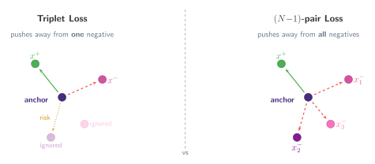
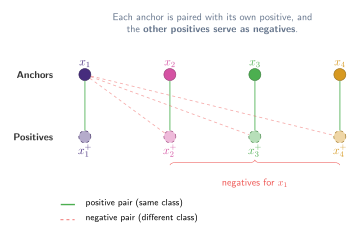

## One negative at a time is too slow

> "We propose to address the problem of slow convergence of triplet loss by allowing joint comparison among more than one negative examples — and propose the (N-1)-pair loss."

[Sohn (2016)](https://papers.nips.cc/paper_files/paper/2016/hash/6b180037abbebea991d8b1232f8a8ca9-Abstract.html) identifies a fundamental limitation of the triplet loss: each update only pushes the anchor away from _one_ negative class at a time. When there are many classes, this is inefficient. The anchor might move away from one negative only to drift closer to another.

The _(N-1)-pair loss_ (commonly called N-pair loss) fixes this by considering **one positive and $N{-}1$ negatives simultaneously**. Instead of asking "is the anchor closer to its positive than to this one negative?", it asks "is the anchor closer to its positive than to _any_ of the $N{-}1$ negatives?" This leads to faster convergence and more uniformly structured embeddings.

:::figure{#npair_vs_triplet}


**Left:** Triplet loss repels only one negative per update; the anchor may drift toward ignored negatives. **Right:** N-pair loss repels all $N{-}1$ negatives simultaneously.
:::

### Batch construction

The training batch is constructed by sampling $N$ pairs, one from each of $N$ different classes:

$$
\{(x_1, x_1^+), (x_2, x_2^+), \dots, (x_N, x_N^+)\}
$$

Each pair $(x_i, x_i^+)$ contains an anchor and a positive from the same class. The key insight is that **the positives of other pairs serve as negatives**. For anchor $x_i$, the points $x_1^+, \dots, x_{i-1}^+, x_{i+1}^+, \dots, x_N^+$ are all from different classes and therefore act as $N{-}1$ negatives.

:::figure{#npair_batch}


Batch construction for $N = 4$ classes. Green lines connect positive pairs (same class). Red dashed lines show how the other positives serve as negatives for $x_1$.
:::

This is efficient: from $N$ pairs ($2N$ examples), we get $N$ training signals, each comparing against $N{-}1$ negatives. No extra sampling is needed beyond the pairs themselves.

## The N-pair loss

The loss for a single anchor $x_i$ with positive $x_i^+$ and negatives $\{x_j^+\}_{j \neq i}$ is:

$$
\mathcal{L}_i = \log\!\left(1 + \sum_{j \neq i} \exp\!\big(f(x_i)^\top f(x_j^+) - f(x_i)^\top f(x_i^+)\big)\right)
$$

and the total loss over the batch is:

$$
\mathcal{L} = \frac{1}{N} \sum_{i=1}^{N} \log\!\left(1 + \sum_{j \neq i} \exp\!\big(f(x_i)^\top f(x_j^+) - f(x_i)^\top f(x_i^+)\big)\right)
$$

Let us unpack the terms inside:

- $f(x_i)^\top f(x_i^+)$ is the **dot product** between the anchor and its positive. We want this to be **large** (high similarity).
- $f(x_i)^\top f(x_j^+)$ is the dot product between the anchor and a negative. We want this to be **small**.
- $f(x_i)^\top f(x_j^+) - f(x_i)^\top f(x_i^+)$ measures how much closer the negative is compared to the positive. If this is positive, the negative is winning.
- The $\exp$ and $\log(1 + \cdot)$ create a **softmax-like** penalty. Negatives that are closer than the positive contribute exponentially more to the loss.

### Connection to softmax cross-entropy

Let us walk through this step by step. First, recall the standard softmax cross-entropy loss for classification. Given $N$ logits $z_1, \dots, z_N$ and a correct class $y$, the loss is:

$$
\mathcal{L}_{\text{CE}} = -z_y + \log\!\left(\sum_{k=1}^{N} \exp(z_k)\right)
$$

This can also be written as $-\log \text{softmax}(z)_y$, i.e. the negative log-probability assigned to the correct class.

:::aside[Deriving cross-entropy from logits]

The equation above computes the loss directly from raw, unnormalised **logits**. There is another form that starts from output **probabilities**. These two are entirely mathematically equivalent; they just represent different stages of the computation pipeline. Here is the step-by-step connection.

#### Start from the probability form

The general cross-entropy between a true distribution $y$ and a predicted distribution $\hat{y}$ over $C$ classes is:

$$
L = -\sum_{c=1}^{C} y_c \log(\hat{y}_c)
$$

#### Step 1: Apply one-hot encoding

In standard classification, the ground truth $y$ is a one-hot vector: $y_c = 1$ for the correct class (call its index $y$) and $y_c = 0$ for all others. The entire sum collapses to a single term:

$$
L = -\log(\hat{y}_y)
$$

#### Step 2: Substitute the softmax

The predicted probability $\hat{y}_y$ comes from applying softmax to the raw logits $z$:

$$
\hat{y}_y = \frac{\exp(z_y)}{\sum_{k=1}^{N} \exp(z_k)}
$$

Substituting back:

$$
L = -\log\!\left(\frac{\exp(z_y)}{\sum_{k=1}^{N} \exp(z_k)}\right)
$$

#### Step 3: Expand using logarithm rules

Using $\log(A/B) = \log A - \log B$:

$$
L = -\Big[\log(\exp(z_y)) - \log\!\left(\sum_{k=1}^{N} \exp(z_k)\right)\Big]
$$

Since $\log(\exp(z_y)) = z_y$:

$$
L = -\Big[z_y - \log\!\left(\sum_{k=1}^{N} \exp(z_k)\right)\Big]
$$

Distributing the negative sign gives exactly the logit form:

$$
\mathcal{L}_{\text{CE}} = -z_y + \log\!\left(\sum_{k=1}^{N} \exp(z_k)\right)
$$

:::

Now, in the N-pair setting, define the "logits" as the dot-product similarities between the anchor $x_i$ and each positive:

$$
z_k = f(x_i)^\top f(x_k^+), \qquad k = 1, \dots, N
$$

The correct class is $k = i$ (the anchor's own positive). Substituting into the cross-entropy formula:

$$
\mathcal{L}_{\text{CE}} = -f(x_i)^\top f(x_i^+) + \log\!\left(\sum_{k=1}^{N} \exp\!\big(f(x_i)^\top f(x_k^+)\big)\right)
$$

Now let us expand the N-pair loss. Starting from:

$$
\mathcal{L}_i = \log\!\left(1 + \sum_{j \neq i} \exp\!\big(f(x_i)^\top f(x_j^+) - f(x_i)^\top f(x_i^+)\big)\right)
$$

We can factor the subtraction out of the exp. Since $\exp(a - b) = \exp(a)/\exp(b)$:

$$
\mathcal{L}_i = \log\!\left(1 + \frac{1}{\exp\!\big(f(x_i)^\top f(x_i^+)\big)} \sum_{j \neq i} \exp\!\big(f(x_i)^\top f(x_j^+)\big)\right)
$$

Rewriting the $1$ as $\exp\!\big(f(x_i)^\top f(x_i^+)\big) / \exp\!\big(f(x_i)^\top f(x_i^+)\big)$ and combining:

$$
\mathcal{L}_i = \log\!\left(\frac{\exp\!\big(f(x_i)^\top f(x_i^+)\big) + \sum_{j \neq i} \exp\!\big(f(x_i)^\top f(x_j^+)\big)}{\exp\!\big(f(x_i)^\top f(x_i^+)\big)}\right)
$$

Using $\log(a/b) = \log a - \log b$:

$$
\mathcal{L}_i = \log\!\left(\sum_{k=1}^{N} \exp\!\big(f(x_i)^\top f(x_k^+)\big)\right) - f(x_i)^\top f(x_i^+)
$$

which is **exactly the softmax cross-entropy loss** with logits $z_k = f(x_i)^\top f(x_k^+)$ and correct class $k = i$. ==In other words, N-pair loss is equivalent to classifying which positive belongs to the anchor using a softmax over similarities.==

This connection is important because it links metric learning directly to classification, and it foreshadows the [InfoNCE loss](../info_nce/), which generalises this idea further by adding a temperature parameter.

### Triplet loss as a special case

When $N = 2$ (one positive, one negative), the N-pair loss reduces to:

$$
\mathcal{L}_i = \log\!\big(1 + \exp\!\big(f(x_i)^\top f(x_j^+) - f(x_i)^\top f(x_i^+)\big)\big)
$$

which is a soft version of the triplet loss (using softplus instead of a hinge). So the triplet loss is a special case of N-pair loss with only one negative class. The power of N-pair comes from scaling this to $N{-}1$ negatives simultaneously.

## N-pair Loss in PyTorch

A minimal implementation. The loss reduces to a cross-entropy over the similarity matrix, where the diagonal entries (anchor-positive pairs) are the correct classes.

```python
# npair_loss_example.py
import torch
import torch.nn as nn
import torch.nn.functional as F
import torch.optim as optim

# ── Synthetic data: sample N pairs from N classes ─────────────────

def sample_npairs(n_classes=8, noise=0.8):
    """Sample one anchor-positive pair per class."""
    # Random class centres on a circle
    angles = torch.linspace(0, 2 * 3.14159, n_classes + 1)[:n_classes]
    centres = torch.stack([angles.cos(), angles.sin()], dim=-1)

    anchors  = centres + noise * torch.randn(n_classes, 2)
    positives = centres + noise * torch.randn(n_classes, 2)
    return anchors, positives

# ── Embedding network ─────────────────────────────────────────────

class EmbeddingNet(nn.Module):
    def __init__(self, embed_dim=32):
        super().__init__()
        self.net = nn.Sequential(
            nn.Linear(2, 64),
            nn.ReLU(),
            nn.Linear(64, embed_dim),
        )

    def forward(self, x):
        return F.normalize(self.net(x), p=2, dim=-1)

# ── N-pair loss ───────────────────────────────────────────────────

def npair_loss(anchors_emb, positives_emb):
    """
    N-pair loss = cross-entropy over the similarity matrix.
    anchors_emb:   (N, d)
    positives_emb: (N, d)
    """
    # Similarity matrix: (N, N) — entry (i,j) = f(x_i)^T f(x_j^+)
    logits = anchors_emb @ positives_emb.T

    # Correct class for anchor i is positive i (the diagonal)
    labels = torch.arange(logits.size(0))

    return F.cross_entropy(logits, labels)

# ── Training loop ─────────────────────────────────────────────────

model = EmbeddingNet()
optimizer = optim.Adam(model.parameters(), lr=1e-3)

for step in range(3000):
    a, p = sample_npairs(n_classes=8)

    e_a = model(a)
    e_p = model(p)

    loss = npair_loss(e_a, e_p)
    optimizer.zero_grad()
    loss.backward()
    optimizer.step()

    if (step + 1) % 500 == 0:
        with torch.no_grad():
            logits = e_a @ e_p.T
            preds = logits.argmax(dim=-1)
            acc = (preds == torch.arange(len(preds))).float().mean()
        print(f"Step {step+1:4d} | loss = {loss.item():.4f} | match acc = {acc.item():.2%}")
```

A few things to notice:

- **The entire N-pair loss is just `F.cross_entropy` applied to the similarity matrix.** The diagonal entries are the correct classes.
- The similarity matrix `anchors_emb @ positives_emb.T` computes all $N^2$ dot products in a single matrix multiply.
- No explicit margin parameter is needed. The softmax naturally handles the competition between positive and negative similarities.
