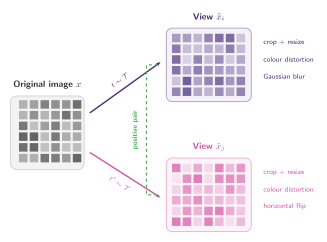
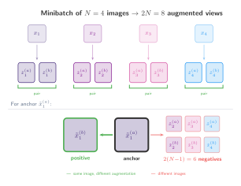

## How far can a standard encoder go?

> "SimCLR learns representations by maximizing agreement between differently augmented views of the same data example via a contrastive loss in the latent space."

By 2020, contrastive self-supervised learning had proven that useful visual representations could be learned without labels. But existing methods relied on specialised architectures, memory banks, or momentum encoders to work well. [Chen et al. (2020)](https://arxiv.org/abs/2002.05709) asked a simpler question: ==how far can we get with just a standard encoder, data augmentation, and the InfoNCE loss?==

The answer turned out to be really far! **SimCLR (Simple Contrastive Learning of Representations)** matched or exceeded prior methods while being, in some ways, quite straightforward. The framework has no memory bank, no momentum encoder, and no custom architecture. It works by generating two augmented views of the same image, encoding both, and training the model to recognise that these two views came from the same source.

### From CPC to SimCLR

In the [previous section](../info_nce/), we saw how CPC defines positive pairs through temporal relationships. That is:

- The context $c_t$ (present) and the target $x_{t+k}$ (future) form a positive pair because they come from the same sequence.
- SimCLR replaces this temporal structure with **data augmentation**. Given a single image $x$, two random augmentations produce views $\tilde{x}_i$ and $\tilde{x}_j$. These two views form a positive pair because they depict the same underlying content.

This shift is important, because CPC has a fundamental requirement of sequential data (audio, video, text) where "future" and "past" are well defined. SimCLR, on the other hand, works with any data where meaningful augmentations can be constructed, making it applicable to images, graphs, and other non-sequential domains.

### The four components

We can summarize SimCLR through the four components:

1. **A stochastic data augmentation module** $\rightarrow$ Transforms each image into two correlated views $\tilde{x}_i$ and $\tilde{x}_j$. The paper shows that the _composition_ of augmentations (not any single one) is critical.
2. **A base encoder $f(\cdot)$** $\rightarrow$ Extracts a representation vector $h = f(\tilde{x})$. SimCLR uses a standard ResNet; the architecture for encoding the images is not the contribution.
3. **A projection head $g(\cdot)$** $\rightarrow$ A small MLP that maps the representation $h$ to a vector $z = g(h)$ where the contrastive loss is applied.
   - A key finding: **representations _before_ the projection head ($h$) transfer better to downstream tasks than those after it ($z$)**.
4. **The NT-Xent loss** (normalised temperature-scaled cross-entropy), which is **exactly the InfoNCE loss with cosine similarity**. No new loss function is needed; the contribution is in the framework around it.

## The SimCLR Framework

### (1) Data augmentation

For each image $x$ in a minibatch, we sample _two_ augmentation operators $t, t' \sim \mathcal{T}$ from a family of transformations $\mathcal{T}$ and apply them independently to produce two views $\tilde{x}_i = t(x)$ and $\tilde{x}_j = t'(x)$. These two views form a **positive pair**.

:::figure{#simclr_augmentation}


Two views of the same image are created by independently sampling augmentations from $\mathcal{T}$. The pair $(\tilde{x}_i, \tilde{x}_j)$ is a positive pair.
:::

The paper studies which augmentations matter most and finds that ==no single augmentation is sufficient; the composition of two augmentations is what makes the task hard enough to learn useful features==. The strongest combination is:

1. **Random crop and resize** to the original size. This forces the model to recognise objects at different scales and positions.
2. **Colour distortion** (random brightness, contrast, saturation, hue). Without this, the model can cheat by matching colour histograms instead of learning semantic features.

Gaussian blur and horizontal flip also help but are less critical. The key insight is that crop alone lets the model rely on colour, and colour distortion alone lets it rely on spatial layout. Combining both forces the model to learn higher-level representations.

### Batch construction and positive/negative pairs

Given a minibatch of $N$ images, we augment each image twice to obtain $2N$ augmented views. For a given anchor view $\tilde{x}_i$:

- Its **positive** is the other view of the same image, $\tilde{x}_j$.
- Its **negatives** are the remaining $2(N{-}1)$ views from all other images in the batch.

:::figure{#simclr_batch}


**Top:** each image $x_i$ produces two augmented views $\tilde{x}_i^{(a)}$ and $\tilde{x}_i^{(b)}$ side by side. **Bottom:** for anchor $\tilde{x}_1^{(a)}$, its positive is the other view of the same image $\tilde{x}_1^{(b)}$ (green), and the $2(N{-}1) = 6$ views from other images are negatives (red).
:::

### (2) Base encoder $f(\cdot)$

Each augmented view $\tilde{x}$ is passed through an encoder $f(\cdot)$ to obtain a representation vector $h = f(\tilde{x}) \in \mathbb{R}^d$. SimCLR uses a ResNet-50, taking the output after the global average pooling layer ($d = 2048$).

Some interesting information here is that any encoder architecture can be used. And the paper shows that larger encoders yield better representations. Which I would say is expected given that the representation space is larger, but bigger does not always mean better.

### (3) Projection head $g(\cdot)$

A small MLP maps the representation $h$ to a vector $z = g(h)$ where the contrastive loss is computed. The default architecture is a single hidden layer with ReLU:

$$
z = g(h) = W^{(2)}\, \sigma\!\big(W^{(1)} h\big)
$$

where $\sigma$ is ReLU, $W^{(1)} \in \mathbb{R}^{d_h \times d}$ and $W^{(2)} \in \mathbb{R}^{d_z \times d_h}$.

Why add a projection head $z = g(h)$ instead of applying the loss directly to $h$? The paper finds that **training with the projection head produces a better encoder representation $h$ than training without it**. The projection head is essential during training, but discarded at inference time.

- **Why it helps:** the contrastive loss encourages invariance to augmentations. This means $z$ must discard information such as colour or orientation. By letting $g(\cdot)$ absorb that information loss, the encoder output $h$ is free to preserve it. Without the projection head, the loss would force $h$ itself to throw away information that is useful for downstream tasks. And we don't want that!
- **Inference:** we discard $g(\cdot)$ and use only the encoder $f(\cdot)$ and its output $h$, which retains richer information than $z$.

### (4) The NT-Xent loss (Normalised Temperature-Scaled Cross Entropy)

The loss for a positive pair $(i, j)$ is defined as:

$$
\ell_{i,j} = {\color{#462C7D} -\log} \frac{ {\color{#4CAF50} \exp\!\big(\text{sim}(z_i, z_j) / \tau\big)} }{ \displaystyle {\color{#D552A3} \sum_{k=1}^{2N} \mathbf{1}_{[k \neq i]}\, \exp\!\big(\text{sim}(z_i, z_k) / \tau\big)} }
$$

where $\text{sim}(u, v) = u^\top v / (\|u\| \|v\|)$ is cosine similarity and $\tau$ is the temperature. Let us understand each term:

- **${\color{#4CAF50} \exp\!\big(\text{sim}(z_i, z_j) / \tau\big)} \rightarrow$** The exponentiated cosine similarity between the two views $z_i$ and $z_j$ of the same image, scaled by temperature.
- **${\color{#D552A3} \sum_{k=1}^{2N} \mathbf{1}_{[k \neq i]}\, \exp\!\big(\text{sim}(z_i, z_k) / \tau\big)} \rightarrow$** The sum of scores over all $2N - 1$ other views in the batch (everything except the anchor $z_i$ itself). This includes the positive $z_j$ and $2(N{-}1)$ negatives.
  - The indicator $\mathbf{1}_{[k \neq i]}$ excludes the anchor from comparing with itself.
- **${\color{#462C7D} -\log}$**: converts the ratio into a cross-entropy loss. When the model assigns high probability to the positive, the loss is low. When it fails, the loss grows.

This is **exactly the InfoNCE loss with cosine similarity as the scoring function**. The total loss is computed over all $2N$ views in the batch (each view takes a turn as the anchor), and the final loss is the average:

$$
\mathcal{L} = \frac{1}{2N} \sum_{k=1}^{N} \big[\ell_{2k-1,\, 2k} + \ell_{2k,\, 2k-1}\big]
$$

For each image, we compute the loss twice: once with view $i$ as anchor and view $j$ as positive, and once the other way around.

## Why large batches?

In the [InfoNCE section](../info_nce/), there's an inequality in which we said that minimising InfoNCE maximises a lower bound on mutual information, and that this bound is capped at $\log(N)$:

$$
I(x;\, c) \geq \log(N) - \mathcal{L}_{\text{InfoNCE}}
$$

In SimCLR, $N$ is the number of negative candidates per anchor. Since negatives come from the other images in the batch, a minibatch of $B$ images gives $2B$ views and $2(B{-}1)$ negatives per anchor. This means **the batch size directly controls how much mutual information the loss can capture**.

The paper shows that performance improves steadily as the batch size grows from 256 to 8192. With small batches, the few negatives make the classification task too easy. The model can distinguish the positive from a handful of random images without learning fine-grained features. With large batches, the model faces thousands of negatives, including many that are visually similar to the anchor. To succeed, it must learn representations that capture subtle semantic differences.

- **Small batch** ($B = 256$): 510 negatives per anchor. The bound allows at most $\log(511) \approx 6.2$ nats of mutual information.
- **Large batch** ($B = 4096$): 8190 negatives per anchor. The bound rises to $\log(8191) \approx 9.0$ nats.

## SimCLR in PyTorch

A minimal implementation covering all four components: random augmentations, a ResNet-style encoder, a projection head, and the NT-Xent loss.

```python
# simclr_example.py
import torch
import torch.nn as nn
import torch.nn.functional as F
import torch.optim as optim
from torchvision import transforms

# ── (1) Data augmentation ────────────────────────────────────────

augmentation = transforms.Compose(
    [
        transforms.RandomResizedCrop(32, scale=(0.2, 1.0)),
        transforms.RandomHorizontalFlip(),
        transforms.RandomApply(
            [transforms.ColorJitter(0.4, 0.4, 0.4, 0.1)], p=0.8
        ),
        transforms.RandomGrayscale(p=0.2),
        transforms.ToTensor(),
    ]
)

# ── (2) Encoder + (3) Projection head ───────────────────────────

class SimCLR(nn.Module):
    def __init__(self, feature_dim=128):
        super().__init__()

        # f(·): base encoder — small CNN for demonstration
        self.encoder = nn.Sequential(
            nn.Conv2d(3, 64, 3, padding=1),
            nn.ReLU(),
            nn.MaxPool2d(2),
            nn.Conv2d(64, 128, 3, padding=1),
            nn.ReLU(),
            nn.AdaptiveAvgPool2d(1),
            nn.Flatten(),
        )

        # g(·): projection head — MLP with one hidden layer
        self.projector = nn.Sequential(
            nn.Linear(128, 128),
            nn.ReLU(),
            nn.Linear(128, feature_dim),
        )

    def forward(self, x):
        h = self.encoder(x)         # representation (kept at inference)
        z = self.projector(h)        # projection (discarded at inference)
        return h, z

# ── (4) NT-Xent loss ─────────────────────────────────────────────

def nt_xent_loss(z, tau=0.5):
    """
    z: (2B, d) — projections from a batch of B images,
         arranged as [z_1^(a), z_1^(b), z_2^(a), z_2^(b), ...]
    """
    batch_size = z.shape[0]  # 2B
    B = batch_size // 2

    # Cosine similarity matrix: (2B, 2B)
    z = F.normalize(z, dim=-1)
    sim = z @ z.T / tau

    # Mask out self-similarity (diagonal)
    mask_self = torch.eye(batch_size, dtype=torch.bool)
    sim.masked_fill_(mask_self, float("-inf"))

    # For each anchor i, its positive is its paired view:
    #   anchor 2k   → positive 2k+1
    #   anchor 2k+1 → positive 2k
    labels = torch.arange(batch_size)
    labels[0::2] = labels[0::2] + 1  # even → odd
    labels[1::2] = labels[1::2] - 1  # odd  → even

    # NT-Xent = cross-entropy with the positive as the correct class
    return F.cross_entropy(sim, labels)

# ── Training loop ────────────────────────────────────────────────

def sample_batch(batch_size=64, img_size=32):
    """Simulate a batch of random 'images' (replace with real data)."""
    return torch.rand(batch_size, 3, img_size, img_size)

model = SimCLR()
optimizer = optim.Adam(model.parameters(), lr=3e-4)

for step in range(3000):
    images = sample_batch()

    # Create two augmented views per image → (2B, C, H, W)
    view_a = images + 0.1 * torch.randn_like(images)  # simplified augmentation
    view_b = images + 0.1 * torch.randn_like(images)

    # Interleave: [x_1^(a), x_1^(b), x_2^(a), x_2^(b), ...]
    x = torch.stack([view_a, view_b], dim=1).reshape(-1, 3, 32, 32)

    _, z = model(x)
    loss = nt_xent_loss(z)

    optimizer.zero_grad()
    loss.backward()
    optimizer.step()

    if (step + 1) % 500 == 0:
        print(f"Step {step + 1:4d} | loss = {loss.item():.4f}")

# Expected: loss starts near ln(2B-1) ≈ ln(127) ≈ 4.84 (chance level)
# and decreases as the model learns to match augmented views.
```

A few things to notice:

- The encoder and projection head are separate. After training, we keep only `model.encoder` and discard `model.projector`.
- **The NT-Xent loss reduces to `F.cross_entropy` over the cosine similarity matrix.** The label for each anchor points to its paired view.
- The self-similarity diagonal is masked with `-inf` so that the anchor never compares with itself (implementing the $\mathbf{1}_{[k \neq i]}$ indicator).
- Views are interleaved as $[\tilde{x}_1^{(a)}, \tilde{x}_1^{(b)}, \tilde{x}_2^{(a)}, \tilde{x}_2^{(b)}, \dots]$ so that the positive for anchor $2k$ is always at index $2k+1$ and vice versa.
