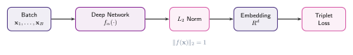
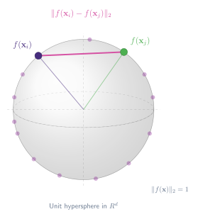
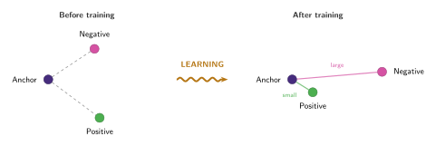

## Distance should mean similarity

> "Our method is based on learning a Euclidean embedding per image using a deep convolutional network. The network is trained such that the squared L2 distances in the embedding space directly correspond to face similarity: faces of the same person have small distances and faces of distinct people have large distances."

[Schroff et al. (2015)](https://arxiv.org/abs/1503.03832) introduced a method called FaceNet for learning face embeddings using a deep convolutional network. The core idea is simple: ==map each image to a point in Euclidean space such that distance reflects similarity==. Images of the same person should be close together; images of different people should be far apart.

While the original application was face recognition, the triplet loss framework is far more general. It applies to any setting where we want to learn an embedding space that preserves some notion of similarity, whether for images, text, audio, or other modalities.

:::figure{#triplet_pipeline}


The model pipeline. A batch of inputs passes through a deep network, is $L_2$-normalised to lie on the unit sphere, and the resulting embeddings are compared via the triplet loss.
:::

### The embedding

We have a deep network $f(\mathbf{x})$ that takes an input $\mathbf{x}$ (e.g. an image) and maps it to a point in $\mathbb{R}^d\!.$ The output is normalised to live on the unit hypersphere:

$$
f: \mathbf{x} \mapsto \mathbb{R}^d, \qquad \|f(\mathbf{x})\|_2 = 1
$$

This normalisation ensures that all embeddings live on the surface of a $d$-dimensional sphere. The squared Euclidean distance between two embeddings then measures how dissimilar they are:

$$
\|f(\mathbf{x}_i) - f(\mathbf{x}_j)\|_2^2
$$

When this distance is small, the network considers the two inputs similar. When it is large, the network considers them different. The question then becomes: _how do we train $f$ to produce such an embedding?_

:::figure{#embedding_sphere}


All embeddings live on the unit hypersphere. The Euclidean distance between two points $f(\mathbf{x}_i)$ and $f(\mathbf{x}_j)$ measures how dissimilar the network considers them.
:::

### Anchor, positive, and negative

The training signal comes from _triplets_ of examples. Each triplet consists of:

- An **anchor** $\mathbf{x}_i^a$: the reference example.
- A **positive** $\mathbf{x}_i^p$: an example that should be similar to the anchor (e.g. a different photo of the same person).
- A **negative** $\mathbf{x}_i^n$: an example that should be dissimilar (e.g. a photo of a different person).

The goal is to ensure that the anchor is closer to the positive than to the negative in the embedding space, by at least a margin $\alpha > 0$:

$$
\|f(\mathbf{x}_i^a) - f(\mathbf{x}_i^p)\|_2^2 + \alpha \;\lt\; \|f(\mathbf{x}_i^a) - f(\mathbf{x}_i^n)\|_2^2
$$

The margin $\alpha$ prevents the trivial solution where all embeddings collapse to the same point. It enforces a minimum gap between the positive and negative distances.

:::figure{#triplet_learning}


The triplet loss minimises the distance between an anchor and a positive (same identity) while maximising the distance between the anchor and a negative (different identity).
:::

## The triplet loss

Turning the constraint above into a loss function that we can minimise with gradient descent:

$$
\mathcal{L} = \sum_{i}^{N} \Big[ \|f(\mathbf{x}_i^a) - f(\mathbf{x}_i^p)\|_2^2 - \|f(\mathbf{x}_i^a) - f(\mathbf{x}_i^n)\|_2^2 + \alpha \Big]_+
$$

where $[\cdot]_+ = \max(\cdot, 0)$ is the hinge function. The loss is zero when the constraint is satisfied (anchor is closer to positive than negative by at least $\alpha$). It is positive when the constraint is violated, and the gradient pushes the network to fix it.

In words, for each triplet:

- **Pull** the anchor and positive closer together (decrease $\|f(\mathbf{x}_i^a) - f(\mathbf{x}_i^p)\|_2^2$).
- **Push** the anchor and negative further apart (increase $\|f(\mathbf{x}_i^a) - f(\mathbf{x}_i^n)\|_2^2$).
- **Stop** once the gap exceeds the margin $\alpha$ (the hinge clips the loss to zero).

:::aside[The hinge function $[\cdot]_+$]

The hinge function (also called the positive part or ReLU) is defined as

$$
[z]_+ = \max(z, 0) = \begin{cases} z & \text{if } z > 0 \\ 0 & \text{otherwise} \end{cases}
$$

As we can see, it basically acts like a gate: when its argument is negative (the constraint is already satisfied), the loss contributes nothing and no gradient flows. When its argument is positive (the constraint is violated), the loss equals the amount of violation.

#### Why not just use the raw difference?

Without the hinge, the loss would keep decreasing even after the constraint is satisfied, pushing the positive and negative distances apart indefinitely. The way I see it is that the hinge is telling the network something like _"this triplet is good enough, move on to harder ones."_

Overall, this is important for training efficiency: once a triplet is correctly separated by margin $\alpha$, no computation is wasted on it.

:::

## Triplet Loss in PyTorch

Here is a minimal PyTorch implementation. We train a small embedding network on synthetic 2D data with three classes, using the triplet loss to learn an embedding where same-class points cluster together.

```python
# triplet_loss_example.py
import torch
import torch.nn as nn
import torch.nn.functional as F
import torch.optim as optim

# ── Synthetic data: 3 clusters in 2D ─────────────────────────────

def sample_triplet(n):
    """Sample n triplets (anchor, positive, negative) from 5 overlapping clusters."""
    centres = torch.tensor([
        [-1.0, 0.0], [1.0, 0.0], [0.0, 1.0], [0.7, -0.8], [-0.7, -0.8]
    ])
    n_cls = centres.shape[0]

    # Pick anchor class, then sample anchor + positive from same class
    cls = torch.randint(0, n_cls, (n,))
    anchor   = centres[cls] + 0.8 * torch.randn(n, 2)
    positive = centres[cls] + 0.8 * torch.randn(n, 2)

    # Pick a different class for the negative
    neg_cls = (cls + torch.randint(1, n_cls, (n,))) % n_cls
    negative = centres[neg_cls] + 0.8 * torch.randn(n, 2)

    return anchor, positive, negative

# ── Embedding network ─────────────────────────────────────────────

class EmbeddingNet(nn.Module):
    def __init__(self, embed_dim=16):
        super().__init__()
        self.net = nn.Sequential(
            nn.Linear(2, 64),
            nn.ReLU(),
            nn.Linear(64, embed_dim),
        )

    def forward(self, x):
        """Map input to unit-normalised embedding."""
        e = self.net(x)
        return F.normalize(e, p=2, dim=-1)  # ||f(x)||_2 = 1

# ── Triplet loss ──────────────────────────────────────────────────

def triplet_loss(anchor, positive, negative, alpha=0.2):
    """
    L = sum[ ||f(a) - f(p)||^2 - ||f(a) - f(n)||^2 + alpha ]+
    """
    d_pos = (anchor - positive).pow(2).sum(dim=-1)  # ||f(a) - f(p)||^2
    d_neg = (anchor - negative).pow(2).sum(dim=-1)  # ||f(a) - f(n)||^2
    losses = torch.clamp(d_pos - d_neg + alpha, min=0)  # hinge [·]+
    return losses.mean()

# ── Training loop ─────────────────────────────────────────────────

model = EmbeddingNet()
optimizer = optim.Adam(model.parameters(), lr=1e-3)
alpha = 0.2  # margin

for step in range(3000):
    a, p, n = sample_triplet(256)

    # Embed all three
    e_a = model(a)
    e_p = model(p)
    e_n = model(n)

    loss = triplet_loss(e_a, e_p, e_n, alpha)
    optimizer.zero_grad()
    loss.backward()
    optimizer.step()

    if (step + 1) % 500 == 0:
        # Fraction of triplets where constraint is satisfied
        with torch.no_grad():
            d_p = (e_a - e_p).pow(2).sum(-1)
            d_n = (e_a - e_n).pow(2).sum(-1)
            acc = (d_p + alpha < d_n).float().mean()
        print(f"Step {step+1:4d} | loss = {loss.item():.4f} | triplet acc = {acc.item():.2%}")
```

A few things to notice:

- `F.normalize(e, p=2, dim=-1)` projects embeddings onto the unit sphere, enforcing $\|f(\mathbf{x})\|_2 = 1$.
- `torch.clamp(..., min=0)` implements the hinge $[\cdot]_+$. Triplets that already satisfy the margin contribute zero loss and zero gradient.
- The margin `alpha = 0.2` is a hyperparameter. Larger values demand more separation between positives and negatives; smaller values are easier to satisfy but produce less discriminative embeddings.
- We track _triplet accuracy_ (fraction of triplets where $d_{\text{pos}} + \alpha < d_{\text{neg}}$) as a training diagnostic.
